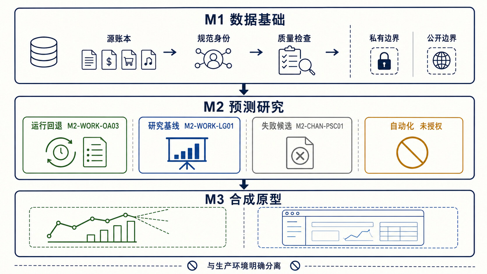
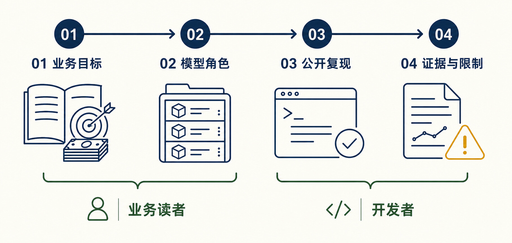

# 有声书产品收入评估与年度目标系统

<div align="center">

**从可信账单到可审计预测：公开工程底座、受控 M2 研究与合成 M3 原型**

[](https://github.com/KAtOReNA7/system/actions/workflows/ci.yml)


</div>

<p align="center">
  
</p>

本仓库统一维护三层能力：

- **M1 数据基础**：账单、作品、渠道等身份和数据质量治理；
- **M2 预测研究**：旧产品未来分成收入现金的可复现、可审计预测；
- **M3 合成原型**：不依赖真实材料的产品演示和方案验证。

> [!IMPORTANT]
> 当前仓库的公开工程基线可安装、构建、测试和启动，但**没有模型获准自动化或生产发布**。
> `production`、final/later-origin holdout、Canary/full160、provider、共享数据库和
> M3 formal 均保持关闭。

## 30 秒了解项目

| 你可能关心的问题 | 当前答案 |
|---|---|
| 这个项目预测什么？ | **未来分成收入现金**；买断及其他非分成现金不进入 M2 预测目标 |
| 当前可以直接使用哪个模型？ | 作品发生-金额校准模型 v0.3（Occurrence-Amount Calibration v0.3，`M2-WORK-OA03`）仅作为**兼容性现行运行回退** |
| 当前研究比较基线是什么？ | 人工锚定可学习全局模型（Human-Anchored Learned Global，`M2-WORK-LG01`） |
| 是否已有生产模型？ | 没有；`activeCandidate=null`，`approvedForAutomation=null` |
| 最新渠道模型结果如何？ | 出版行业规模适配渠道核心（Publishing-Scale Channel Core，`M2-CHAN-PSC01`）已实际执行并失败，不是“尚未运行” |
| 最新核心老品结论如何？ | 核心老品分周期金额模型的 3/6/12 月性能失败保持冻结；Primary/Core90 另有 5 个有限极端外推单元格，已单独登记数值稳定性失败 |
| 当前受控研究是什么？ | LG01 头部现金残差校准模型 v0.1（LG01 Head-Cash Residual Calibration Model v0.1，`M2-WORK-HCRC01`）只完成 3 个月探索性预注册，尚未读取外层结果，不是活动候选 |
| 没有真实账单能否开发？ | 可以完成公开安装、构建、测试、启动、查询和合成 fixture；只会阻断所属 private capability |

## 项目状态一览

| 范围 | 当前结论 | 用户应如何理解 |
|---|---|---|
| 公共工程 | 可安装、构建、测试和启动 | Linux/Windows 使用同一套无私有数据门禁；以上方 CI 徽章为准 |
| M2 业务门禁 | Canary 失败（`CANARY_FAIL`） | 尚未达到自动化或发布要求 |
| M2 自动化 | 自动化被阻断（`AUTOMATION_BLOCKED`） | 没有模型获准自动化，活动候选为空（`activeCandidate=null`） |
| M2 评价合同 v2.1 | 历史开发评价合同 | 继续保留审计证据，但当前开发评价权威已前移到 v2.2 |
| M2 评价合同 v2.2 | 开发评价已激活，并透明隔离无法分配的冲销残差（`M2_EVALUATION_V2_2_ACTIVE_FOR_DEVELOPMENT_WITH_DISCLOSED_RESIDUAL_EXCLUSION`） | 不是 production/automation gate，不改变运行回退模型 |
| M2 出版行业规模适配 | 首个完整原始候选已冻结并失败（`M2_PUBLISHING_SCALE_CORE_FAIL`） | 原始候选相对同人口冻结研究基线显著恶化；历史实现阻断仍保留为审计记录，不再代表当前结果 |
| M2 分层收入组合 v0.1 | 已完成首个有效组合开发评价并失败（`M2_LAYERED_REVENUE_COMPOSITION_FAIL`） | 12/36 个月主结果失败；年龄带辅助臂和年度分量未完整执行；没有晋升或自动化授权 |
| M2 核心老品范围与尾部测试 | 范围纠偏、冻结重评分与一次训练人口消融已完成（`M2_CORE_LEGACY_SCOPE_AND_TAIL_TEST_COMPLETE`） | 尾部干扰未确认（`TAIL_INTERFERENCE_NOT_CONFIRMED`）；核心 80% 训练稳定退化，未授权新架构 |
| M2 核心老品全周期路由与已有渠道分配 | 预注册验证已完成（`M2_CORE_LEGACY_HORIZON_ROUTER_AND_CHANNEL_ALLOCATION_COMPLETE`） | 合法模型交集的同案例证据已补齐；滚动路由未确认（`HORIZON_ROUTER_NOT_CONFIRMED`），已有渠道分配证据混合（`CHANNEL_ALLOCATION_MIXED`） |
| M2 OA03 当前范围复现 | 同公式重新执行完成、无新增性能支持（`M2_OA03_CURRENT_SCOPE_REPLICATION_COMPLETE_PERFORMANCE_MIXED`） | 没有复现历史数值；`PERFORMANCE_MIXED` 是机器证据状态而非业务通过；Core80 Primary 主要参考不可合法重建，Strict 3/6/12 月均不支持 |
| M2 核心老品分周期金额模型 v0.1 | 首个完整 B0–B3 开发评价已冻结并失败（`M2_CORE_HORIZON_AMOUNT_DEVELOPMENT_FAIL`） | B1–B3 已真实训练；3/6/12 月最佳原始实验臂均为 B3，但三个周期都未通过，现行回退、活动候选和自动化授权不变 |
| M2 CHAM01 数值稳定性披露 | Primary/Core90 有限极端外推（`M2_CHAM01_PRIMARY_CORE90_NUMERIC_STABILITY_FAIL_FINITE_EXTREME_EXTRAPOLATION`） | 5 个冻结原始单元格的单一作品贡献近乎全部绝对误差；原值未截断、置零或重跑，数值失败与性能失败分别登记 |
| M2 LG01 头部现金残差校准 v0.1 | 已预注册且尚未执行（`M2_LG01_HEAD_CASH_RESIDUAL_PREREGISTERED_NOT_EXECUTED`） | 仅限 Strict Core80 三个月作品总额；Core90 只作敏感性，Primary 只作数值诊断；`activeCandidate=null` |
| M3 | 仅合成 fixture/prototype | 不代表真实材料执行或正式发布 |

最新状态以 [M2 当前状态索引 v0.47](docs/analysis/m2-v2/M2-v2-current-state-index-v0.47.md)
为准；模型名称、角色、别名、谱系、成绩人口和可比组以
[Model Registry](config/m2-model-registry.v1.json) 为唯一当前机器权威。

## 系统地图

<p align="center">
  
</p>

### 能力状态

| 能力 | 当前角色 | 证据与限制 |
|---|---|---|
| 作品点预测 | 作品发生-金额校准模型 v0.3（Occurrence-Amount Calibration v0.3，`M2-WORK-OA03`）是兼容性现行运行回退模型（compatibility operational fallback） | 当前人工权威开发人口 WAPE 为 `0.49075894`；未通过绝对质量门槛，当前 Core 老品范围没有新增性能支持 |
| 作品研究比较 | 人工锚定可学习全局模型（Human-Anchored Learned Global，`M2-WORK-LG01`）是研究比较基线（research baseline） | 只用于研究比较，不是 production 晋升 |
| 渠道预测研究 | 出版行业规模适配渠道核心（Publishing-Scale Channel Core，`M2-CHAN-PSC01`）已执行失败 | raw candidate 已冻结；历史实现阻断不能掩盖有效失败，也不授权同窗调参 |
| 周期路由研究 | 按预测周期滚动模型路由器 v0.1（Rolling Horizon Model Router v0.1，`M2-WORK-HR01`）已执行但未确认 | 3/12/36 个月只追平最强单模型，6 个月 WAPE 退化约 2.53%；不是活动候选或运行管线 |
| 头部现金残差研究 | LG01 头部现金残差校准模型 v0.1（LG01 Head-Cash Residual Calibration Model v0.1，`M2-WORK-HCRC01`）已预注册但尚未执行 | 只研究 3 个月冻结残差信号；不得重新拟合 LG01/CHAM01，也不得外推到 6/12/36 月 |
| 组合预测 | 组合现金 ETS/Holt-Winters（Portfolio ETS/Holt-Winters，`M2-PORT-ETS01`）是组合级参考（portfolio reference） | 组合结果不得分配回作品；不同 horizon 必须分别报告 |
| 分层组合开发候选 | 分层收入组合模型 v0.1（Layered Revenue Composition Model v0.1，`M2-PORT-LRC01`）已执行失败 | 四分量守恒，但 12/36 个月质量失败且协议物化不完整；不替代组合级参考 |
| 排序能力 | 仅有后验诊断（post-hoc diagnostic） | 排序信号不能掩盖点预测失败，也不能直接用于分配 |
| 风险区间 | 存在可复用的冻结开发证据（development evidence） | 缺少合格独立 later-origin，不得接入 production |

### 现在能做什么

- 在没有 private 数据、数据库和 provider key 的新电脑上复现公共工程基线；
- 查询当前模型身份、角色、别名、谱系和成绩可比性；
- 运行 formal/fixture 两种 composition，并验证 `/health`；
- 审阅公开脱敏的模型结果、评价合同、失败证据和治理状态；
- 在单独授权并具备对应 private capability 时执行受控研究。

### 明确不能做什么

- 把现行运行回退或研究基线解释为 production champion；
- 用安全 fallback 或 selected pipeline 掩盖 raw candidate 的失败；
- 在缺少 forecast-origin 可见证据时用当前状态回填历史；
- 将作品点预测、组合预测、排序/分配和风险区间放入同一排行榜；
- 提交真实账单、private input/output、凭据、数据库或冻结行级证据；
- 未经独立授权打开 production、final holdout、自动化、发布或 M3 formal。

## 当前模型角色

| 能力 | 中文名称（英文原名、稳定 ID） | 当前角色 | 需要怎样理解 |
|---|---|---|---|
| 作品点预测 | 作品发生-金额校准模型 v0.3（Occurrence-Amount Calibration v0.3，`M2-WORK-OA03`） | 兼容性现行运行回退（compatibility operational fallback） | 可以作为已有现金历史的保守锚点，但不是当前开发冠军或当前范围最优模型，尚未通过绝对质量与自动化门槛 |
| 作品研究比较 | 人工锚定可学习全局模型（Human-Anchored Learned Global，`M2-WORK-LG01`） | 研究比较基线（research baseline） | 用于同人口候选比较，不等于 production 晋升 |
| 组合预测 | 组合现金 ETS/Holt-Winters（Portfolio ETS/Holt-Winters，`M2-PORT-ETS01`） | 组合级参考（portfolio reference） | 3/6/12 月必须分别评价，组合结果不能分配回作品 |
| 渠道预测 | 出版行业适配渠道月度发生—条件金额核心（Publishing-Scale Channel Monthly Occurrence × Conditional Amount Core，`M2-CHAN-PSC01`） | 已执行失败候选 | raw candidate 已冻结；不允许同窗 outcome-driven 调参 |
| 周期路由 | 按预测周期滚动模型路由器 v0.1（Rolling Horizon Model Router v0.1，`M2-WORK-HR01`） | 已执行失败候选 | 没有稳定优于各周期最强单模型，不是 selected pipeline |
| 分层组合 | 分层收入组合模型 v0.1（Layered Revenue Composition Model v0.1，`M2-PORT-LRC01`） | 已执行失败候选 | 作品点预测以外的组合能力；不能与作品模型直接排名 |

当前没有活动候选和自动化批准模型。完整历史模型、实验臂、别名和成绩总账见
[M2 模型目录与成绩总账](docs/analysis/m2-current/M2-model-catalog-and-scorecard-v1.md)。
当前活动实验是 M2 LG01 头部现金残差校准 v0.1
（M2 LG01 Head-Cash Residual Calibration v0.1，
`M2-EXP-LG01-HEAD-CASH-RESIDUAL-01`），其状态仅为已预注册且尚未执行
（`M2_LG01_HEAD_CASH_RESIDUAL_PREREGISTERED_NOT_EXECUTED`）。

## 最新研究结论

出版行业规模适配渠道核心（`M2-CHAN-PSC01-RAW`）已完成首个完整、同人口、可解释的
原始候选评价，共冻结 `3,318,819` 行预测：

| 同人口评价 | 冻结研究基线 WAPE / signed bias | `M2-CHAN-PSC01-RAW` WAPE / signed bias | 结论 |
|---|---:|---:|---|
| Primary | `0.44310049 / -0.12165171` | `0.92408663 / -0.88928240` | WAPE 恶化 108.55% |
| Strict | `0.41281268 / -0.03786001` | `0.91533339 / -0.85410647` | WAPE 恶化 121.73% |

这次结果证明的是**当前独立渠道发生—条件金额实现失败**，并不等于出版渠道业务机制
理论已经被否定。主要问题是条件正金额严重低估；机制时间结构仍表现出约 5% 的局部
信息增益。下一步需要先审计金额尺度塌缩与比较器完整性，再决定是否建立新的、有总量
锚定与守恒约束的候选。

详细证据：

- [出版规模渠道开发评价](docs/analysis/m2-current/M2-current-publishing-scale-channel-development-v0.1.md)
- [出版规模渠道可预测性诊断](docs/analysis/m2-current/M2-current-publishing-scale-channel-forecastability-v0.1.md)
- [M2 当前状态索引 v0.47](docs/analysis/m2-v2/M2-v2-current-state-index-v0.47.md)

随后完成的核心老品审计进一步表明：

- 动态核心 90% 训练仅有微小且不稳定的短期改善，动态核心 80% 训练稳定退化，尾部干扰
  未确认（`TAIL_INTERFERENCE_NOT_CONFIRMED`）；
- 完整周期合法同案例证据已经补齐，但滚动周期路由没有稳定优于单模型
  （`HORIZON_ROUTER_NOT_CONFIRMED`）；
- 三种固定历史渠道份额窗口与研究基线隐含份额在不同周期方向不一致，已有渠道分配证据
  混合（`CHANNEL_ALLOCATION_MIXED`）。

> 不同预测目标、粒度、人口、horizon、评价窗口或 actual 定义的成绩不能直接排名。
> WAPE 与 signed bias 是必要指标，但不足以单独评价 occurrence、条件金额、排序、
> 组合预算、风险区间和时间稳定性。

## 推荐阅读路径

<p align="center">
  
</p>

### 给业务读者

1. 先读 [M2 Forecast Intelligence v2 PRD](docs/prd/m2-v2/M2-forecast-intelligence-v2-prd-v0.2.md)，
   明确预测目标、使用场景和禁止外推的边界；
2. 再读 [M2 模型目录与成绩总账](docs/analysis/m2-current/M2-model-catalog-and-scorecard-v1.md)，
   理解模型、实验、状态码和当前角色；
3. 最后读 [M2 当前状态索引 v0.47](docs/analysis/m2-v2/M2-v2-current-state-index-v0.47.md)，
   查看最新结论、阻断项和下一步。

### 给开发者

1. 先读 [协作规则](AGENTS.md) 和
   [M2 canonical core 局部规则](src/domain/m2Current/AGENTS.md)；
2. 通过 [Model Registry](config/m2-model-registry.v1.json) 和只读命令解析模型身份；
3. 从 [`src/domain/m2Current/`](src/domain/m2Current/) 与
   [`scripts/m2-current/`](scripts/m2-current/) 进入当前实现；
4. 用公共门禁复现工程，再按 capability doctor 判断私有能力是否可用。

## 五分钟开始

### 工具链

- Git
- Node 24.x
- npm 11.13.0
- Python 3.11–3.13（CI reference 为 3.13）

项目通过 `scripts/resolve-compatible-python.mjs` 解析兼容 Python；不要把某台电脑的
绝对 Python 路径、仓库路径、预置 HEAD 或本地文件 digest 写进公共任务门禁。

```bash
git clone https://github.com/KAtOReNA7/system.git
cd system
npm ci
npm run doctor:dev
npm run check:no-real-data
npm run lint
npm run build
npm test
npm run smoke
npm run smoke:portable-start
npm run test:e2e
npm run verify:m2:current
```

上述公共基线不会读取 `data/private-input/**`、`data/private-output/**`、`.env`、
`.pgpass`、数据库 dump 或任何 provider/API key。

## 启动方式

启动 formal composition：

```bash
npm start
```

启动合成 fixture composition或开发热重载：

```bash
npm run start:fixture
npm run dev
```

formal composition 在无数据库时仍应启动并通过 `/health`；数据库业务接口会明确返回
degraded/unavailable，不会静默回落到 fixture。

## 查询当前模型

```bash
npm run m2:model -- status
npm run m2:model -- list
npm run m2:model -- show M2-WORK-OA03
npm run m2:model -- aliases exact-v0.3
npm run m2:model -- experiment M2-EXP-PUBLISHING-SCALE-CHANNEL-01
npm run m2:model -- compare M2-WORK-OA03 M2-WORK-LG01
```

这些命令只读取公开 Model Registry；不会训练模型、读取 private capability、生成预测
或改变 production。

## M2 预测目标与当前作品范围

M2 的正式预测对象是**未来分成收入现金**：

- 买断及其他非分成现金在模型外独立审计；
- pure-buyout 必须 `null abstain`，不能用 0、承诺金额或月均等效值替代预测；
- 分成账单是 actual 的唯一现金来源，总账仅用于守恒审计；
- 所有特征必须证明在 forecast origin 可得；
- 发生概率、条件金额、总量校准、排序、组合和区间风险分别评价；
- raw candidate 必须单独报告，不能被 fallback 后的 selected 结果掩盖；
- 模型晋升需要同人口、跨时间块和独立 later-origin 证据。

当前作品级开发范围进一步限定为：每个预测起点动态重算的核心成熟老品，以及这些作品
在该起点已经出现并成熟的 canonical 渠道。起点后的新增作品、首次新增渠道、动态核心
人口之外的长尾，以及公司组合总额缺口均不进入当前作品预测 actual。作品总额只允许
汇总同一批符合资格渠道对；不成熟渠道对必须弃权并单独报告覆盖，不能按 0 计误差。

当前最早可能具备时间独立性的 later-origin 是 2026-01；36 个月标签需完整到
2029-01，并且仍需原始 frozen state。此前不拆月重试、不补造预测、不打开 final
holdout。

评价合同 v2.2 当前仅作为**开发评价合同**，并透明披露无法分配的冲销残差隔离；它不
授予 production、automation 或 release 权限。详情见
[评价合同 v2.2](docs/analysis/m2-current/M2-evaluation-contract-v2.2.md)。

## Public / Private 边界

| 类型 | 示例 | 缺失时如何处理 | 是否进入 Git |
|---|---|---|---|
| 公开工程与脱敏聚合 | 代码、测试、配置、PRD、聚合报告 | 公共门禁必须通过 | 是 |
| 私有来源权威（`PRIVATE_SOURCE_AUTHORITY`） | 原始账单、人工确认、真实主数据 | 仅阻断所属 capability | 否 |
| 可重建私有派生缓存（`PRIVATE_DERIVED_CACHE`） | 冲销协调结果、派生物化缓存 | 从来源权威与冻结代码自动重建 | 否 |
| 私有运行溯源（`PRIVATE_RUN_PROVENANCE`） | 历史 receipt、运行环境记录 | 缺失告警，不作为跨电脑开发硬阻断 | 否 |
| 冻结私有证据 | 行级预测、评价行、manifest、digest | 保留或可验证冷归档，不能按年龄直接删除 | 否 |

真实材料不会被推送到远端；更换电脑时，可重建缓存或历史收据缺失也不会反复阻断公开
开发。

## 当前研究与发布边界

- 作品发生-金额校准模型 v0.3（Occurrence-Amount Calibration v0.3，
  `M2-WORK-OA03`）仅作为兼容性现行运行回退；它不是当前开发冠军或当前范围最优
  模型。没有活动实验、活动候选或自动化批准。
- TSB occurrence、生命周期和渠道倍率专家的 raw 点预测均已失败；selected
  pipeline 的回退结果不能隐藏 raw candidate。
- 渠道生成实验 v0.2（Channel Generative v0.2，
  `M2-EXP-CHANNEL-GENERATIVE-02`）因合同语义前置条件未满足而阻断
  （`GENERATIVE_V02_CORE_EXECUTION_BLOCKED`），属于未执行，不是执行失败。
- 出版行业规模适配渠道核心（Publishing-Scale Channel Core，`M2-CHAN-PSC01`）
  已形成首个完整有效 raw candidate 并失败（`M2_PUBLISHING_SCALE_CORE_FAIL`）；
  候选结果已冻结，历史实现阻断只作 provenance。
- 评价合同 v2.1 冻结复核复现第一版 WAPE/bias，并固化发生 baseline、配对排序、
  原生区间、组合不确定性和隐私/缺失状态；它没有改变模型角色或 raw failure。
- 评价合同 v2.2 完成 2,000 次完整作品 cluster 排序 bootstrap、冲销追溯重述和
  冻结预测标签重评分；整数守恒差为 0。最终财务对账视图继续披露非零未分配冲销
  残差，开发可建模标签只隔离该 residual component，当前状态为开发评价已激活并
  披露残差隔离（`M2_EVALUATION_V2_2_ACTIVE_FOR_DEVELOPMENT_WITH_DISCLOSED_RESIDUAL_EXCLUSION`），
  不代表 production 或 automation gate。
- 核心老品正确人口冻结重评分覆盖 70 个合法起点：核心 80% / 核心 90% 的未来绝对
  收入覆盖在 3 个月为 76.59% / 87.88%，在 36 个月为 81.40% / 90.27%；不同
  horizon 的最佳冻结模型不同，不能生成跨 horizon 冠军。
- 一次受控训练人口消融没有证实尾部干扰（`TAIL_INTERFERENCE_NOT_CONFIRMED`）：
  动态核心 90% 训练的 3 / 6 个月作品总额改善仅 0.033% / 0.247%，无 bootstrap
  与时间块稳定性支持，且渠道层变差；动态核心 80% 训练的作品总额退化 4.456% /
  4.705%。当前证据不足以授权“核心作品总额 + 渠道份额”独立架构。
- 下一轮模型开发必须等待合格 later-origin，或真实可审计、带
  `effectiveAt/availableAt` 的历史商业状态输入；不能继续同窗调参。

## 命令生命周期

`config/command-lifecycle.v0.1.json` 将全部 package scripts 分为：

- `current-public`：普通开发和 CI 可使用；
- `archive-only`：只用于历史审计重放，不授予新开发或业务权限；
- `restricted-local`：需要所属 private/local capability 和单独授权；
- `history-dispatcher`：历史命令的统一人工入口。

历史脚本因不可变审计绑定继续保留。人工确需重放时使用：

```bash
npm run history:m2 -- --acknowledge-archive-only <archive-script> [arguments]
```

## 仓库结构

| 路径 | 用途 |
|---|---|
| `src/` | 应用与 domain runtime |
| `src/domain/m2Current/` | 当前 M2 canonical core |
| `scripts/m2-current/` | 当前 M2 查询、诊断和受控执行入口 |
| `test/` | 公共、合同、历史、private-safety 与 E2E 测试 |
| `db/migrations/` | 唯一 forward-only Flyway migrations |
| `config/` | 模型、能力、工具链、测试和命令生命周期合同 |
| `docs/prd/` | 产品需求权威 |
| `docs/analysis/` | 公开脱敏分析与历史审计证据 |
| `data/` | 本地 private capability 与冻结证据；默认不进入 Git |

历史 PR、旧分支、B0–B8、C1–C3 和旧状态索引继续保留用于审计追溯，但不是当前执行入口。

## 文档导航

| 主题 | 当前入口 |
|---|---|
| 最新状态 | [M2 当前状态索引 v0.47](docs/analysis/m2-v2/M2-v2-current-state-index-v0.47.md) |
| 模型身份与角色 | [Model Registry](config/m2-model-registry.v1.json) · [中文模型目录](docs/analysis/m2-current/M2-model-catalog-and-scorecard-v1.md) |
| 产品定义 | [M2 Forecast Intelligence v2 PRD](docs/prd/m2-v2/M2-forecast-intelligence-v2-prd-v0.2.md) |
| 评价体系 | [v2.2 合同](docs/analysis/m2-current/M2-evaluation-contract-v2.2.md) · [v2.2 验证](docs/analysis/m2-current/M2-evaluation-contract-v2.2-validation.md) |
| 出版规模渠道实验 | [开发评价](docs/analysis/m2-current/M2-current-publishing-scale-channel-development-v0.1.md) · [可预测性诊断](docs/analysis/m2-current/M2-current-publishing-scale-channel-forecastability-v0.1.md) |
| 核心老品范围 | [范围合同](docs/analysis/m2-current/M2-core-legacy-observed-channel-scope-contract-v0.1.md) · [冻结重评分](docs/analysis/m2-current/M2-core-legacy-frozen-rescore-v0.1.md) · [尾部干扰测试](docs/analysis/m2-current/M2-core-legacy-tail-interference-test-v0.1.md) |
| 核心老品全周期 | [同案例重评分](docs/analysis/m2-current/M2-core-legacy-full-horizon-same-case-rescore-v0.1.md) · [滚动路由](docs/analysis/m2-current/M2-core-legacy-horizon-router-v0.1.md) · [已有渠道分配](docs/analysis/m2-current/M2-core-legacy-observed-channel-allocation-v0.1.md) |
| 核心老品分周期金额 | [预注册](docs/analysis/m2-current/M2-core-legacy-horizon-amount-preregistration-v0.1.md) · [冻结开发评价](docs/analysis/m2-current/M2-core-legacy-horizon-amount-development-v0.1.md) · [有限极端外推披露](docs/analysis/m2-current/M2-core-legacy-horizon-amount-numeric-stability-disclosure-v0.1.json) |
| LG01 头部现金残差校准 | [三个月探索性预注册](docs/analysis/m2-current/M2-lg01-head-cash-residual-preregistration-v0.1.md) · [机器合同](config/m2-current-lg01-head-cash-residual.v0.1.json) |
| 工程与协作 | [协作规则](AGENTS.md) · [命令生命周期](config/command-lifecycle.v0.1.json) |

## 安全与贡献

- 禁止提交真实账单、台账、原始材料、private input/output、Excel/CSV、环境文件、密钥、
  连接串或数据库文件；
- 禁止连接未授权的 production、共享或 staging-like 数据库；
- 正式 runtime 不得静默回落到 fixture；
- 新的 M2 实现扩展 canonical core，不复制历史 runner 创建平行路线；
- 不因命名或首页治理改写历史文件、稳定 ID、digest 或冻结结果；
- 提交前运行公共基线，并只暂存本任务明确涉及的文件。

完整协作、授权、验证与 Git 规则见 [AGENTS.md](AGENTS.md)。
