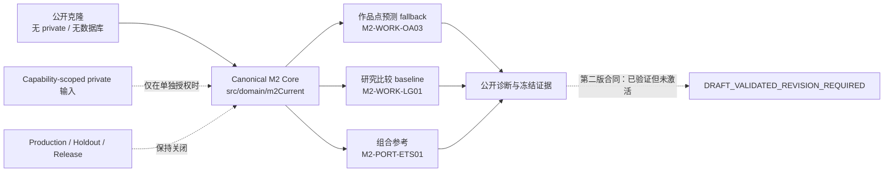

# 有声书产品收入评估与年度目标系统

<div align="center">

**公开可复现的工程底座 · 受控的 M2 分成现金预测研究 · 合成数据驱动的 M3 原型**

[](https://github.com/KAtOReNA7/system/actions/workflows/ci.yml)


</div>

本仓库统一维护 M1 数据基础、M2 旧产品未来分成收入现金预测，以及 M3 新产品合成
原型。公共克隆不需要真实账单、私有工件、provider key 或数据库，即可安装、构建、
测试、运行公共诊断，并启动 formal/fixture 两种 composition。

> 当前不是可发布的自动预测产品。公开工程基线可用，但 M2 候选质量与业务门禁仍未
> 通过；production、final holdout、Canary/full160、provider、共享数据库和 M3
> formal 均保持关闭。

## 项目状态一览

| 范围 | 当前结论 | 用户应如何理解 |
|---|---|---|
| 公共工程 | 可安装、构建、测试和启动 | Linux/Windows 使用同一套无私有数据门禁；以上方 CI 徽章为准 |
| M2 业务门禁 | Canary 失败（`CANARY_FAIL`） | 尚未达到自动化或发布要求 |
| M2 自动化 | 自动化被阻断（`AUTOMATION_BLOCKED`） | 没有模型获准自动化，活动候选为空（`activeCandidate=null`） |
| M2 评价合同第二版 | 已验证、需修订、未激活（`DRAFT_VALIDATED_REVISION_REQUIRED`） | 冻结预测重计分完成，但不能替代现行门禁 |
| M2 最新重计分 | 完成且模型角色不变（`M2_EVALUATION_V2_FROZEN_RESCORE_COMPLETE_NO_MODEL_CHANGE`） | 只读取既有冻结预测，没有训练、调参或生成预测 |
| M3 | 仅合成 fixture/prototype | 不代表真实材料执行或正式发布 |

最新治理入口是 [M2 当前状态索引 v0.28](docs/analysis/m2-v2/M2-v2-current-state-index-v0.28.md)。
模型名称、别名、角色、成绩人口和可比组以
[Model Registry](config/m2-model-registry.v1.json) 为唯一当前机器权威。

## 当前模型与能力边界

| 能力 | 当前角色 | 证据与限制 |
|---|---|---|
| 作品点预测 | 作品发生-金额校准模型 v0.3（Occurrence-Amount Calibration v0.3，`M2-WORK-OA03`）是现行运行回退模型（operational fallback） | 当前人工权威开发人口 WAPE 为 `0.49075894`；未通过绝对质量门槛 |
| 作品研究比较 | 人工锚定可学习全局模型（Human-Anchored Learned Global，`M2-WORK-LG01`）是研究比较基线（research baseline） | 只用于研究比较，不是 production 晋升 |
| 组合预测 | 组合现金 ETS/Holt-Winters（Portfolio ETS/Holt-Winters，`M2-PORT-ETS01`）是组合级参考（portfolio reference） | 组合结果不得分配回作品；不同 horizon 必须分别报告 |
| 排序能力 | 仅有后验诊断（post-hoc diagnostic） | 排序信号不能掩盖点预测失败，也不能直接用于分配 |
| 风险区间 | 存在可复用的冻结开发证据（development evidence） | 缺少合格独立 later-origin，不得接入 production |

不同目标、粒度、人口、horizon、评价窗口或 actual 定义的成绩不能直接排名。更完整的
中文目录见 [M2 模型目录与成绩总账](docs/analysis/m2-current/M2-model-catalog-and-scorecard-v1.md)。



## 五分钟开始

工具链要求：

- Git
- Node 24.x
- npm 11.13.0
- Python 3.11–3.13；CI reference 为 3.13

```bash
git clone https://github.com/KAtOReNA7/system.git
cd system
npm ci
npm run doctor:dev
npm run check:no-real-data
npm run lint
npm run build
npm test
npm run smoke
npm run smoke:portable-start
npm run verify:m2:current
```

上述公共基线不读取 `data/private-input/**`、`data/private-output/**`、`.env`、
`.pgpass`、数据库 dump 或任何 provider/API key。缺少私有工件只会阻断所属
capability，不会阻断公共开发。

## 启动与只读查询

启动 formal composition：

```bash
npm start
```

启动合成 fixture composition 或开发热重载：

```bash
npm run start:fixture
npm run dev
```

formal composition 无数据库时仍可启动并通过 `/health`；数据库业务接口会明确返回
degraded/unavailable，不会静默回落到 fixture。

查询当前模型角色与可比性：

```bash
npm run m2:model -- status
npm run m2:model -- list
npm run m2:model -- show M2-WORK-OA03
npm run m2:model -- aliases exact-v0.3
npm run m2:model -- experiment M2-EXP-CHANNEL-GENERATIVE-02
npm run m2:model -- compare M2-WORK-OA03 M2-WORK-LG01
```

查询命令只读取公开 Model Registry；不会训练模型、读取 private capability 或改变
production。

## M2 预测目标

M2 的正式预测对象是**未来分成收入现金**：

- 买断及其他非分成现金在模型外独立审计，不进入特征、标签、指标、点预测或区间；
- pure-buyout 必须 `null abstain`，禁止用 0、承诺金额或月均等效值代替预测；
- 分成账单是预测实际值的唯一现金来源，总账只用于守恒审计，买断账单只作历史背景；
- 所有开发特征必须证明在 forecast origin 可得，禁止用 current 状态事后回填历史；
- 作品点预测、组合预测、排序/分配和风险区间是不同能力，不共享排行榜。

当前最早可能具备时间独立性的 later-origin 是 2026-01；36 个月标签需完整到
2029-01，并且仍需原始 frozen state。此前不拆月重试、不补造预测、不打开 final
holdout。

## 当前研究结论

- exact v0.3 继续作为作品级现行运行回退；没有活动候选或自动化批准模型。
- TSB occurrence、生命周期和渠道倍率专家的 raw 点预测均已失败；selected
  pipeline 的回退结果不能隐藏 raw candidate。
- 渠道生成实验 v0.2（Channel Generative v0.2，
  `M2-EXP-CHANNEL-GENERATIVE-02`）因合同语义前置条件未满足而阻断
  （`GENERATIVE_V02_CORE_EXECUTION_BLOCKED`），属于未执行，不是执行失败。
- 评价合同第二版冻结重计分复现了第一版 WAPE/bias，并增加误差分布、发生分类、
  排序和区间诊断；它没有改变任何模型角色或失败结论。
- 下一轮模型开发必须等待合格 later-origin，或真实可审计、带
  `effectiveAt/availableAt` 的历史商业状态输入；不能继续同窗调参。

## 文档导航

| 主题 | 当前入口 |
|---|---|
| 当前状态 | [M2 当前状态索引 v0.28](docs/analysis/m2-v2/M2-v2-current-state-index-v0.28.md) |
| 模型权威 | [Model Registry](config/m2-model-registry.v1.json) · [中文模型目录](docs/analysis/m2-current/M2-model-catalog-and-scorecard-v1.md) |
| 评价体系 | [评价体系审计](docs/analysis/m2-current/M2-evaluation-system-audit-v1.md) · [第二版合同提案](docs/analysis/m2-current/M2-evaluation-contract-v2-proposal.md) |
| 冻结重计分 | [工件准备度](docs/analysis/m2-current/M2-evaluation-v2-frozen-artifact-readiness-v1.md) · [公开报告](docs/analysis/m2-current/M2-evaluation-v2-frozen-rescore-v1.md) · [合同验证](docs/analysis/m2-current/M2-evaluation-contract-v2-validation-v1.md) |
| 代码与仓库 | [全库收敛审计](docs/analysis/repository-current-state-and-convergence-audit-v0.1.md) · [协作规则](AGENTS.md) |
| 产品定义 | [M2 Forecast Intelligence v2 PRD](docs/prd/m2-v2/M2-forecast-intelligence-v2-prd-v0.2.md) |

历史 PR、旧分支、B0–B8、C1–C3 和旧状态索引保留在 `docs/analysis/` 中，仅用于审计
追溯，不是当前执行入口。

## 命令生命周期

`config/command-lifecycle.v0.1.json` 将全部 package scripts 分为：

- `current-public`：普通开发和 CI 可使用；
- `archive-only`：只用于历史审计重放，不授予新开发或业务权限；
- `restricted-local`：需要所属 private/local capability 和单独授权；
- `history-dispatcher`：历史命令的统一人工入口。

历史脚本因不可变审计绑定继续保留。人工确需重放时使用：

```bash
npm run history:m2 -- --acknowledge-archive-only <archive-script> [arguments]
```

## 仓库结构

| 路径 | 用途 |
|---|---|
| `src/` | 应用与 domain runtime |
| `src/domain/m2Current/` | 当前 M2 canonical core |
| `scripts/m2-current/` | 当前 M2 查询、诊断和受控执行入口 |
| `test/` | 公共、合同、历史、private-safety 与 E2E 测试 |
| `db/migrations/` | 唯一 forward-only Flyway migrations |
| `config/` | 模型、工具链、能力、测试与命令生命周期合同 |
| `docs/prd/` | 产品需求权威 |
| `docs/analysis/` | 公开脱敏分析和历史审计证据 |

## 安全与贡献

- 禁止提交真实账单、台账、原始材料、private input/output、Excel/CSV、环境文件、
  密钥、连接串或数据库文件。
- 禁止连接未授权的 production、共享或 staging-like 数据库。
- 正式 runtime 不得静默回落到 fixture。
- 不复制历史 runner 创建平行路线；新的 M2 实现扩展 canonical core。
- 不因命名治理改写历史文件、稳定 ID、digest 或冻结结果。
- 提交前运行公共基线，并使用显式路径暂存。

完整协作、授权、验证和 Git 规则见 [AGENTS.md](AGENTS.md)。
