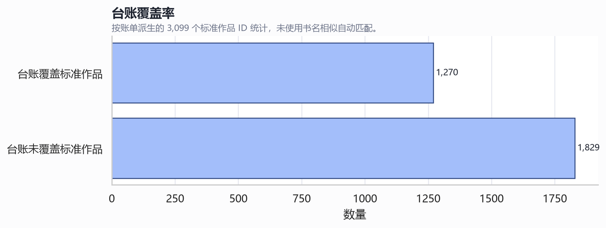
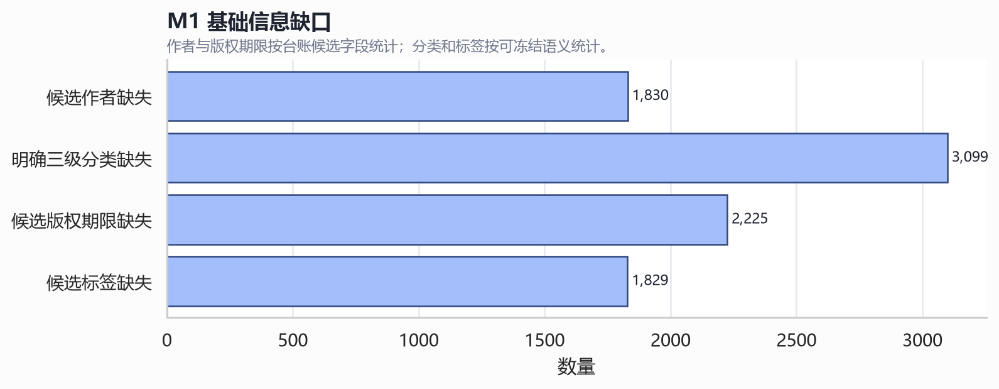
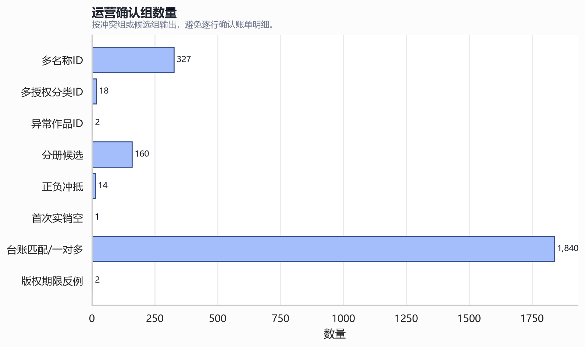

# M1 数字版权台账分析报告

## 技术摘要

- 台账输入：1 个文件、1 个工作表、12033 条记录、65 个字段。
- 账单基线：192899 行，账单最大月份 2026-05；运营确认 2026-05 为不完整月份，最新已确认完整月份为 2026-04。
- 台账覆盖：1270 / 3099 个账单标准作品，覆盖率 40.98%；未使用书名相似自动关联。
- M1 基础信息覆盖：台账可部分提供候选名称、作者、版权开始日期、版权到期日期和候选标签，但不能单独覆盖明确三级分类和标签库语义。
- 首次实销规则已解除 PENDING-DATA：标准作品和业务形态首次实销月份均取首次出现正数实销记录的月份，零值和负值不作为首次实销。
- 金额精度已解除 PENDING-DATA：财务认可 Excel 底层完整精度，权威金额和对账必须使用精确十进制语义；物理类型候选为 `NUMERIC(32,18)`。

## 关键数量

| 指标 | 数值 |
|---|---:|
| 标准作品总数（账单派生） | 3099 |
| 台账覆盖标准作品 | 1270 |
| 台账未覆盖标准作品 | 1829 |
| 候选作者缺失标准作品 | 1830 |
| 明确三级分类缺失标准作品 | 3099 |
| 候选版权期限缺失标准作品 | 2225 |
| 候选标签缺失标准作品 | 1829 |
| 运营确认总组数 | 2364 |

## 图表

## 分项报告

- [01-file-workbook-structure.md](01-file-workbook-structure.md)
- [02-field-domain-and-missingness.md](02-field-domain-and-missingness.md)
- [03-work-id-matching.md](03-work-id-matching.md)
- [04-duplicates-relations.md](04-duplicates-relations.md)
- [05-standard-work-coverage.md](05-standard-work-coverage.md)
- [06-name-differences.md](06-name-differences.md)
- [07-author-alias.md](07-author-alias.md)
- [08-classification-tags.md](08-classification-tags.md)
- [09-copyright-dates.md](09-copyright-dates.md)
- [10-copyright-counterexamples.md](10-copyright-counterexamples.md)
- [11-master-data-quality.md](11-master-data-quality.md)
- [12-unfillable-works.md](12-unfillable-works.md)
- [13-freezable-fields.md](13-freezable-fields.md)
- [14-operation-confirmation.md](14-operation-confirmation.md)

## 结论

数字版权台账不能单独覆盖 M1 基础信息需求。运营已确认台账 `签订日期` 作为版权开始日期、`到期时间` 作为版权到期日期；仍需确认分类树/标签库映射、台账未覆盖标准作品的补全路径，以及正式导入阻断冲突组。
