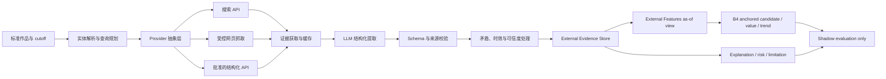

# M2 v2 External Intelligence Layer 研究

## 结论

External Intelligence Layer 技术上可行，并且与当前 M2 的信息缺口匹配，但其价值尚未被现有数据证明。建议先作为独立的、只读的 evidence plane 进入 prospective shadow，而不是直接成为新模型或正式输出依赖。

最关键的约束是 **as-of 可回放性**：今天搜索到的页面不能作为 2020–2022 历史 cutoff 的特征。没有来源自带的历史序列或当时保存的快照，外部信息只能支持当前解释和未来 shadow，不能被用于声称历史回测提升。先积累 evidence snapshots，再做增量模型实验，是比直接训练 C4 更稳妥的路线。

## 假设与适用范围

研究假设：系统自动检索公开、可审计的外部信息，由 LLM 提取结构化事实，再与内部 as-of 数据组合；LLM 不直接预测收入。

本层可以服务：

- 需求变化与趋势信号；
- 作者/IP/原作影响力的结构化上下文；
- 改编、出版、获奖或公开运营事件；
- 证据支持的商业价值评分；
- 风险、limitations 与解释；
- 未来统计模型的 as-of 外生特征。

本层不能：

- 改写 formal-cash target；
- 推测未承诺未来买断；
- 用 LLM 直接输出收入金额；
- 把当前页面内容回填成历史 feature；
- 把无法审计的摘要当作高可信事实；
- 自动生成运营动作。

## research-layer-design



### 1. 实体解析

查询前先建立去标识化内部实体与公开检索实体的受控映射：

- 标准作品；
- 作者或权利主体；
- 原作/音频/改编实体关系；
- 同名、别名、卷册和版本；
- 公开来源允许使用的检索词。

实体消歧必须输出置信度和候选冲突。低置信同名匹配不得生成可训练 feature。

### 2. Query Planner

查询模板按证据类型冻结，例如作者、原作表现、改编事件、榜单、搜索趋势。Planner 只允许使用 cutoff 时可得的实体信息，不得把后来 outcome 写进 query。每次查询记录 template version、query hash、provider、requestedAt 和 cutoff。

### 3. Provider 抽象

不能把架构绑定到单个搜索厂商。Google Custom Search JSON API 已对新客户关闭，并计划于 2027-01-01 停止现有服务；Bing Search API 已于 2025-08-11 退役。因此需要统一接口、provider capability registry、预算、限流和 fallback，而不是把供应商名字写进模型合同。

官方状态：

- [Google Custom Search JSON API overview](https://developers.google.com/custom-search/v1/overview)
- [Bing Search APIs retirement](https://learn.microsoft.com/en-us/lifecycle/announcements/bing-search-api-retirement)

### 4. 获取与缓存

- 优先使用批准的搜索/结构化 API 获取 URL、标题、摘要和时间；
- 只在来源条款允许时抓取必要页面片段；
- 遵守 robots 规则、限流和来源条款；
- 缓存查询结果与规范化证据，避免重复抓取；
- 不在训练仓库存储整页网页、长文本或受版权保护的完整内容。

robots 规则的技术标准见 [RFC 9309](https://www.ietf.org/rfc/rfc9309.html)。robots 允许与否不替代网站条款或版权评审。

### 5. LLM 结构化提取

LLM 只作为 evidence extractor/judge：

- 从已获取来源提取明确字段；
- 给出 source span、事实时间、公开可得时间；
- 标注 unknown、conflict 和 unsupported；
- 生成简短中文解释；
- 不生成收入预测；
- 不把模型常识当作来源事实。

使用带来源返回能力的 web search 可加速研究和检索原型，但正式数据面仍需保存可重放证据与引用。OpenAI Responses API 提供内置 web search 工具，适合受控研究层，而不应成为不透明的唯一生产依赖：[OpenAI API quickstart](https://platform.openai.com/docs/quickstart/make-your-first-api-request)。

### 6. 证据存储合同

建议最小字段：

| 字段 | 含义 |
|---|---|
| evidenceId | 稳定证据 ID |
| workEntityKey | 内部去标识化实体键 |
| evidenceType | search/social/author/original/adaptation/market 等 |
| sourceDomain/sourceUrl | 来源与 URL |
| queryTemplateVersion/queryHash | 可重放查询 |
| observedAt | 系统采集时间 |
| eventAt | 事实发生时间 |
| availableAt | 公开可得时间；as-of 关键字段 |
| shortExcerptHash | 短摘录哈希；避免存整页 |
| contentDigest | 实际用于提取内容的摘要哈希 |
| retrievalMetadata | 状态码、content type、provider 与抓取器版本 |
| sourceLocator | 页内段落、JSON path 或结构化记录定位 |
| restrictedSnapshotRef | 来源许可允许时的最小短摘录或受限快照引用；不得进入公开仓库 |
| structuredFacts | schema-constrained 事实 |
| reliability/freshness/confidence | 质量字段 |
| contradictionStatus | 一致、冲突、未解决 |
| extractionModelVersion | 提取器版本 |
| sourceTermsClass | 来源许可/使用类别 |
| limitations | 缺口与不确定性 |

训练视图必须满足 `availableAt <= cutoff`。缺少 `availableAt` 的证据不得进入历史特征。若来源许可不允许保存最小摘录或受限快照，系统只能承诺“查询与来源可追踪”，不能承诺网页变化后可完整重放原内容；这类证据应降低 reproducibility 等级。

## 数据来源分级

| 优先级 | 来源 | 适用 | 风险/限制 |
|---|---|---|---|
| 1 | 官方或权威结构化 API | 榜单、趋势、公开统计 | 许可、费用、历史窗口 |
| 2 | 官方站点/权威公告 | 改编、出版、获奖、公开事件 | 需要实体解析和时间抽取 |
| 3 | 搜索 API 索引结果 | 发现来源、覆盖扩展 | 供应商变动、摘要非事实终点 |
| 4 | 允许抓取的公开页面 | 补充细节 | 页面变化、反爬、版权与条款 |
| 5 | 社交聚合信号 | 短期热度 | 噪声、刷量、个人信息、接口限制 |
| 禁止 | 无来源 LLM 记忆、非公开信息、不可审计临时经验 | 无 | 不可训练、不可外发 |

## Search API、Chrome、GPT Web 与 Agent 的选择

### 搜索 API：推荐作为主自动入口

优点：结构化、可限流、可缓存、较易记录 query/provider/version。缺点：成本、结果窗口、厂商变更和许可。必须通过 provider abstraction 接入。

### Chrome/浏览器自动化：条件使用

Chrome DevTools Protocol 和 Playwright 可以自动控制网页；Playwright 具备 actionability 与 auto-wait，但这并不能消除页面变更、登录、验证码、反爬或条款风险。参考：

- [Chrome DevTools Protocol Monitor](https://developer.chrome.com/docs/devtools/protocol-monitor)
- [Playwright actionability](https://playwright.dev/docs/actionability)

建议仅用于：

- 搜索 API 不覆盖、且来源明确允许自动访问的少量页面；
- 人工监督的研究与失败诊断；
- 不是大规模生产主链路。

### GPT Web/OpenAI web search：推荐用于研究与二级证据处理

适合查询规划、来源发现、网页摘要和结构化提取。正式 evidence 必须保留引用、时间和 provider metadata，并通过 schema/allowlist 校验；不能只保存 LLM 总结。

### Agent workflow：推荐，但必须有硬边界

Agent 适合把“实体解析 → 查询 → 来源选择 → 提取 → 冲突处理”编排成幂等任务。必须具备：

- 每作品/证据类型预算；
- domain allowlist/denylist；
- 最大查询和页面数；
- 超时、重试和 circuit breaker；
- prompt/model/provider 版本锁；
- 全链路审计日志；
- fail-closed 和 B4 fallback；
- 不执行登录、付费、互动或对外发布。

## 稳定性与更新频率

建议按价值和波动分层，而不是每天全库刷新：

| Cohort | 建议频率 |
|---|---|
| Top10 / 高价值 / 活跃事件 | 每月或事件触发 |
| active / dense | 每季度 |
| ordinary / intermittent | 每季度至半年 |
| long-tail / dormant | 每半年或事件触发 |
| 权威身份与长期事实 | 变更触发 |

若每部作品使用 4 个查询模板，一次全量刷新约为 `3,053 × 4 = 12,212` 次搜索调用，尚未包含页面获取、LLM tokens、重试与存储。成本应以公式治理：

```text
monthlyCost
= queryCalls × providerUnitPrice
+ extractedPages × extractionTokenCost
+ retries
+ storageAndMonitoring
```

在供应商和价格未冻结前，不应承诺固定金额。通过缓存、增量刷新、TopK 优先和早停控制成本。

## 法律、合规与内容风险

本节是工程风险评估，不构成法律意见。正式采用前需专项评审：

- 个人信息：作者、社交账号和用户内容可能涉及个人信息；遵循最小必要、目的限定和保存期限。参考[《个人信息保护法》](https://www.npc.gov.cn/npc/c2/c30834/202108/t20210820_313088.html)。
- 网络数据安全：需要数据分类、访问控制、日志与供应商治理。参考[《网络数据安全管理条例》](https://app.www.gov.cn/govdata/gov/202409/30/520076/article.html)。
- 生成式 AI：面向境内公众提供生成式服务与内部受控研究的责任不同，仍需评估数据与输出边界。参考[《生成式人工智能服务管理暂行办法》](https://www.cac.gov.cn/2023-07/13/c_1690898326795531.htm)。
- AI 内容标识：若未来对外展示 AI 生成内容，需要评估标识要求。参考[《人工智能生成合成内容标识办法》](https://www.cac.gov.cn/2025-03/14/c_1743654684782215.htm)。
- 网站条款、robots、数据库权利和版权：只存必要结构化事实、短摘录哈希和来源引用；不复制整页或建立未授权内容库。

## External Evidence Coverage 评价

至少报告：

- work evidence coverage：至少一种合格证据的作品占比；
- type coverage：作者、原作、搜索、社交、改编、市场等类型覆盖；
- as-of eligible coverage：`availableAt <= cutoff` 的可训练证据覆盖；
- entity resolution success rate；
- authoritative source share；
- fresh evidence share；
- contradiction rate 与 unresolved rate；
- provider failure/fallback rate；
- median query/page/token cost；
- evidence-to-feature conversion rate；
- feature incremental value：相对 B4 的预注册 ablation；
- group fairness/coverage：高价值、普通、长尾、不同收入模式。

不能只以“搜到页面”视为成功；证据必须通过实体、时点、来源和 schema 四道门。

## 分阶段落地与停止门槛

### Phase E0：合同与法律评审

- 冻结 evidence schema、as-of 规则、source policy、删除策略和预算；
- 不抓取全库、不训练。

### Phase E1：小规模 evidence pilot

- 100–200 部分层作品；
- 只测覆盖、消歧、时效、冲突、成本和复现；
- 不改 B4，不输出模型 uplift。

停止条件：来源许可不清、有效覆盖过低、同名误配或成本不可控。

### Phase E2：prospective shadow snapshots

- 按冻结频率自动积累 evidence；
- 与正式产品隔离；
- 记录 future available labels，不打开 final holdout。

### Phase E3：feature ablation

- 只有形成足够 as-of 历史后，预注册 B4 + external residual 候选；
- 比较 internal-only、external-only、combined 和 B4；
- 必须保留 B4 fallback。

### Phase E4：业务验证

- Human-vs-AI 盲测；
- 中文解释与证据抽检；
- 明确批准前仍 `not_for_formal_decision`。

## 最终可行性判断

| 维度 | 判断 |
|---|---|
| 技术可行性 | YES，需 provider abstraction 与 evidence store |
| 当前可直接训练 | NO，缺历史 as-of 外部快照 |
| 自动化 | YES，搜索 API 主、Agent 编排、浏览器例外 |
| 稳定性 | CONDITIONAL，依赖来源、缓存、版本与 fallback |
| 成本 | 可控但未知，需 pilot 实测 |
| 法律风险 | 可治理但需专项审查 |
| 正式发布依赖 | 目前 NO，先 shadow |
