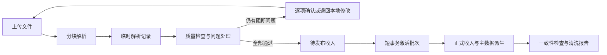

# M1 技术设计草案 v0.1

| 项目 | 内容 |
|---|---|
| 状态 | DRAFT |
| 版本 | v0.1 |
| 日期 | 2026-06-20 |
| 范围 | M1 数据基础逻辑设计 |
| 不包含 | 数据库迁移、应用代码、接口实现、页面设计、未经验证的阈值 |

## 1. 设计目标与边界

本设计将 M1 已冻结的业务语义转换为可实施的逻辑模型、状态机和数据处理流程，不修改 PRD 业务规则。所有对象主键均为内部技术主键，不新增运营可见业务 ID。

本设计遵守以下边界：账单只有七个业务字段，实销金额是唯一金额口径；零值和负值原样保留；正式收入按批次整批可见；原始文件不作为长期资产；未解决的阻断问题不得进入正式数据；标准作品 ID 使用原始财务作品 ID 的数字主体；评估任务状态不写入评估尝试；评估异常不作为正式评估结果状态。

后台任务模型遵守 `REQ-EVAL-001` 的边界：如果未来被评估流程复用，任务仍只承担排队、运行、取消和重试；实际评估调用产生的评估尝试属于 M2/M3 领域，不进入本 M1 数据模型。`REQ-EVAL-002` 至 `REQ-EVAL-004` 同样不在本轮设计范围内。

具体数据库产品、字段物理类型、索引实现、分区策略和迁移脚本留待工程实现阶段决定。本文中的“唯一约束”表示逻辑唯一性要求，不限定具体数据库语法。

对应需求与验收：`REQ-DATA-IMPORT-001` 至 `REQ-DATA-IMPORT-007`、`REQ-DQ-001` 至 `REQ-DQ-003`、`REQ-WORK-001` 至 `REQ-WORK-007`、`REQ-CHANNEL-001`、`REQ-CLASS-001`、`REQ-CLASS-002`、`REQ-PLATFORM-001` 至 `REQ-PLATFORM-003`；`AT-M1-001` 至 `AT-M1-007`、`AT-M1-010` 至 `AT-M1-012`、`AT-M1-020` 至 `AT-M1-024`、`AT-M1-030`、`AT-M1-040`、`AT-M1-041`、`AT-M1-050` 至 `AT-M1-052`。

## 2. 总体逻辑架构

M1 数据处理分为五个逻辑区域：文件接收区、临时解析区、质量检查与处理区、待发布区、正式数据区。

文件接收区保存上传文件及其指纹和元数据。临时解析区按原始行保存七个账单字段、定位信息和解析结果。质量检查区保存问题、规则版本和人工决定。待发布区保存已经通过全部关键校验、但尚未对业务查询可见的候选收入。正式数据区只通过“当前有效批次”暴露收入，并据此生成渠道、标准作品、业务形态和上线时间等派生结果。

正式业务查询必须以有效批次为入口，不允许绕过批次状态直接读取待发布数据。文件内容、解析记录和问题处理记录可以在技术界面中查看，但不能被评估或业务汇总使用。

对应需求与验收：`REQ-DATA-IMPORT-002`、`REQ-DATA-IMPORT-003`、`REQ-DQ-001`、`REQ-PLATFORM-001`；`AT-M1-002`、`AT-M1-003`、`AT-M1-010`、`AT-M1-050`。

## 3. 逻辑数据模型

### 3.1 后台任务 `background_task`

用途：承载上传、解析、校验、正式导入、撤销、报告生成、恢复检查等后台流程。该对象是技术任务，不是评估尝试。

最小字段：

- 技术主键；
- 任务类型；
- 通用任务状态；
- 当前业务阶段；
- 进度值和进度说明；
- 幂等键；
- 父任务技术主键，用于多文件全量任务；
- 重试来源任务技术主键；
- 请求摘要；
- 错误分类、错误代码和安全错误摘要；
- 创建、开始、结束和更新时间；
- 发起者和取消者。

唯一约束：同一任务类型和同一幂等键最多存在一个逻辑执行结果；子任务只能属于一个父任务。

关系：一个多文件任务可包含多个文件处理子任务；一个任务可以关联一个文件、一个批次、一个撤销记录或一个恢复检查记录。

对应需求与验收：`REQ-DATA-IMPORT-002`、`REQ-PLATFORM-001`、`REQ-PLATFORM-002`、`REQ-PLATFORM-003`；`AT-M1-002`、`AT-M1-050`、`AT-M1-051`、`AT-M1-052`。

### 3.2 导入文件 `import_file`

用途：保存一次实际接收文件的身份、来源、处理状态和留存状态。

最小字段：

- 技术主键；
- 所属任务技术主键；
- 原始文件名、文件大小和媒体类型；
- 指纹算法、算法版本和指纹值；
- 存储引用；
- 文件处理状态；
- 文件留存状态；
- 解析器版本；
- 上传时间、删除计划时间、实际删除时间；
- 删除失败错误摘要；
- 原始记录数、原始实销合计和覆盖月份摘要。

唯一约束：指纹算法版本与指纹值组合唯一，用于阻止同一内容重复上传。若未来需要更换指纹算法，必须保留算法版本并执行兼容识别，不能只比较不同算法的摘要文本。

关系：一个文件拥有多条临时解析记录和数据问题；一个成功正式导入的文件最多对应一个有效导入批次。被撤销文件重新导入时，新的上传行为仍应形成新批次；是否允许复用已删除的物理文件内容不能绕过重复上传与重新导入业务流程。

对应需求与验收：`REQ-DATA-IMPORT-002`、`REQ-DATA-IMPORT-005`；`AT-M1-002`、`AT-M1-005`。

### 3.3 临时解析记录 `staged_bill_row`

用途：按原始行保存账单内容、定位信息、规范化结果和导入资格。该对象不是正式收入。

最小字段：

- 技术主键；
- 文件技术主键；
- 工作表或分块定位；
- 原始行号；
- 七个原始业务字段：年月、渠道 ID、文学库渠道名称、授权分类、我方作品 ID、作品名称、实销金额；
- 对应的规范化值；
- 行内容摘要；
- 解析状态；
- 导入资格状态；
- 使用的解析器版本和校验规则版本；
- 创建和更新时间。

唯一约束：同一文件内的工作表定位与原始行号唯一。不得对“年月、渠道、作品、金额相同”的业务组合设置正式唯一约束，因为真实账单中多条相同记录可能是疑似重复，也可能需要人工确认，必须由质量规则处理。

关系：一条临时记录可以关联零到多个数据问题；最终只能被接受进入待发布收入或被确认删除，不能同时处于两种结果。

对应需求与验收：`REQ-DATA-IMPORT-001`、`REQ-DATA-IMPORT-003`、`REQ-DQ-001`、`REQ-DQ-002`；`AT-M1-001`、`AT-M1-003`、`AT-M1-010`、`AT-M1-011`。

### 3.4 数据问题 `data_issue`

用途：表达会影响收入正确性、映射正确性或正式导入资格的问题。

最小字段：

- 技术主键；
- 文件技术主键；
- 可选的临时记录技术主键；
- 问题类型；
- 阻断级别；
- 问题状态；
- 涉及字段和原始值快照；
- 系统判断依据；
- 清洗规则版本；
- 创建和解决时间；
- 当前处理决定技术主键。

唯一约束：同一规则版本对同一文件、同一原始行和同一问题类型只生成一个当前问题，重跑校验不得重复堆积相同问题。

关系：问题可拥有多条处理历史，但最多有一个当前有效处理决定。文件重新上传后，新文件重新生成问题；旧文件问题保留追溯并标记为被后续上传替代，不迁移成新文件的已解决结论。

对应需求与验收：`REQ-DQ-001`、`REQ-DQ-002`、`REQ-DQ-003`；`AT-M1-010`、`AT-M1-011`、`AT-M1-012`。

### 3.5 人工处理决定 `issue_resolution`

用途：保存运营或已验收自动规则对问题作出的处理决定，避免覆盖原问题。

最小字段：

- 技术主键；
- 问题技术主键；
- 决定类型；
- 决定依据和备注；
- 决定者类型与决定者；
- 使用的规则版本；
- 生效状态；
- 创建和撤销时间。

唯一约束：一个问题最多存在一个当前生效决定。自动决定必须引用已启用且已验收的规则版本。

对应需求与验收：`REQ-DATA-IMPORT-004`、`REQ-DQ-001`、`REQ-DQ-002`、`REQ-DQ-003`；`AT-M1-004`、`AT-M1-010`、`AT-M1-011`、`AT-M1-012`。

### 3.6 清洗规则版本 `cleaning_rule_version`

用途：记录重复识别和其他数据质量规则的版本、启用状态和来源，使自动删除和问题生成可追溯。

最小字段：

- 技术主键；
- 稳定规则标识；
- 版本号；
- 状态；
- 规则内容摘要或配置引用；
- 验收依据；
- 启用和停用时间；
- 创建者和批准者。

唯一约束：同一稳定规则标识和版本号唯一；同一规则在同一时间最多存在一个启用版本。

扩展重复模式、自动化阈值和具体配置仍为 `PENDING-DATA`，本设计只提供版本承载能力。

对应需求与验收：`REQ-DQ-002`；`AT-M1-011`。

### 3.7 账单导入批次 `bill_import_batch`

用途：表达一份文件的一次正式导入及其有效性，是正式收入可见性的边界。

最小字段：

- 技术主键；
- 文件技术主键；
- 批次状态；
- 发布幂等键；
- 解析器版本和校验规则版本集合；
- 原始记录数、确认删除记录数、正式记录数；
- 原始实销合计、确认删除金额、正式实销合计；
- 发布时间、撤销时间；
- 发布前恢复点技术主键；
- 撤销记录技术主键；
- 操作者和操作记录摘要。

唯一约束：一个文件最多形成一个成功发布的批次；发布幂等键唯一；金额必须满足严格对账公式；只有有效批次可参与正式查询。

关系：一个批次包含多个覆盖月份和多条正式收入记录。批次撤销后收入记录保留追溯，但不再参与正式收入、数据截止月份和派生主数据计算。

对应需求与验收：`REQ-DATA-IMPORT-002` 至 `REQ-DATA-IMPORT-007`；`AT-M1-002` 至 `AT-M1-007`。

### 3.8 批次覆盖月份 `batch_coverage_month`

用途：精确表示一个批次实际覆盖的月份集合，避免只保存最小月和最大月时掩盖中间缺月。

最小字段：批次技术主键、账单月份。

唯一约束：同一批次和月份组合唯一。全局数据截止月份取所有有效批次覆盖月份的最大值。

对应需求与验收：`REQ-DATA-IMPORT-005`、`REQ-DATA-IMPORT-006`；`AT-M1-005`、`AT-M1-006`。

### 3.9 正式收入记录 `income_record`

用途：保存通过正式批次发布的不可变收入事实。

最小字段：

- 技术主键；
- 批次技术主键；
- 来源临时记录技术主键；
- 年月；
- 原始渠道 ID 和原始渠道名称；
- 授权分类；
- 原始财务作品 ID；
- 原始作品名称；
- 实销金额；
- 统一渠道技术主键；
- 标准作品技术主键；
- 业务形态技术主键；
- 发布创建时间。

唯一约束：同一批次和来源临时记录唯一。不得以业务字段组合去重。实销金额不可被后续直接修改；修正通过撤销批次和新批次重新导入完成。

正式收入记录不单独保存可能与父批次不一致的有效状态。其逻辑状态由批次继承：批次待激活时为待发布，批次有效时为有效，批次已撤销时为已撤销。业务查询只能读取有效批次下的收入。

对应需求与验收：`REQ-DATA-IMPORT-001`、`REQ-DATA-IMPORT-003`、`REQ-DATA-IMPORT-004`、`REQ-DATA-IMPORT-007`、`REQ-DQ-002`；`AT-M1-001`、`AT-M1-003`、`AT-M1-004`、`AT-M1-007`、`AT-M1-011`。

### 3.10 统一渠道 `channel` 与渠道别名 `channel_alias`

统一渠道最小字段：技术主键、稳定内部标识、标准渠道名称、启用状态、创建和更新时间。

渠道别名最小字段：技术主键、统一渠道技术主键、原始渠道 ID、原始渠道名称、可选有效起止月份、确认状态、确认记录、创建和更新时间。

唯一约束：一个处于有效期内的标准化别名键只能指向一个有效统一渠道。别名键具体由渠道 ID、渠道名称还是组合构成，必须根据真实账单分析确认；在确认前不能写死。原始收入始终保留原渠道 ID 和名称，不因别名更新而覆盖。

对应需求与验收：`REQ-CHANNEL-001`；`AT-M1-030`。

### 3.11 标准作品 `standard_work`

最小字段：

- 技术主键；
- 标准作品 ID；
- 标准作品名称；
- 作者技术主键；
- 标准作品上线时间；
- 产品状态；
- 版权开始和到期日期；
- 当前主分类分配技术主键；
- 创建和更新时间；
- 当前信息来源和变更版本。

唯一约束：标准作品 ID 全局唯一，并以规范化数字字符串保存。该字符串是运营业务 ID，不再生成其他运营编号。标准作品上线时间由所有有效正式收入推导，应支持在批次撤销、重新导入或分册映射变化后重算。

对应需求与验收：`REQ-WORK-001`、`REQ-WORK-003`、`REQ-WORK-007`；`AT-M1-020`、`AT-M1-022`。`REQ-WORK-007` 当前没有独立 `AT-M1-*` 映射，见第 11 节追踪缺口。

### 3.12 业务形态 `work_business_form`

最小字段：技术主键、标准作品技术主键、业务形态类型、首次实销月份、创建和更新时间。

唯一约束：同一标准作品和业务形态类型组合唯一。业务形态类型仅为有声版权或有声成品。业务形态不保存独立产品状态和版权期限。首次实销月份根据该形态下所有有效正式收入推导，并在批次变化后重算。

对应需求与验收：`REQ-WORK-002`、`REQ-WORK-003`、`REQ-WORK-004`；`AT-M1-021`、`AT-M1-022`、`AT-M1-023`。

### 3.13 原始财务 ID 映射 `financial_work_id_mapping`

用途：统一承载正常财务 ID 和历史分册隐藏映射，同时明确两者的不同性质。

最小字段：

- 技术主键；
- 规范化原始财务作品 ID；
- 标准作品技术主键；
- 业务形态类型；
- 映射类型，区分常规映射与历史分册映射；
- 映射状态；
- 确认记录；
- 生效和停用时间；
- 创建和更新时间。

唯一约束：一个当前有效的原始财务作品 ID 只能映射到一个标准作品和一种业务形态。正常业务中，同一标准作品的一种业务形态最多有一个常规原始财务 ID；额外 ID 只能作为已确认的历史分册映射存在。历史分册映射不可在运营前台形成独立产品记录。

映射顺序：先规范化原始 ID；若存在有效历史分册映射，则按映射目标归集；否则按数字主体和前缀推导标准作品与业务形态。名称、作者或业务形态出现明显冲突时生成阻断问题，不能静默改写映射。

对应需求与验收：`REQ-WORK-001`、`REQ-WORK-002`、`REQ-WORK-005`、`REQ-WORK-006`；`AT-M1-020`、`AT-M1-021`、`AT-M1-024`。`REQ-WORK-006` 当前没有独立 `AT-M1-*` 映射，见第 11 节追踪缺口。

### 3.14 标准作品状态历史 `work_status_history`

用途：保留已上架、疑似下架、已下架、重新上架的变更轨迹，不覆盖历史确认。

最小字段：技术主键、标准作品技术主键、状态、来源、确认者、依据摘要、生效时间、结束时间、创建时间。

唯一约束：同一标准作品同一时点只能有一个当前有效状态。疑似下架阈值和自动判断条件保持 `PENDING-DATA`，不得在模型或代码中写死。

对应需求与验收：`REQ-WORK-007`。当前无独立 `AT-M1-*` 映射。

### 3.15 作者 `author` 与作者别名 `author_alias`

作者最小字段：技术主键、标准名称、启用状态、创建和更新时间。

作者别名最小字段：技术主键、作者技术主键、别名、来源、确认记录、启用状态。

唯一约束：同一规范化别名在当前有效范围内不能静默指向多个作者；发生歧义时生成主数据问题。作者信息并不包含在当前七字段账单中，需要通过基础信息补充来源建立，不能从作品名称猜测。

对应范围：M1 核心对象和 M1 标准作品主数据要求。当前追踪矩阵没有独立 `REQ-AUTHOR-*` 或 `AT-M1-*`，见第 11 节追踪缺口。

### 3.16 分类体系与作品分类

逻辑对象包括分类体系版本、分类节点、标准作品主分类分配和分类变更记录。

分类体系版本最小字段：技术主键、版本号、状态、启用和停用时间、批准记录。分类节点最小字段：技术主键、版本技术主键、父节点技术主键、层级、名称、来源类型、是否兜底、启用状态。作品分类分配最小字段：技术主键、标准作品技术主键、版本技术主键、三级叶节点技术主键、状态、来源和确认记录。

唯一约束：同一标准作品同一时点只有一条当前有效主分类路径；有效路径必须完整包含一级、二级、三级；出版物和原创网文必须属于不同一级来源树。最终分类树和自动分类规则保持 `PENDING-DATA`。

对应需求与验收：`REQ-CLASS-001`；`AT-M1-040`。

### 3.17 标签库与作品标签

逻辑对象包括标签库版本、标签、标准作品标签分配和标签变更记录。

标签最小字段：技术主键、标签库版本技术主键、标签类型、标签名称、启用状态。作品标签分配最小字段：技术主键、标准作品技术主键、标签技术主键、状态、来源、确认记录和生效时间。

唯一约束：标签类型只能区分辅助内容标签和特殊属性标签；同一作品不能重复分配同一标签；停用标签不能用于新分配，但历史分配仍可追溯。最终标签值和自动生成规则保持 `PENDING-DATA`。

对应需求与验收：`REQ-CLASS-002`；`AT-M1-041`。

### 3.18 恢复点 `recovery_point`

用途：记录关键操作前的可恢复基础设施快照，不代替业务撤销。

最小字段：技术主键、恢复点类型、外部快照引用、创建原因、关联操作类型和技术主键、创建状态、验证状态、创建和验证时间、保留信息、安全错误摘要。

唯一约束：正式导入、撤销、作品归并和批量修正开始前必须关联一个已成功创建的恢复点。恢复点是否可用必须通过验证状态表达，不能只记录“已请求创建”。

对应需求与验收：`REQ-DATA-IMPORT-007`、`REQ-PLATFORM-003`；`AT-M1-007`、`AT-M1-052`。

### 3.19 撤销记录 `batch_reversal`

用途：保存一次批次撤销请求、执行结果和影响范围。

最小字段：技术主键、目标批次技术主键、撤销幂等键、撤销状态、原因、恢复点技术主键、受影响收入数量和金额、受影响标准作品集合摘要、发起和完成时间、操作者、错误摘要。

唯一约束：同一批次只能有一个成功撤销结果；重复提交相同撤销幂等键返回原结果，不再次反转数据。

对应需求与验收：`REQ-DATA-IMPORT-007`、`REQ-PLATFORM-003`；`AT-M1-007`、`AT-M1-052`。

## 4. 状态与转换设计

### 4.1 通用任务状态

通用任务状态采用：待执行、执行中、成功、失败、已取消。业务阶段单独保存，不把“解析中”“等待处理”“正式导入”等阶段混入通用状态。

允许转换：待执行可进入执行中或已取消；执行中可进入成功、失败或已取消；失败后重新执行生成新任务并通过 `retry_of` 关联，不把原失败任务改回执行中；成功和已取消为终态。

取消只影响尚未正式激活的处理中间数据。批次已经有效后，不能通过取消任务删除正式收入，必须执行批次撤销。

对应需求与验收：`REQ-PLATFORM-001`；`AT-M1-050`。

### 4.2 账单文件处理状态

文件处理状态采用：已上传、解析中、校验中、等待问题处理、可正式导入、正式导入中、已正式导入、处理失败、已取消、已被重新上传替代。

主要转换如下：已上传进入解析中；解析成功进入校验中，解析失败进入处理失败；校验发现阻断问题进入等待问题处理；全部问题解决后进入可正式导入；正式导入成功进入已正式导入，失败回到可正式导入或进入处理失败，具体取决于失败是否可重试；退回本地修改后，原文件进入已被重新上传替代，新文件从已上传重新开始完整校验。

文件留存状态独立采用：已保留、待删除、已删除、删除失败。正式导入成功与原始文件删除是两个独立事实；删除失败不回滚已确认的正式数据。

对应需求与验收：`REQ-DATA-IMPORT-003`、`REQ-DATA-IMPORT-005`、`REQ-DQ-003`；`AT-M1-003`、`AT-M1-005`、`AT-M1-012`。

### 4.3 临时解析记录状态

解析状态采用：待解析、解析成功、解析失败。导入资格状态采用：待校验、被问题阻断、可导入、已确认删除、已被新文件替代。

解析成功不等于可导入。只有该行全部阻断问题解决，且处理决定不是确认删除时，才能进入可导入。已确认删除的金额必须进入批次“确认删除金额”，参与严格对账。

对应需求与验收：`REQ-DATA-IMPORT-004`、`REQ-DQ-001`、`REQ-DQ-002`；`AT-M1-004`、`AT-M1-010`、`AT-M1-011`。

### 4.4 数据问题状态

问题状态采用：待处理、自动解决、人工确认保留、人工确认删除、被重新上传替代。

自动解决必须引用已验收规则版本。人工确认保留表示原始记录可以继续进入正式导入；人工确认删除表示原始记录不进入正式收入，但金额必须计入确认删除金额；被重新上传替代表示旧文件问题不再继续处理，但保留历史记录。

具体哪些问题可以自动解决、错误多少时退回整份文件和自动化阈值均保持 `PENDING-DATA`。

对应需求与验收：`REQ-DQ-001`、`REQ-DQ-002`、`REQ-DQ-003`；`AT-M1-010`、`AT-M1-011`、`AT-M1-012`。

### 4.5 正式批次状态

批次状态采用：准备发布、发布中、有效、发布失败、撤销中、已撤销、撤销失败。

只有“有效”批次参与正式收入查询和数据截止月份计算。准备发布和发布中的候选收入不可见。发布失败不能留下有效收入。有效批次只能进入撤销中；撤销成功进入已撤销，撤销失败恢复为有效并记录异常，不能形成一半撤销状态。

对应需求与验收：`REQ-DATA-IMPORT-003`、`REQ-DATA-IMPORT-006`、`REQ-DATA-IMPORT-007`；`AT-M1-003`、`AT-M1-006`、`AT-M1-007`。

### 4.6 正式收入逻辑状态

收入记录不维护独立可变状态，其逻辑状态继承父批次：待发布、有效或已撤销。这样可以避免批次状态与数百万收入行状态不一致，也避免撤销时逐行更新状态。

对应需求与验收：`REQ-DATA-IMPORT-003`、`REQ-DATA-IMPORT-007`；`AT-M1-003`、`AT-M1-007`。

## 5. 导入业务原子性方案比较

### 5.1 路线 A：分块暂存、候选收入预写入、批次短事务激活

流程为：文件分块进入临时解析区；完成质量检查和处理决定；生成待发布收入和待应用的主数据映射；执行严格对账；创建恢复点；使用幂等键启动发布；分块写入与“准备发布”批次关联的收入候选；完成后在一个短事务内再次校验计数和金额、应用有限的主数据关系变更并将批次切换为有效；提交后触发派生字段重算和一致性检查。

正式查询统一要求批次状态为有效。因此即使候选收入已经物理写入正式收入存储，在批次激活前也不对业务可见。发布失败时可以清理未激活候选，也可以保留到技术保留期后清理，但不能参与正式汇总。

优点是数据库无关性较强，不需要大型长事务，容易实现严格对账、幂等、审计和撤销，也能直接满足多文件任务下每个文件形成独立批次的规则。缺点是所有正式查询必须正确执行有效批次过滤，并且需要防止开发绕过正式查询入口。

### 5.2 路线 B：数据库分区装载与分区挂接或表交换

流程为：每个批次在独立暂存分区完成装载和校验；发布时通过数据库支持的分区挂接、表交换或等价元数据操作将整个批次加入正式收入集合；撤销时摘除对应分区。

优点是大批量发布和撤销速度快，物理隔离清晰，正式查询不容易看到半批数据。缺点是强依赖具体数据库能力，分区键和全局唯一约束设计复杂，批次数量长期增长后需要额外运维，主数据变更仍然需要独立处理，也增加备份恢复和迁移难度。

### 5.3 路线 C：不可变导入事件与正式投影

流程为：解析和确认结果写入不可变事件账本；批次发布事件提交后，异步构建正式收入和主数据投影；业务读取具有已完成版本标记的投影。

优点是审计和重放能力强，撤销可以通过反向事件表达。缺点是 M1 工程复杂度最高，需要解决投影延迟、幂等重放、投影版本切换和最终一致性，不符合当前以稳定数据底座为优先的阶段目标。

### 5.4 推荐方案

推荐路线 A。它直接对应 ADR-0005 的业务原子性要求，在不绑定数据库高级特性的前提下，可以通过批次状态形成清晰的可见性边界。路线 B 可在未来真实账单规模证明路线 A 的发布或撤销性能不足时作为数据库特定优化，但不应在缺少真实规模数据时提前引入。路线 C 不建议用于 M1 首版。

路线 A 必须满足四个工程不变量：业务查询只能读取有效批次；收入记录不可直接修改；批次激活前必须完成严格对账；批次状态切换和发布幂等记录必须处于同一短事务。

对应需求与验收：`REQ-DATA-IMPORT-003`、`REQ-DATA-IMPORT-004`、`REQ-DATA-IMPORT-007`、`REQ-PLATFORM-003`；`AT-M1-003`、`AT-M1-004`、`AT-M1-007`、`AT-M1-052`。

## 6. 撤销、重新导入、恢复点与幂等

### 6.1 批次撤销

撤销开始前创建并验证恢复点。系统锁定目标批次的撤销操作，计算该批次收入、月份、渠道、标准作品和业务形态影响集合，保存撤销记录，并在短事务内将批次从有效切换为已撤销。正式查询立即排除该批次，随后基于剩余有效批次重算数据截止月份、标准作品上线时间、业务形态首次实销月份和收入汇总。

撤销只取消该批次贡献。标准作品、渠道或映射等共享主数据不因一个批次撤销而直接物理删除。由批次自动创建且不再被任何有效批次、人工补全或其他业务记录引用的对象，可以进入后续清理候选，但不能在撤销事务中无条件删除。

撤销完成后生成受影响标准作品集合，供评估失效和自动重评流程消费。M1 负责可靠生成影响事件或记录，不在本设计中实现后续评估业务。

对应需求与验收：`REQ-DATA-IMPORT-006`、`REQ-DATA-IMPORT-007`、`REQ-WORK-003`、`REQ-WORK-004`、`REQ-PLATFORM-003`；`AT-M1-006`、`AT-M1-007`、`AT-M1-022`、`AT-M1-023`、`AT-M1-052`。

### 6.2 重新导入

被撤销文件修正后重新上传，必须重新计算指纹、完整解析并重新校验。重新导入形成新批次，不复用旧批次技术主键和状态。新批次可以通过“替代批次”引用旧批次用于追溯，但该引用不代表自动继承旧问题处理决定。

若上传内容与历史文件完全相同，文件指纹规则会识别重复。对“被撤销但内容完全相同的文件是否允许通过明确的重新导入操作再次提交”，当前 PRD 未给出独立规则，技术实现前需要确认。不能通过关闭全局指纹检查来解决。

对应需求与验收：`REQ-DATA-IMPORT-002`、`REQ-DATA-IMPORT-007`、`REQ-DQ-003`；`AT-M1-002`、`AT-M1-007`、`AT-M1-012`。

### 6.3 恢复点与灾难恢复

恢复点是数据库或数据存储的可恢复快照引用，负责处理操作失败、基础设施故障或数据损坏；批次撤销是日常业务操作。两者不能互相替代。

系统恢复后执行五类检查：批次状态与收入可见性、批次计数和金额、原始 ID 映射、渠道映射、标准作品和业务形态关联。恢复时读取任务幂等记录：已成功任务保持完成；有运行租约但未完成的任务标记中断并由规则决定重新排队；尚未开始的任务可以重新执行。任何恢复流程不得重复发布批次或重复发出完成通知。

对应需求与验收：`REQ-PLATFORM-003`；`AT-M1-052`。

### 6.4 幂等键设计

上传幂等键由指纹算法版本和文件指纹构成。发布幂等键由文件技术主键和一次明确发布请求标识构成。撤销幂等键由目标批次和一次明确撤销请求标识构成。临时解析行以文件、工作表定位和原始行号唯一。正式收入以批次和来源临时记录唯一。通知和后续影响事件以事件类型、批次和目标对象组合去重。

幂等重试必须返回原有执行结果或继续未完成执行，不能创建第二个有效批次、第二组正式收入或第二次撤销结果。

对应需求与验收：`REQ-DATA-IMPORT-002`、`REQ-DATA-IMPORT-003`、`REQ-DATA-IMPORT-007`、`REQ-PLATFORM-003`；`AT-M1-002`、`AT-M1-003`、`AT-M1-007`、`AT-M1-052`。

## 7. ID、业务形态、上线时间和映射约束

### 7.1 原始财务作品 ID 解析

解析结果必须同时保留原始文本和规范化文本。纯数字规范化 ID 映射为有声版权，`Y+数字主体` 映射为有声成品，标准作品 ID 为数字主体。物理存储应使用字符串语义，避免电子表格或数据库数值转换造成前导零、科学计数法或超长数字精度损失。

空格、大小写、前导零、全角字符、科学计数法和其他异常形式如何规范化必须先查看真实账单，再形成版本化规则。未确认前应作为问题处理，不能静默修正。

对应需求与验收：`REQ-WORK-001`、`REQ-WORK-002`；`AT-M1-020`、`AT-M1-021`。

### 7.2 常规映射与历史分册映射

默认情况下，规范化原始 ID 的数字主体决定标准作品，前缀决定业务形态。历史分册归并是显式例外：运营确认后，额外原始 ID 通过隐藏映射指向主标准作品。隐藏映射优先于默认数字主体推导。

同一原始 ID 不能同时指向多个标准作品。一个标准作品的一种业务形态只能拥有一个常规原始财务 ID，其他 ID 必须标记为历史分册映射并保留确认依据。

对应需求与验收：`REQ-WORK-005`、`REQ-WORK-006`；`AT-M1-024`。`REQ-WORK-006` 缺少独立验收编号。

### 7.3 上线时间

业务形态首次实销月份取该形态所有有效收入中的最早月份。标准作品上线时间取该标准作品全部业务形态首次实销月份中的最早值。两个字段均是有效正式收入的派生结果，撤销、重新导入和分册映射变化后必须重算。

后来新增另一业务形态，只更新该形态首次实销月份和收入结构，不改变已经由更早收入确定的标准作品上线时间，也不再次标记为新品。

对应需求与验收：`REQ-WORK-003`、`REQ-WORK-004`；`AT-M1-022`、`AT-M1-023`。

### 7.4 渠道别名

正式收入同时保存原始渠道 ID、原始渠道名称和统一渠道引用。别名变化只改变统一汇总关系，不覆盖历史原始值。一个有效别名不能映射到多个统一渠道；无法唯一判断时生成阻断问题。

渠道 ID 与名称的组合关系、名称标准化方式和有效时间范围能否从账单确认，必须通过真实账单分析决定。

对应需求与验收：`REQ-CHANNEL-001`；`AT-M1-030`。

## 8. 严格对账与一致性不变量

每个批次必须满足：原始账单实销合计减去已确认删除金额，等于正式导入实销合计。三项金额都使用相同精度和同一求和语义。零值和负值参与计算，不得过滤。

还必须满足以下不变量：有效批次的正式记录数等于其可导入临时记录数；每条正式收入可追溯到唯一来源行；每条正式收入具有唯一统一渠道、标准作品和业务形态映射；一个原始财务 ID 只有一个当前有效映射；标准作品上线时间和业务形态首次实销月份等于有效收入推导结果；数据截止月份等于有效批次覆盖月份最大值；已撤销批次不参与任何正式汇总。

发布前执行批次级校验，发布后执行同样的不变量检查。发布后检查失败属于严重技术异常，应阻断后续评估并触发恢复或撤销处理，不允许人工改金额凑平。

对应需求与验收：`REQ-DATA-IMPORT-004`、`REQ-DATA-IMPORT-006`、`REQ-CHANNEL-001`、`REQ-WORK-001` 至 `REQ-WORK-006`、`REQ-PLATFORM-003`；`AT-M1-004`、`AT-M1-006`、`AT-M1-020` 至 `AT-M1-024`、`AT-M1-030`、`AT-M1-052`。

## 9. 安全、文件留存与审计

正式环境到测试环境只允许单向复制。复制和销毁必须记录，测试环境不得使用正式凭证、正式邮件通道或正式任务队列，也不得回写正式环境。访问范围不得高于正式环境授权范围。

原始文件在正式导入并完成必要留存流程后进入删除流程。文件名、指纹、覆盖月份、记录数、实销合计、清洗报告、导入状态和操作记录长期保留。文件删除失败记录技术异常，但不改变已经确认的批次金额和有效性。

审计记录至少覆盖上传、逐项处理决定、规则自动处理、正式发布、撤销、重新导入、渠道和作品映射确认、分类标签修改、恢复点创建和恢复执行。具体审计保留期限需结合真实数据规模和合规要求确定。

对应需求与验收：`REQ-DATA-IMPORT-005`、`REQ-DATA-IMPORT-007`、`REQ-PLATFORM-003`；`AT-M1-005`、`AT-M1-007`、`AT-M1-052`。

## 10. 需求与设计映射摘要

| 设计主题 | 需求 | 验收 |
|---|---|---|
| 七字段与唯一金额口径 | REQ-DATA-IMPORT-001 | AT-M1-001 |
| 文件指纹、文件与批次 | REQ-DATA-IMPORT-002 | AT-M1-002 |
| 暂存、发布与批次可见性 | REQ-DATA-IMPORT-003 | AT-M1-003 |
| 批次金额不变量 | REQ-DATA-IMPORT-004 | AT-M1-004 |
| 文件元数据和删除状态 | REQ-DATA-IMPORT-005 | AT-M1-005 |
| 覆盖月份与截止月份 | REQ-DATA-IMPORT-006 | AT-M1-006 |
| 撤销、重导和幂等 | REQ-DATA-IMPORT-007 | AT-M1-007 |
| 问题与发布阻断 | REQ-DQ-001 | AT-M1-010 |
| 重复、冲抵和规则版本 | REQ-DQ-002 | AT-M1-011 |
| 新文件完整重跑 | REQ-DQ-003 | AT-M1-012 |
| 标准作品 ID 与映射 | REQ-WORK-001 | AT-M1-020 |
| 业务形态 | REQ-WORK-002 | AT-M1-021 |
| 标准作品上线时间 | REQ-WORK-003 | AT-M1-022 |
| 形态首次实销月份 | REQ-WORK-004 | AT-M1-023 |
| 分册隐藏映射 | REQ-WORK-005 | AT-M1-024 |
| 常规 ID 唯一性 | REQ-WORK-006 | 当前缺少独立 AT-M1 映射 |
| 标准作品状态 | REQ-WORK-007 | 当前缺少独立 AT-M1 映射 |
| 统一渠道与别名 | REQ-CHANNEL-001 | AT-M1-030 |
| 分类路径和版本 | REQ-CLASS-001 | AT-M1-040 |
| 标签类型和版本 | REQ-CLASS-002 | AT-M1-041 |
| 任务状态与业务阶段 | REQ-PLATFORM-001 | AT-M1-050 |
| 后台任务与评估尝试的边界 | REQ-EVAL-001 | 非 M1 验收范围；本设计仅保持边界 |
| AI 不降级 | REQ-PLATFORM-002 | AT-M1-051 |
| 恢复点、恢复与幂等检查 | REQ-PLATFORM-003 | AT-M1-052 |

## 11. 当前追踪与需求缺口

本节只记录缺口，不在本技术设计中修改 PRD。

第一，`REQ-WORK-006` 和 `REQ-WORK-007` 已在权威 M1 文档中冻结，但没有进入 `00-governance/traceability.md`，也没有独立的 `AT-M1-*` 验收用例。进入实现前应补充其验收映射，分别覆盖“一种业务形态一个常规原始 ID”和“标准作品四种状态及业务形态不单独保存状态”。

第二，作者和作者别名被列为 M1 核心对象，但当前没有稳定 `REQ-AUTHOR-*` 需求和 M1 验收编号。需要确认它们在 M1 的最低字段、唯一性、补全来源和验收范围。

第三，基础信息中的标准作品名称、作者、版权开始日期和版权到期日期目前没有独立稳定需求编号。特别是“两种业务形态共享版权期限”的反例阻断要求没有对应验收用例。

第四，`REQ-DATA-IMPORT-002` 要求阻止同一文件重复上传，`REQ-DATA-IMPORT-007` 又允许被撤销文件重新导入为新批次。若重新导入内容与被撤销文件完全相同，是否需要一个受控的显式例外尚未定义。

第五，渠道别名最小字段包含有效时间范围，但真实账单是否足以确定有效期尚不明确。无法确认时应允许为空并阻断有歧义的多目标映射，不能推测日期。

## 12. 只有真实数据分析后才能完成的设计项

以下内容只预留配置、版本和验证位置，不在 v0.1 中确定具体值：

- 完整重复与异常模式；
- 相同业务字段多行记录的合法与重复判别特征；
- 错误过多时整份退回的规则；
- 规则自动化阈值；
- 文件格式、工作表结构、文件大小、记录数和性能目标；
- 任务并发数、重试次数和普通任务记录保留期限；
- 渠道 ID 与名称的稳定对应关系、别名规范化键和有效时间；
- 原始财务作品 ID 的异常格式和规范化规则；
- 历史分册识别特征及冲突分布；
- 两种业务形态共享版权期限是否存在真实反例；
- 最终分类树、标签库和自动生成规则；
- 疑似下架、基本无收入和收入归零阈值。

详细分析步骤见《真实账单分析清单》。

## 13. 进入实现前的技术冻结条件

开始数据库物理设计和应用编码前，至少需要完成以下事项：确认第 11 节追踪缺口的处理方式；完成真实账单文件结构和 ID 格式分析；确认金额物理精度；确认渠道别名键；确认重复文件与撤销后同内容重导的关系；确认分类、标签和版权期限补充数据来源；用接近全量数据验证推荐原子导入路线的容量和发布时间；将最终决定写入权威需求或 ADR，并补齐对应验收用例。
