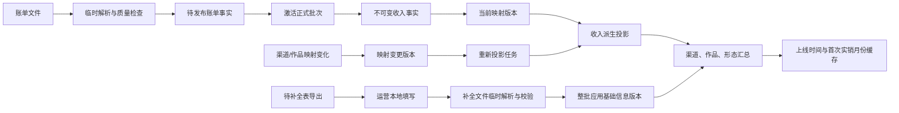

# M1 技术设计草案 v0.2

> 后续增量：真实账单与数字版权台账分析后的已确认规则，见 `M1-技术设计草案-v0.3.md`。v0.3 覆盖本文件中关于数据截止月份、首次实销金额符号、金额精度候选、台账覆盖缺口和物理设计进入条件的对应内容。

| 项目 | 内容 |
|---|---|
| 状态 | APPROVED FOR DATA ANALYSIS |
| 版本 | v0.2 |
| 日期 | 2026-06-20 |
| 基线 | `M1-技术设计草案-v0.1.md`、当前 v0.2 PRD、ADR-0001 至 ADR-0005 |
| 不包含 | 应用代码、数据库迁移、接口、页面、未经真实数据验证的阈值 |
| 物理数据库设计 | NOT APPROVED；等待真实账单分析完成并满足第 15 节冻结条件 |

## 1. 本次增量修订范围

v0.2 保留 v0.1 的分块处理、业务原子性、批次撤销、恢复点和幂等设计，并完成以下增量修订：

1. 增加标准作品基础信息补全的完整流程、逻辑对象、状态和失败恢复机制。
2. 补齐 `REQ-WORK-006`、`REQ-WORK-007` 及标准作品基础信息、补全表、作者、作者别名、共享版权期限反例阻断的 REQ/AT 映射。
3. 将正式收入拆分为不可变账单事实和可版本化派生投影，支持渠道别名、原始作品 ID 映射及分册归并变化后的整批重新投影。
4. 明确相同指纹文件仅能从已撤销批次发起受控重新导入。
5. 首次实销金额符号规则在 v0.2 阶段为 `PENDING-DATA`；已由 v0.3 基于运营确认更新为“仅正数实销决定首次实销月份”。
6. 明确每项事实的权威来源、缓存字段及重算触发条件，消除多个对象同时维护同一权威事实的风险。
7. 更新进入物理数据库设计前必须完成的真实数据分析条件。

本设计不新增运营可见业务 ID，不恢复已删除的两个非统计金额字段，不修改评估状态体系，不新增业务阈值。

## 2. 设计原则

### 2.1 不可变事实与可变解释分离

正式账单事实只保存七个业务字段、来源批次和来源行定位，发布后不可直接修改。统一渠道、标准作品和业务形态属于对原始事实的受控解释，保存为带版本的派生投影，可以因映射规则变化重新构建。

### 2.2 单一权威来源

同一业务事实只能有一个权威来源。临时记录在发布前是处理依据；正式发布后，正式收入事实成为账单权威。标准作品当前基础信息来自当前有效基础信息版本。上线时间和业务形态首次实销月份来自有效收入事实与当前有效投影的计算结果。

### 2.3 整批可见与整批回滚

账单发布、基础信息应用和派生关系重新投影都必须使用版本或批次状态作为可见性边界。外部只能看到上一个完整有效版本或新完整有效版本，不能看到处理中间状态。

### 2.4 技术任务与业务结果分离

后台任务只承担待执行、执行中、成功、失败和已取消等技术流程。评估任务状态不写入评估尝试，评估异常也不成为正式评估结果状态。M1 只提供可复用任务基础能力。

### 2.5 待数据项不固化

所有标记为 `PENDING-DATA` 的格式、阈值、精度、归一化规则和判断条件只预留配置与版本位置，不进入硬编码约束。

## 3. 总体逻辑数据流

## 4. 逻辑数据模型

### 4.1 后台任务 `background_task`

保存技术主键、任务类型、通用状态、业务阶段、进度、幂等键、父任务、重试来源、输入摘要、错误分类和时间信息。任务类型至少覆盖账单解析、账单发布、撤销、受控重新导入、基础信息导出、基础信息校验、基础信息应用、映射重新投影和恢复检查。

同一任务类型与幂等键只能产生一个逻辑结果。失败后重试建立新任务并引用原任务，不把失败任务改回执行中。

映射：`REQ-PLATFORM-001`、`REQ-PLATFORM-003`；`AT-M1-050`、`AT-M1-052`。

### 4.2 文件指纹登记与导入文件

`file_fingerprint_registry` 保存唯一内容身份，包括指纹算法、算法版本、指纹值和首次发现时间；算法版本与指纹值组合唯一。`import_file` 保存一次处理上下文，包括技术主键、指纹登记引用、所属任务、原始文件名、文件大小、媒体类型、临时存储引用、处理状态、留存状态、解析器版本、上传时间、删除时间、删除失败记录和受控重导来源批次。

普通上传入口发现已有指纹登记时阻止创建新的处理上下文。受控重新导入在验证来源批次已撤销后，可以创建新的 `import_file` 并引用同一指纹登记；因此不会为了允许重导而破坏文件内容身份的唯一性。原始物理文件已删除时，运营仍需通过受控入口重新提供文件内容，系统重新验证其指纹。

映射：`REQ-DATA-IMPORT-002`、`REQ-DATA-IMPORT-005`、`REQ-DATA-IMPORT-007`；`AT-M1-002`、`AT-M1-005`、`AT-M1-007`。

### 4.3 临时账单记录 `staged_bill_row`

保存文件、工作表或分块位置、原始行号、七个原始字段、规范化候选值、解析状态、导入资格状态、解析器版本和校验规则版本。它只用于当前文件处理，不是正式收入权威来源。

同一文件、工作表定位和原始行号唯一。不得对年月、渠道、作品和金额组合建立业务唯一约束，因为相同行可能需要规则和人工决定。

发布后，临时记录只承担来源追踪，可按技术保留规则清理；正式收入事实不能再依赖临时记录仍然存在才能读取。

映射：`REQ-DATA-IMPORT-001`、`REQ-DATA-IMPORT-003`、`REQ-DQ-001`、`REQ-DQ-002`；`AT-M1-001`、`AT-M1-003`、`AT-M1-010`、`AT-M1-011`。

### 4.4 数据问题与处理决定

`data_issue` 保存问题类型、文件与来源行定位、字段和值快照、阻断级别、判断依据、规则版本、状态和解决时间。`issue_resolution` 保存处理决定、依据、决定者、规则版本和生效状态。原问题和决定历史不可覆盖。

同一规则版本对同一文件、来源行和问题类型只生成一个当前问题。一个问题最多有一个当前生效决定。受控重新导入形成新的文件处理上下文，重新生成问题，不继承旧问题处理决定。

映射：`REQ-DQ-001` 至 `REQ-DQ-003`、`REQ-DATA-IMPORT-007`；`AT-M1-010` 至 `AT-M1-012`、`AT-M1-007`。

### 4.5 清洗规则版本 `cleaning_rule_version`

保存稳定规则标识、版本号、状态、配置引用、验收依据、启停时间和批准信息。同一规则同一时间最多一个启用版本。扩展重复模式和自动化阈值保持 `PENDING-DATA`。

映射：`REQ-DQ-002`；`AT-M1-011`。

### 4.6 账单导入批次 `bill_import_batch`

保存文件引用、批次状态、发布幂等键、解析和校验版本、原始记录数、确认删除数、正式记录数、原始实销合计、确认删除金额、正式实销合计校验快照、发布时间、撤销时间、恢复点和前序批次引用。离散覆盖月份只保存在 `batch_coverage_month`；批次对象如缓存最小月和最大月，必须明确为可重算摘要。

原始实销合计和确认删除金额是发布时输入与处理决定的不可变审计快照。正式业务收入的金额权威是该有效批次下 `income_fact` 的求和；批次正式实销合计只保存发布时校验快照，并在一致性检查中与事实求和持续比对，不能作为另一套可独立修改的收入数据。

一个普通文件最多形成一个有效批次。受控重新导入形成新批次，并通过 `predecessor_reversed_batch_id` 引用已撤销旧批次。该引用只用于追溯，不继承旧批次状态或问题决定。

映射：`REQ-DATA-IMPORT-002` 至 `REQ-DATA-IMPORT-007`；`AT-M1-002` 至 `AT-M1-007`。

### 4.7 批次覆盖月份 `batch_coverage_month`

以批次和月份组合保存离散覆盖月份。数据截止月份只从当前有效批次覆盖月份取最大值，已撤销批次不参与。

映射：`REQ-DATA-IMPORT-005`、`REQ-DATA-IMPORT-006`；`AT-M1-005`、`AT-M1-006`。

### 4.8 不可变正式收入事实 `income_fact`

保存技术主键、有效批次引用、来源文件与来源行定位，以及年月、原始渠道 ID、文学库渠道名称、授权分类、原始财务作品 ID、原始作品名称和实销金额七个业务字段。

正式收入事实不保存可被映射变化改写的统一渠道、标准作品或业务形态引用。它也不保存独立有效状态，其可见性继承父批次。发布后不得直接更新七字段和实销金额；修正只能通过撤销批次和新批次导入。

同一批次与来源行定位唯一。业务字段相同的多行仍分别保存，不通过数据库唯一约束自动删除。

映射：`REQ-DATA-IMPORT-001`、`REQ-DATA-IMPORT-003`、`REQ-DATA-IMPORT-004`、`REQ-DATA-IMPORT-007`、`REQ-DQ-002`；`AT-M1-001`、`AT-M1-003`、`AT-M1-004`、`AT-M1-007`、`AT-M1-011`。

### 4.9 映射版本 `mapping_release`

保存一次完整可用映射集合的版本号、状态、父版本、变更原因、变更类型、创建者、批准者、生效时间和回滚时间。变更类型至少区分渠道别名、原始作品 ID 映射和分册归并。

映射版本是收入派生关系的解释版本，不修改收入事实。每次变更必须保存差异项、影响范围和对应任务。

映射：`REQ-CHANNEL-001`、`REQ-WORK-005`、`REQ-WORK-006`、`REQ-PLATFORM-003`；`AT-M1-024`、`AT-M1-025`、`AT-M1-030`、`AT-M1-052`。

### 4.10 收入派生投影 `income_projection`

保存收入事实、映射版本、统一渠道、标准作品、业务形态、投影状态和生成任务。一个收入事实在同一映射版本下只能有一个投影结果。

业务读取使用当前有效 `mapping_release` 下的完整投影。构建中的新版本不可见。投影版本激活时通过短事务切换当前版本指针，不逐行修改收入事实。

映射：`REQ-CHANNEL-001`、`REQ-WORK-001`、`REQ-WORK-002`、`REQ-WORK-005`、`REQ-WORK-006`、`REQ-DATA-IMPORT-003`；`AT-M1-003`、`AT-M1-020`、`AT-M1-021`、`AT-M1-024`、`AT-M1-025`、`AT-M1-030`。

### 4.11 统一渠道与渠道别名

`channel` 保存统一渠道技术主键、稳定内部标识、标准名称和启用状态。`channel_alias` 保存映射版本、原始渠道 ID、原始渠道名称、可确认时的有效时间范围、统一渠道、确认状态和变更记录。

同一有效映射版本中，一个规范化别名键只能指向一个统一渠道。别名键的具体组成和规范化规则必须通过真实账单分析确认。

映射：`REQ-CHANNEL-001`；`AT-M1-030`。

### 4.12 标准作品 `standard_work`

只保存技术主键、唯一标准作品 ID、创建信息及必要派生缓存引用。标准作品 ID 使用规范化数字字符串，不新增运营业务编号。

标准作品名称、作者、主分类和版权期限不直接重复保存为第二套可独立修改字段，而由当前有效 `work_master_data_version` 提供。标准作品上线时间可以缓存，但权威来源是有效收入事实与当前收入投影。

映射：`REQ-WORK-001`、`REQ-WORK-003`、`REQ-WORK-008`；`AT-M1-020`、`AT-M1-022`、`AT-M1-027`。

### 4.13 业务形态 `work_business_form`

保存标准作品、业务形态类型和首次实销月份缓存。同一标准作品和业务形态类型唯一。业务形态不拥有独立状态或版权期限。

首次实销月份缓存的权威来源是有效收入事实、当前收入投影和规则版本。v0.3 已确认零金额和负金额不作为首次实销，首次实销月份只取首次出现正数实销记录的月份。

映射：`REQ-WORK-002` 至 `REQ-WORK-004`、`REQ-WORK-007`、`REQ-WORK-011`；`AT-M1-021` 至 `AT-M1-023`、`AT-M1-026`、`AT-M1-031`。

### 4.14 原始作品 ID 映射与分册隐藏映射

`financial_work_id_mapping` 保存映射版本、规范化原始财务作品 ID、标准作品、业务形态、映射类型、状态和确认记录。映射类型区分常规映射和历史分册映射。

同一映射版本中，一个原始财务作品 ID 只能指向一个标准作品和一种业务形态。同一标准作品的一种业务形态最多一个常规原始 ID；额外 ID 只能作为已确认历史分册隐藏映射。

映射：`REQ-WORK-001`、`REQ-WORK-002`、`REQ-WORK-005`、`REQ-WORK-006`；`AT-M1-020`、`AT-M1-021`、`AT-M1-024`、`AT-M1-025`。

### 4.15 标准作品状态历史 `work_status_history`

保存标准作品、状态、依据、来源、确认者和生效区间。状态只允许已上架、疑似下架、已下架、重新上架。同一标准作品同一时点只有一个当前状态。业务形态不保存独立状态。

如为查询性能在 `standard_work` 缓存当前状态，该字段只作为缓存，必须保存来源状态记录和同步版本；状态历史才是权威来源。

映射：`REQ-WORK-007`；`AT-M1-026`。

### 4.16 标准作品基础信息版本 `work_master_data_version`

保存标准作品、版本号、标准作品名称、作者、主分类分配引用、版权开始日期、版权到期日期、来源应用批次、生效状态、生效时间和替代版本。

同一标准作品同一时点只有一个当前有效基础信息版本。一级和二级分类不在该对象重复保存，依据三级叶节点及分类体系版本推导。标准作品 ID、上线时间和业务形态首次实销月份不属于补全字段，不能由补全文件修改。

映射：`REQ-WORK-008`、`REQ-WORK-011`、`REQ-CLASS-001`；`AT-M1-027`、`AT-M1-031`、`AT-M1-040`。

### 4.17 作者与作者别名

`author` 保存技术主键、标准名称、状态和变更信息。`author_alias` 保存作者、规范化别名、原始别名、来源、确认记录和有效状态。

同一当前有效规范化别名不能静默指向多个作者。同名作者或歧义别名产生阻断问题，不仅凭名称自动归并。标准作品基础信息引用作者对象，不重复保存可独立修改的作者文本作为第二权威来源；导入文件中的作者文本只作为输入快照和匹配依据。

映射：`REQ-WORK-010`；`AT-M1-029`。

### 4.18 分类与标签

分类体系使用版本、节点和标准作品主分类分配表达。主分类分配保存分类体系版本和三级叶节点，不独立维护“当前”标记；当前有效 `work_master_data_version` 引用的分配才是该作品当前主分类。完整一级至三级路径从同一分类版本的树结构推导。最终分类树保持 `PENDING-DATA`。

标签使用标签库版本、标签和作品标签分配表达。辅助内容标签和特殊属性标签分开，停用标签不能用于新分配，历史记录保留。最终标签值保持 `PENDING-DATA`。

映射：`REQ-CLASS-001`、`REQ-CLASS-002`；`AT-M1-040`、`AT-M1-041`。

### 4.19 基础信息补全导出 `master_data_export`

保存导出任务、导出时间、导出模板版本、基础信息基线版本、筛选条件、文件指纹和导出作品集合。每一导出行包含标准作品 ID、当前值、待补全字段及行版本标记。

导出文件中的标准作品 ID 是匹配键，不是新项目 ID。基线版本用于检测运营填写期间系统数据是否已经变化，避免旧表覆盖新值。

映射：`REQ-WORK-009`；`AT-M1-028`。

### 4.20 基础信息补全上传与临时记录

`master_data_import_file` 保存补全文件身份、指纹、模板版本、来源导出和处理状态。`staged_master_data_row` 保存原始行定位、标准作品 ID、标准作品名称、作者文本或作者引用、一级至三级分类、版权开始日期、版权到期日期、解析状态和校验状态。

`master_data_issue` 保存字段错误、未知作品、重复作品行、作者歧义、分类路径错误、日期格式错误、版权期限反例、基线版本冲突等问题。问题报告从临时记录和问题对象生成。

补全上传不能直接修改正式标准作品。原始上传值保留在临时记录，正式值只在整批应用成功后形成新的基础信息版本。

映射：`REQ-WORK-008` 至 `REQ-WORK-011`、`REQ-CLASS-001`；`AT-M1-027` 至 `AT-M1-029`、`AT-M1-031`、`AT-M1-040`。

### 4.21 基础信息应用批次 `master_data_apply_batch`

保存补全文件、应用状态、应用幂等键、输入行数、变更作品数、恢复点、应用前后版本、发布时间和失败信息。一个应用批次包含逐作品 `work_master_data_change`，记录旧版本、新版本、变化字段、来源行和操作者。

只有全部关键问题解决且基线版本检查通过后，应用批次才能激活。应用失败时不产生部分当前版本。成功后，旧版本转为历史，新版本整批成为当前有效。

映射：`REQ-WORK-009`、`REQ-PLATFORM-003`；`AT-M1-028`、`AT-M1-052`。

### 4.22 恢复点、撤销与映射变更记录

`recovery_point` 保存外部快照引用、关联操作、创建状态、验证状态和时间。`batch_reversal` 保存目标批次、撤销状态、幂等键、恢复点和影响范围。`mapping_change_record` 保存映射版本差异、确认记录、受影响原始键和回滚版本。

恢复点用于灾难恢复，不替代账单撤销、基础信息版本回退或映射版本回滚。

映射：`REQ-DATA-IMPORT-007`、`REQ-PLATFORM-003`、`REQ-WORK-005`、`REQ-CHANNEL-001`；`AT-M1-007`、`AT-M1-024`、`AT-M1-030`、`AT-M1-052`。

### 4.23 批次影响记录 `batch_impact_record`

保存来源批次、影响事件类型、标准作品、影响记录版本、生成任务、幂等键、创建时间和供后续模块消费所需的最小影响摘要。同一批次、影响事件类型、标准作品和记录版本组合唯一。

M1 只负责准确生成、持久保存并可幂等读取该记录，不在该对象中保存评估失效状态、自动重评状态或评估任务状态。后续模块是否及如何消费，由 M2/M4 的正式规则决定。

映射：`REQ-DATA-IMPORT-007`、`REQ-PLATFORM-003`；`AT-M1-007`、`AT-M1-052`。

## 5. 账单状态与转换

### 5.1 通用任务状态

状态为待执行、执行中、成功、失败、已取消。已失败任务重试时建立新任务。已成功和已取消为终态。

### 5.2 文件处理状态

状态为已上传、解析中、校验中、等待问题处理、可正式导入、正式导入中、已正式导入、处理失败、已取消、已被重新上传替代。

文件留存状态独立为已保留、待删除、已删除、删除失败。删除失败不改变正式批次有效性。

### 5.3 临时账单记录状态

解析状态为待解析、解析成功、解析失败。导入资格状态为待校验、被问题阻断、可导入、已确认删除、已被新文件替代。

已确认删除的记录不进入正式收入，其金额必须进入批次确认删除金额。

### 5.4 数据问题状态

状态为待处理、自动解决、人工确认保留、人工确认删除、被重新上传替代。自动解决必须引用已验收规则版本。

### 5.5 正式批次状态

状态为准备发布、发布中、有效、发布失败、撤销中、已撤销、撤销失败。只有有效批次参与正式收入和数据截止月份计算。撤销失败时保持原有效版本可见，不允许部分撤销。

### 5.6 收入事实和投影状态

收入事实的逻辑可见性继承父批次，不单独维护状态。投影版本状态为构建中、待验证、当前有效、历史版本、构建失败。只有当前有效映射版本的完整投影可供业务读取。

映射：`REQ-DATA-IMPORT-003`、`REQ-DATA-IMPORT-007`、`REQ-DQ-001`、`REQ-PLATFORM-001`；`AT-M1-003`、`AT-M1-007`、`AT-M1-010`、`AT-M1-050`。

## 6. 标准作品基础信息补全流程

### 6.1 导出待补全表

系统根据当前有效标准作品及其基础信息版本识别缺失项，生成导出快照。导出至少包含标准作品 ID、标准作品名称、作者、一级至三级分类、版权开始日期、版权到期日期、当前值和行版本标记。

导出快照固定本次待补全作品集合和基线版本。之后即使正式数据变化，已导出的文件仍可追溯，但上传时必须执行基线冲突检查。

### 6.2 运营本地填写

运营只填写或修正允许补全的基础信息字段。标准作品 ID 用于匹配，不允许修改为另一个作品；上线时间、业务形态首次实销月份和收入字段不出现在可编辑范围。

### 6.3 上传补全文件

上传文件必须关联模板版本和可识别的导出快照。系统计算文件指纹并创建独立后台任务。补全文件与账单文件使用不同文件类型和处理流程，不能进入账单导入批次。

### 6.4 临时解析与字段校验

系统逐行解析到 `staged_master_data_row`，至少校验：标准作品存在且未重复出现；必填字段非空；作者可以唯一匹配或明确新建待确认作者；一级至三级分类属于同一有效分类版本和完整路径；版权日期格式有效；两种业务形态仍共享同一标准作品层期限；输入行版本未被较新正式修改替代。

零金额或负金额与上线时间判断不属于补全表字段校验，不在此流程中修改。

### 6.5 问题报告

所有问题汇总生成问题报告，包含行定位、字段、原始输入、问题类型和处理要求。存在任何阻断问题时，整个补全文件不能正式应用。修正方式为运营本地修改后重新上传并重新执行完整校验，不复用旧文件的问题处理结果。

### 6.6 整批正式应用

全部关键校验通过后，系统创建并验证恢复点，生成待应用变更集，再次检查基线版本和引用完整性。通过短事务激活新的基础信息版本及作者、分类引用变化，整批成功或整批失败。

基础信息应用不修改收入事实和收入投影。若基础信息变化会影响后续评估，只生成受影响作品集合供后续模块处理。

### 6.7 变更记录与失败恢复

每部作品保存旧版本、新版本、变化字段、来源文件和来源行。应用失败时当前有效基础信息版本保持不变；恢复时根据应用幂等键判断继续、回滚或保持完成，不能重复生成版本。

### 6.8 补全流程状态

补全文件处理状态为已上传、解析中、校验中、等待本地修正、可应用、应用中、已应用、处理失败、已被重新上传替代。基础信息应用批次状态为准备应用、应用中、有效、应用失败、回滚中、已回滚、回滚失败。

只有有效应用批次产生的基础信息版本可成为当前值。等待本地修正的文件修改后必须作为新文件重新上传，旧文件进入已被重新上传替代；新文件重新执行全部校验。应用失败或回滚失败时保持上一完整有效基础信息版本可见，并进入恢复处理，不能暴露部分新值。

映射：`REQ-WORK-008` 至 `REQ-WORK-011`、`REQ-CLASS-001`、`REQ-PLATFORM-003`；`AT-M1-027` 至 `AT-M1-029`、`AT-M1-031`、`AT-M1-040`、`AT-M1-052`。

## 7. 导入业务原子性技术路线

### 7.1 路线 A：分块暂存、候选事实预写入、短事务激活

账单先分块解析和校验；通过后将候选事实与准备发布批次关联写入；发布短事务再次核对数量和金额，并将批次切换为有效。正式查询只读取有效批次，因此不会看到部分结果。

优点是数据库依赖较低、对账和幂等边界明确、适合当前阶段。缺点是所有正式查询必须统一使用有效批次入口。

### 7.2 路线 B：数据库分区装载与挂接

每批数据装载到独立分区，发布时执行分区挂接或表交换，撤销时摘除分区。优点是大批量切换快，缺点是依赖具体数据库、分区与全局约束复杂，主数据和映射投影仍需额外版本机制。

### 7.3 路线 C：不可变事件与异步投影

所有导入和撤销写为事件，再异步形成正式投影。审计和重放能力强，但需要处理最终一致性、投影延迟和复杂重放，M1 成本过高。

### 7.4 推荐

继续推荐路线 A。映射重建另使用“构建新投影版本 + 短事务切换当前版本”机制。只有真实账单容量测试证明路线 A 不满足要求时，才考虑路线 B。

映射：`REQ-DATA-IMPORT-003`、`REQ-DATA-IMPORT-004`、`REQ-PLATFORM-003`；`AT-M1-003`、`AT-M1-004`、`AT-M1-052`。

## 8. 历史收入派生关系重新投影

### 8.1 触发条件

统一渠道别名、原始作品 ID 映射或历史分册归并发生已确认变化时，创建新的 `mapping_release` 和重新投影任务。不得直接批量更新收入事实中的渠道、作品或形态字段，因为这些字段不属于收入事实。

### 8.2 影响范围识别

根据变化的原始渠道键、原始财务作品 ID 和旧映射版本，定位所有受影响的有效收入事实、批次、月份、统一渠道、标准作品和业务形态。影响范围保存为任务输入快照，执行过程中映射版本不可变化。

### 8.3 新投影构建

在不可见的新映射版本下，为受影响收入事实重建统一渠道、标准作品和业务形态引用。未受影响收入可以复用经版本证明仍有效的投影，或按实现策略重建；无论采用哪种方式，新版本必须覆盖所有有效收入事实且每条事实恰有一个投影。

### 8.4 对账与一致性检查

重新投影不改变实销金额。激活前必须重新执行：每个原始批次的严格对账公式；投影前后全局实销合计一致；每批次、每月份实销合计一致；每条有效收入事实恰有一个新投影；渠道、标准作品和业务形态引用全部有效；上线时间和业务形态首次实销月份可以从新投影完整重算。

### 8.5 原子激活与派生缓存重算

新投影全部通过后，短事务切换当前映射版本。随后按影响集合重算渠道汇总、标准作品汇总、标准作品上线时间和业务形态首次实销月份缓存，并记录所依据的映射版本。

业务读取在切换前使用完整旧版本，切换后使用完整新版本。不能把新旧投影混合用于同一次查询。

### 8.6 失败恢复与整批回滚

构建或校验失败时，新版本标记失败，当前有效版本保持不变。激活后发现严重问题时，将当前版本指针整批回滚到前一有效版本，并按旧版本重算缓存。恢复点用于处理版本指针或存储损坏，不替代映射版本回滚。

每次变更保存映射版本、差异、影响范围、任务记录、校验报告、修改历史、激活者和回滚记录。

映射：`REQ-CHANNEL-001`、`REQ-WORK-005`、`REQ-WORK-006`、`REQ-DATA-IMPORT-004`、`REQ-PLATFORM-001`、`REQ-PLATFORM-003`；`AT-M1-004`、`AT-M1-024`、`AT-M1-025`、`AT-M1-030`、`AT-M1-050`、`AT-M1-052`。

## 9. 撤销与受控重新导入

### 9.1 批次撤销

撤销前创建恢复点，锁定目标批次，保存影响范围，并原子切换为已撤销。随后从剩余有效批次和当前投影重算数据截止月份、收入汇总、上线时间和业务形态首次实销月份，生成受影响标准作品集合及 `batch_impact_record`。共享主数据不因一个批次撤销而直接物理删除。

M1 到此结束：不直接修改正式评估状态，不创建自动重评任务。影响记录可供后续模块幂等消费，但消费行为不属于本轮技术设计的已确认规则。

### 9.2 普通上传

普通上传按文件指纹全局检查。发现相同指纹时返回已有文件或批次信息并阻止继续，不通过改文件名绕过。

### 9.3 受控重新导入

受控重新导入只能从已撤销批次操作入口发起。系统确认旧批次状态为已撤销、文件指纹匹配并记录发起权限，创建新文件处理上下文和新批次引用旧批次。

新处理上下文必须从解析开始执行全部字段校验、质量规则、问题生成和严格对账。旧问题、人工决定和自动处理结果只保留历史，不复制到新处理上下文。

### 9.4 幂等

受控重新导入幂等键至少绑定旧批次和本次重导请求。重复请求返回同一新任务或新批次，不能生成多个有效后继批次。

映射：`REQ-DATA-IMPORT-002`、`REQ-DATA-IMPORT-007`、`REQ-DQ-001` 至 `REQ-DQ-003`；`AT-M1-002`、`AT-M1-007`、`AT-M1-010` 至 `AT-M1-012`。

## 10. 首次实销月份的已确认规则

v0.3 已基于真实账单分析和运营确认解除 `RB-WORK-LAUNCH-001`：

- 标准作品和业务形态的首次实销月份，均取首次出现正数实销记录的月份；
- 零金额和负金额不作为首次实销；
- 同月存在正数和负数时，只要存在正数记录，该月可以作为首次实销月份；
- 从未出现正数实销的作品，首次实销月份留空并进入异常确认；
- 标准作品上线时间取两种业务形态首次正数实销月份中的最早值。

逻辑模型仍只保存可重算缓存，不把该规则做成不可变数据库触发器或不可追溯的硬编码。缓存必须记录收入投影版本和规则版本。

映射：`REQ-WORK-003`、`REQ-WORK-004`；`AT-M1-022`、`AT-M1-023`。

## 11. 事实权威来源与重复保存检查

| 事实 | 权威来源 | 允许的副本或缓存 | 重算/同步触发 |
|---|---|---|---|
| 原始七字段与实销金额 | 有效批次下的 `income_fact` | 临时解析记录只作为发布前输入和来源追踪 | 批次撤销或新批次导入；事实本身不更新 |
| 文件内容指纹 | `file_fingerprint_registry` | `import_file` 和批次只引用登记项 | 每次接收内容时重新计算；算法升级保留版本 |
| 批次覆盖月份 | `batch_coverage_month` | 批次摘要可缓存最小月、最大月 | 批次发布、撤销 |
| 数据截止月份 | 所有有效批次覆盖月份最大值 | 系统配置或汇总表可缓存 | 批次发布、撤销、恢复 |
| 统一渠道引用 | 当前 `mapping_release` 下的 `income_projection` | 渠道汇总可缓存 | 渠道别名版本激活或回滚 |
| 标准作品和业务形态引用 | 当前 `mapping_release` 下的 `income_projection` | 作品和形态收入汇总可缓存 | ID 映射、分册映射版本激活或回滚 |
| 标准作品上线时间 | 有效收入事实 + 当前投影 + 待冻结金额符号规则 | `standard_work` 可缓存并记录投影/规则版本 | 批次发布、撤销、投影切换、金额符号规则启用 |
| 业务形态首次实销月份 | 有效收入事实 + 当前投影 + 待冻结金额符号规则 | `work_business_form` 可缓存并记录版本 | 同上 |
| 当前标准作品名称、作者、分类、版权期限 | 当前有效 `work_master_data_version` | 列表查询模型可缓存 | 基础信息应用、版本回退、恢复 |
| 完整三级分类路径 | 当前分类体系版本和三级叶节点 | 展示文本可缓存 | 分类版本或作品分类分配变化 |
| 当前产品状态 | 当前有效 `work_status_history` | `standard_work` 可缓存当前状态 | 状态确认、状态回退、恢复 |
| 作者标准名称 | `author` | 基础信息导入行保留输入文本但不是权威值 | 作者确认或作者版本变化 |
| 原始合计与确认删除金额 | 批次发布输入和处理决定形成的不可变审计快照 | 校验报告引用该快照 | 重新上传形成新文件和新批次，不修改旧快照 |
| 正式导入实销合计 | 有效批次下 `income_fact` 求和 | 批次保存发布时校验快照 | 发布前后、撤销后、重新投影后、恢复后持续比对 |

本次检查后，v0.1 中正式收入记录同时保存原始字段和可变统一引用的设计被替换。v0.2 的 `income_fact` 只保存不可变事实，`income_projection` 只保存带版本解释，避免映射修改时改写账单事实。

基础信息字段不再同时作为 `standard_work` 可编辑字段和版本对象字段维护；`work_master_data_version` 是唯一权威。作品当前主分类由当前基础信息版本引用的主分类分配确定，一级和二级分类从三级叶节点推导。产品当前状态如缓存到标准作品，必须明确它不是权威来源。

## 12. 严格对账与一致性不变量

每个有效批次必须满足：

`原始账单实销合计 - 已确认删除金额 = 正式导入实销合计`

零值和负值参与金额求和，不得过滤。每条正式收入事实必须追溯到唯一文件和来源行。每条有效收入事实在当前映射版本下必须恰有一个投影。映射重新投影前后，全局、批次和月份实销合计必须一致。已撤销批次不参与数据截止月份、正式汇总和当前投影业务读取。

基础信息应用必须满足：输入标准作品集合与待应用变更集合一致；每部作品最多一个当前基础信息版本；应用前后标准作品 ID、收入事实和收入金额不变；失败不产生部分当前版本。

映射：`REQ-DATA-IMPORT-004`、`REQ-DATA-IMPORT-006`、`REQ-DATA-IMPORT-007`、`REQ-WORK-008`、`REQ-WORK-009`、`REQ-PLATFORM-003`；`AT-M1-004`、`AT-M1-006`、`AT-M1-007`、`AT-M1-027`、`AT-M1-028`、`AT-M1-052`。

## 13. REQ 与 AT 映射摘要

| 设计主题 | 需求 | 验收 |
|---|---|---|
| 七字段、不可变事实和金额口径 | REQ-DATA-IMPORT-001 | AT-M1-001 |
| 普通指纹阻断、文件和批次 | REQ-DATA-IMPORT-002 | AT-M1-002 |
| 分块处理与业务原子性 | REQ-DATA-IMPORT-003 | AT-M1-003 |
| 批次及重新投影严格对账 | REQ-DATA-IMPORT-004 | AT-M1-004 |
| 文件元数据和删除 | REQ-DATA-IMPORT-005 | AT-M1-005 |
| 覆盖月份与截止月份 | REQ-DATA-IMPORT-006 | AT-M1-006 |
| 撤销与受控重新导入 | REQ-DATA-IMPORT-007 | AT-M1-007 |
| 问题阻断 | REQ-DQ-001 | AT-M1-010 |
| 重复、冲抵和规则版本 | REQ-DQ-002 | AT-M1-011 |
| 本地修改和完整重校验 | REQ-DQ-003 | AT-M1-012 |
| 标准作品 ID | REQ-WORK-001 | AT-M1-020 |
| 业务形态 | REQ-WORK-002 | AT-M1-021 |
| 标准作品上线时间 | REQ-WORK-003 | AT-M1-022 |
| 业务形态首次实销月份 | REQ-WORK-004 | AT-M1-023 |
| 分册隐藏映射 | REQ-WORK-005 | AT-M1-024 |
| 常规 ID 唯一性 | REQ-WORK-006 | AT-M1-025 |
| 标准作品状态 | REQ-WORK-007 | AT-M1-026 |
| 标准作品基础信息 | REQ-WORK-008 | AT-M1-027 |
| 基础信息补全表 | REQ-WORK-009 | AT-M1-028 |
| 作者与作者别名 | REQ-WORK-010 | AT-M1-029 |
| 共享版权期限与反例阻断 | REQ-WORK-011 | AT-M1-031 |
| 渠道别名和重新投影 | REQ-CHANNEL-001 | AT-M1-030 |
| 分类路径与版本 | REQ-CLASS-001 | AT-M1-040 |
| 标签类型与版本 | REQ-CLASS-002 | AT-M1-041 |
| 通用任务和业务阶段 | REQ-PLATFORM-001 | AT-M1-050 |
| AI 不降级 | REQ-PLATFORM-002 | AT-M1-051 |
| 恢复点、恢复和幂等 | REQ-PLATFORM-003 | AT-M1-052 |

## 14. 真实数据分析后才能冻结的字段和约束

以下内容继续保持 `PENDING-DATA`：

- 实销金额所需物理精度和最大批次金额范围；
- 年月、渠道 ID、作品 ID、名称和金额的实际单元格类型及无损解析规则；
- 原始财务作品 ID 的前导零、大小写、空格、科学计数法和异常前缀处理；
- 渠道别名唯一键、名称规范化和有效时间范围；
- 完整重复模式、自动处理边界和整份退回规则；
- 文件大小、记录数、分块大小、任务并发和性能目标；
- 历史分册候选识别特征和真实影响规模；
- 首次实销金额符号规则已由 v0.3 确认；实现时需使用正数实销规则并记录规则版本；
- 两种业务形态共享版权期限是否存在真实反例；
- 最终分类树、标签库和基础信息补充来源的实际格式；
- 疑似下架、基本无收入和收入归零阈值。

## 15. 进入物理数据库设计前的技术冻结条件

物理数据库设计开始前，必须完成《真实账单分析清单》中与字段表示、数据规模和模型基数相关的分析，并至少冻结以下事项：

1. **金额物理表示**：确认实销金额最大整数位、小数位、负值范围和全量求和范围，才能确定精确十进制类型。
2. **年月物理表示**：确认所有年月格式可以无损归一化，并确定非法值处理方式。
3. **原始渠道和作品 ID 表示**：确认最大长度、字符范围、前导零、大小写、科学计数法损失和规范化边界，才能确定字段长度、排序规则和唯一索引语义。
4. **渠道别名键**：确认由渠道 ID、名称还是组合形成唯一键，以及有效时间是否可得，才能设计物理唯一约束。
5. **文件与记录规模**：确认文件数、最大行数、总收入事实量、月份跨度和增长量，才能决定分区、索引、暂存区和清理策略。
6. **重复与问题规模**：确认候选重复密度、单行问题数量和处理历史规模，才能确定问题表索引和批处理方式。
7. **重新投影规模**：测量渠道更名、ID 映射和分册归并可能影响的最大事实量，验证新投影构建、版本切换和整批回滚的容量。
8. **基础信息来源格式**：确认待补全表的真实行数、作者和分类值域、版权日期格式及同名作者情况，才能冻结作者别名和补全暂存的物理约束。
9. **共享版权期限反例检查**：若真实数据出现两种业务形态期限不同的反例，必须先完成业务确认；在此之前不得增加业务形态级版权期限字段。
10. **首次实销金额符号规则**：`RB-WORK-LAUNCH-001` 已由 v0.3 确认，物理设计需按正数实销规则设计上线时间和业务形态首次实销缓存，并保留规则版本。
11. **分类和标签基数**：确认分类树深度固定规则已经满足、初始节点和标签数量级可控，才能完成相关索引和版本表物理设计。
12. **恢复目标与保留规模**：确认备份、恢复点、临时记录、问题记录和原始文件删除的容量及保留要求，才能设计存储和清理策略。

`APPROVED FOR DATA ANALYSIS` 仅表示本设计可以作为真实账单分析口径，不表示可以进入物理数据库设计。在上述事项未完成前，只能继续逻辑模型、状态机、测试设计和数据分析工具设计，不应冻结物理表、索引或生成正式数据库迁移。真实数据结论必须更新对应 `REQ-*`、`AT-M1-*`、配置版本或 ADR 后，才进入物理模型冻结。

## 16. 实现前最终检查

- `/data/real-bills/` 已由仓库根目录 `.gitignore` 排除，真实账单不进入版本库；
- 所有当前 M1 `REQ-*` 都有对应 `AT-M1-*`；
- 普通重复上传与已撤销批次受控重新导入入口分离；
- 基础信息补全具备导出、上传、临时校验、问题报告、整批应用、变更记录和恢复流程；
- 原始收入事实与映射投影分离，重新投影不改写七字段和实销金额；
- 所有缓存字段都有权威来源、版本标记和重算触发条件；
- 零金额或负金额首次实销规则已由 v0.3 确认；
- 未编写应用代码、数据库迁移、接口或页面。
