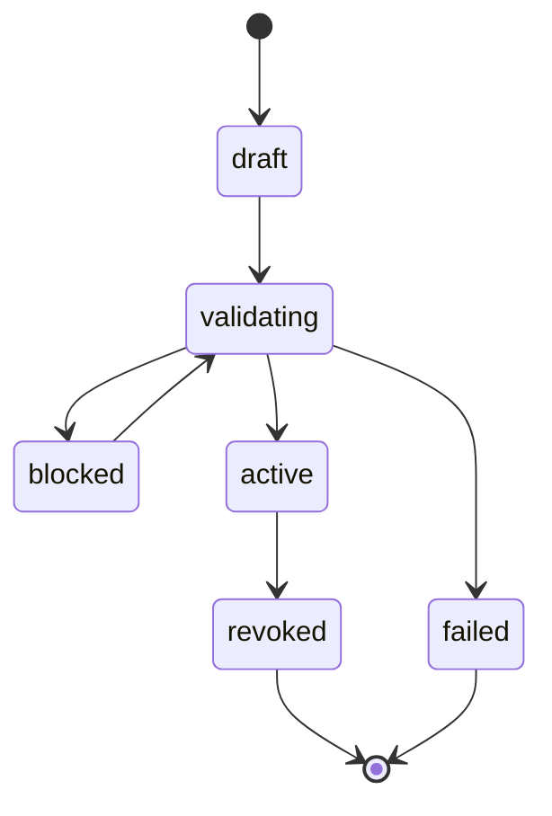
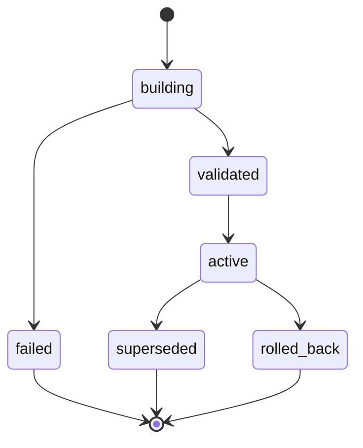
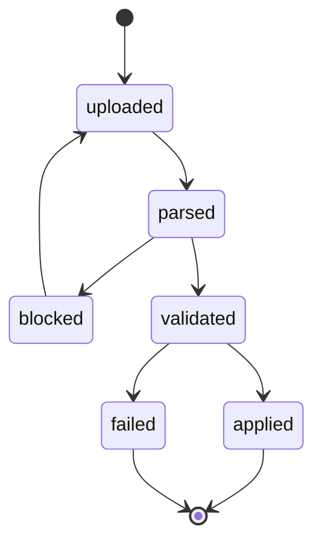
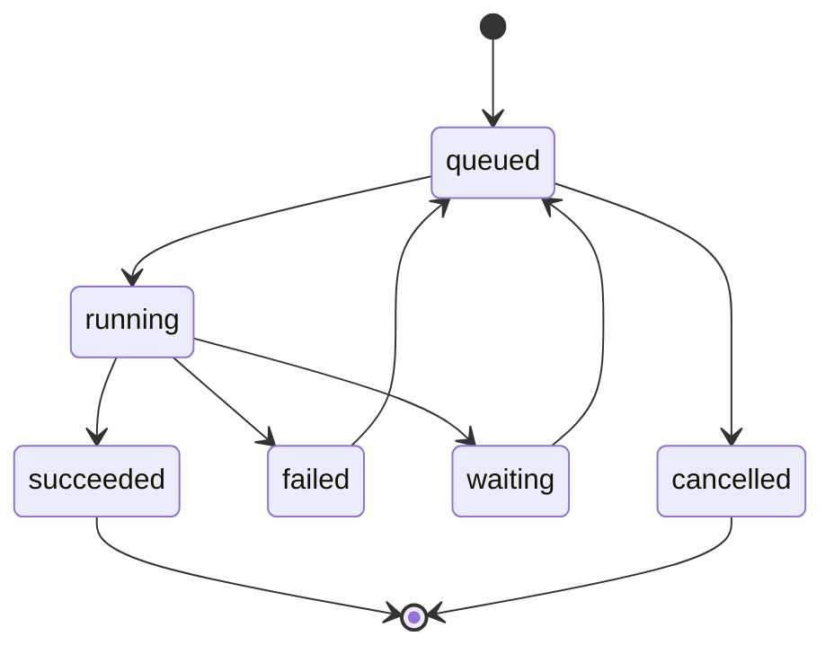

# M1 物理数据模型 v0.1

| 项目 | 内容 |
|---|---|
| 状态 | PHYSICAL MODEL DESIGN DRAFT |
| 日期 | 2026-06-20 |
| 数据库 | PostgreSQL 16+ |
| ADR | `docs/technical-design/ADR-M1-数据库选型.md` |
| 不包含 | 数据库迁移文件、应用代码、接口、页面、正式数据导入、运营确认结果自动应用 |

## 1. 设计基线

本模型基于当前已确认事实：

- 收入事实当前 `192,899` 行，账单月份范围 `2017-06` 至 `2026-05`；
- `2026-05` 是不完整账单月份，当前最新已确认完整月份为 `2026-04`；
- 权威金额使用 `NUMERIC(32,18)`，禁止使用 `float` / `double` 保存或对账；
- 自然月使用 `date` 保存为当月 1 日，并使用检查约束保证无歧义；
- 原始渠道 ID、原始作品 ID 按文本语义保存；
- 原始收入事实不可修改，渠道、标准作品和业务形态关系保存在版本化投影中；
- 首次实销月份只依据正数实销记录；
- 数字版权台账 `签订日期` 对应版权开始日期，`到期时间` 对应版权到期日期；
- 两种业务形态共享标准作品层版权期限；
- 分类结构支持固定三级路径，具体分类值可后续导入；
- 标签区分辅助内容标签和特殊属性标签；
- 物理模型不依赖 3,099 部标准作品基础信息已经全部填写。

通用字段约定：

- 除纯关联明细表特别说明外，业务表默认包含 `created_at timestamptz not null default now()`、`created_by text null`、`updated_at timestamptz null`、`updated_by text null`；
- 所有 `status` 字段必须有检查约束；
- 所有金额字段使用 `numeric(32,18)`；
- 所有月份字段使用 `date`，字段名以 `_month` 结尾时必须满足“自然月首日”检查；
- 标准作品 ID、原始作品 ID、渠道 ID 均使用 `text`，不使用数值类型吞掉前导字符或业务前缀。

## 2. 物理表总表

本模型共 **42 张表**。

| 序号 | 表名 | 职责 | 属性 |
|---:|---|---|---|
| 1 | `background_task` | 后台任务主表 | 权威 |
| 2 | `background_task_event` | 任务状态事件 | 权威审计 |
| 3 | `file_fingerprint_registry` | 文件指纹唯一性登记 | 权威 |
| 4 | `import_file` | 上传/导入文件元数据 | 权威 |
| 5 | `bill_staging_session` | 账单临时解析会话 | 临时权威 |
| 6 | `temp_bill_record` | 临时账单行 | 临时权威 |
| 7 | `data_issue` | 数据问题 | 权威 |
| 8 | `data_issue_decision` | 问题处理决定 | 权威 |
| 9 | `cleaning_rule_version` | 清洗/校验规则版本 | 权威 |
| 10 | `import_batch` | 账单导入批次 | 权威 |
| 11 | `import_batch_file` | 批次与文件关系 | 权威 |
| 12 | `import_batch_month` | 批次覆盖月份 | 派生权威 |
| 13 | `income_fact` | 不可变收入事实 | 权威 |
| 14 | `mapping_version` | 映射投影版本 | 权威 |
| 15 | `income_projection` | 收入事实派生投影 | 派生 |
| 16 | `income_projection_monthly_summary` | 投影月度汇总缓存 | 派生缓存 |
| 17 | `channel` | 统一渠道 | 权威 |
| 18 | `channel_alias` | 渠道别名 | 权威 |
| 19 | `standard_work` | 标准作品 | 权威 + 缓存 |
| 20 | `work_business_form` | 标准作品业务形态 | 权威 + 缓存 |
| 21 | `raw_work_id_mapping` | 原始作品 ID 映射 | 权威 |
| 22 | `historical_volume_mapping` | 历史分册映射 | 权威 |
| 23 | `standard_work_status_history` | 标准作品状态历史 | 权威 |
| 24 | `author` | 作者 | 权威 |
| 25 | `author_alias` | 作者别名 | 权威 |
| 26 | `classification_system` | 分类体系 | 权威 |
| 27 | `classification_node` | 分类节点 | 权威 |
| 28 | `work_classification_assignment` | 作品分类分配 | 权威 |
| 29 | `tag` | 标签库 | 权威 |
| 30 | `work_tag_assignment` | 作品标签分配 | 权威 |
| 31 | `basic_info_version` | 基础信息版本 | 权威 |
| 32 | `basic_info_version_work` | 版本化作品基础信息 | 权威 |
| 33 | `basic_info_export` | 基础信息补全导出 | 权威 |
| 34 | `basic_info_upload` | 基础信息补全上传 | 权威 |
| 35 | `basic_info_temp_record` | 补全文件临时记录 | 临时权威 |
| 36 | `basic_info_issue` | 补全文件问题 | 权威 |
| 37 | `basic_info_apply_batch` | 基础信息整批应用 | 权威 |
| 38 | `month_completeness_confirmation` | 月份完整性确认 | 权威 |
| 39 | `batch_impact_record` | 批次影响记录 | 派生权威 |
| 40 | `restore_point` | 恢复点 | 权威 |
| 41 | `import_batch_undo` | 批次撤销记录 | 权威 |
| 42 | `mapping_change_record` | 映射变更记录 | 权威审计 |

## 3. 表定义

字段格式：`字段名 类型 null/default 说明`。除特别说明外，所有表均使用 PostgreSQL。

### 3.1 `background_task`

- 职责：后台异步任务，包括账单解析、正式批次激活、映射重投影、基础信息应用、恢复点校验。
- 属性：权威。
- 字段：`id bigserial pk`；`task_type text not null`；`business_key text not null`；`idempotency_key text not null`；`status text not null default 'queued'`；`business_stage text null`；`priority int not null default 100`；`attempt_count int not null default 0`；`max_attempts int not null default 1`；`required_model text null`；`payload jsonb not null default '{}'`；`result jsonb null`；`error_code text null`；`error_message text null`；`available_at timestamptz not null default now()`；`started_at timestamptz null`；`finished_at timestamptz null`；通用字段。
- 主键：`id`。
- 外键：无，任务通过 `business_key` 引用业务对象，避免跨多类型 FK。
- 唯一约束：`uk_background_task_idempotency(idempotency_key)`。
- 检查约束：`status in ('queued','running','succeeded','failed','cancelled','waiting')`；`attempt_count >= 0`。
- 索引：`idx_background_task_queue(status, available_at, priority, id)`；`idx_background_task_business_key(business_key)`。
- 保留：任务主记录至少保留 2 年；大 payload 可在归档后脱敏。
- 对应：`REQ-PLATFORM-001`、`REQ-PLATFORM-002`、`AT-M1-050`、`AT-M1-051`。

### 3.2 `background_task_event`

- 职责：记录任务状态变化和关键阶段事件。
- 属性：权威审计。
- 字段：`id bigserial pk`；`task_id bigint not null`；`from_status text null`；`to_status text not null`；`event_type text not null`；`message text null`；`event_payload jsonb not null default '{}'`；`occurred_at timestamptz not null default now()`；`created_by text null`。
- 主键：`id`。
- 外键：`task_id -> background_task(id)`。
- 唯一约束：无。
- 检查约束：`to_status` 使用同 `background_task.status` 值域。
- 索引：`idx_task_event_task_time(task_id, occurred_at)`。
- 保留：随任务保留。
- 对应：`REQ-PLATFORM-001`、`AT-M1-050`。

### 3.3 `file_fingerprint_registry`

- 职责：登记文件指纹，支持普通上传入口阻止相同指纹，并支持从已撤销批次发起受控重新导入。
- 属性：权威。
- 字段：`id bigserial pk`；`sha256 text not null`；`file_size_bytes bigint not null`；`first_import_file_id bigint null`；`active_blocking_status text not null default 'active'`；`created_at timestamptz not null default now()`。
- 主键：`id`。
- 外键：`first_import_file_id -> import_file(id)`。
- 唯一约束：`uk_file_fingerprint_sha256(sha256)`。
- 检查约束：`active_blocking_status in ('active','revoked_reimport_allowed')`；`file_size_bytes > 0`。
- 索引：`idx_file_fingerprint_status(active_blocking_status)`。
- 保留：永久保留指纹；不依赖原始文件是否删除。
- 对应：`REQ-DATA-IMPORT-002`、`REQ-DATA-IMPORT-007`、`AT-M1-002`、`AT-M1-007`。

### 3.4 `import_file`

- 职责：保存上传文件元数据、指纹、留存状态和解析报告引用。
- 属性：权威。
- 字段：`id bigserial pk`；`fingerprint_id bigint not null`；`original_filename text not null`；`storage_uri text null`；`file_size_bytes bigint not null`；`sha256 text not null`；`uploaded_at timestamptz not null default now()`；`uploaded_by text null`；`retention_status text not null default 'retained'`；`deleted_at timestamptz null`；`parse_report_uri text null`；`row_count int null`；`total_amount numeric(32,18) null`。
- 主键：`id`。
- 外键：`fingerprint_id -> file_fingerprint_registry(id)`。
- 唯一约束：无；同一指纹的受控重新导入允许新文件记录。
- 检查约束：`retention_status in ('retained','deleted','redacted')`；`file_size_bytes > 0`。
- 索引：`idx_import_file_fingerprint(fingerprint_id)`；`idx_import_file_uploaded_at(uploaded_at)`。
- 保留：元数据永久保留；原始文件按 PRD 文件留存规则删除或脱敏。
- 对应：`REQ-DATA-IMPORT-002`、`REQ-DATA-IMPORT-005`、`REQ-DATA-IMPORT-007`、`AT-M1-002`、`AT-M1-005`、`AT-M1-007`。

### 3.5 `bill_staging_session`

- 职责：一次账单上传/解析的临时工作区，承载分块处理和正式激活前校验。
- 属性：临时权威。
- 字段：`id bigserial pk`；`task_id bigint not null`；`import_file_id bigint not null`；`rule_version_id bigint not null`；`status text not null default 'parsing'`；`parsed_row_count int not null default 0`；`valid_row_count int not null default 0`；`invalid_row_count int not null default 0`；`raw_total_amount numeric(32,18) null`；`created_at timestamptz not null default now()`；`finished_at timestamptz null`。
- 主键：`id`。
- 外键：`task_id -> background_task(id)`；`import_file_id -> import_file(id)`；`rule_version_id -> cleaning_rule_version(id)`。
- 唯一约束：`uk_bill_staging_file_task(import_file_id, task_id)`。
- 检查约束：`status in ('parsing','parsed','failed','discarded','promoted')`。
- 索引：`idx_bill_staging_status(status)`。
- 保留：成功激活后保留到导入验收完成；失败会话保留问题排查期。
- 对应：`REQ-DATA-IMPORT-003`、`REQ-DQ-003`、`AT-M1-003`、`AT-M1-012`。

### 3.6 `temp_bill_record`

- 职责：临时账单行，承载原始七字段、解析结果和行级校验状态。
- 属性：临时权威。
- 字段：`id bigserial pk`；`staging_session_id bigint not null`；`source_sheet_name text null`；`source_row_number int not null`；`bill_month date null`；`raw_channel_id text null`；`raw_channel_name text null`；`raw_authorization_category text null`；`raw_work_id text null`；`raw_work_name text null`；`actual_sales_amount numeric(32,18) null`；`parse_status text not null default 'parsed'`；`row_hash text not null`；`created_at timestamptz not null default now()`。
- 主键：`id`。
- 外键：`staging_session_id -> bill_staging_session(id)`。
- 唯一约束：`uk_temp_bill_record_row(staging_session_id, source_sheet_name, source_row_number)`。
- 检查约束：`bill_month is null or bill_month = date_trunc('month', bill_month)::date`；`parse_status in ('parsed','invalid','ignored')`。
- 索引：`idx_temp_bill_session(staging_session_id)`；`idx_temp_bill_issue_scan(staging_session_id, raw_work_id, raw_channel_id)`。
- 保留：随 staging 会话清理；正式收入事实不依赖临时表。
- 对应：`REQ-DATA-IMPORT-001`、`REQ-DATA-IMPORT-003`、`REQ-DQ-001`、`AT-M1-001`、`AT-M1-003`、`AT-M1-010`。

### 3.7 `data_issue`

- 职责：账单导入和映射投影中的数据问题，包括重复、冲突、异常 ID、多名称、多授权分类。
- 属性：权威。
- 字段：`id bigserial pk`；`issue_scope text not null`；`staging_session_id bigint null`；`import_batch_id bigint null`；`mapping_version_id bigint null`；`issue_type text not null`；`severity text not null`；`blocking boolean not null default true`；`group_key text not null`；`sample_ref jsonb not null default '{}'`；`status text not null default 'open'`；通用字段。
- 主键：`id`。
- 外键：`staging_session_id -> bill_staging_session(id)`；`import_batch_id -> import_batch(id)`；`mapping_version_id -> mapping_version(id)`。
- 唯一约束：`uk_data_issue_group(issue_scope, issue_type, group_key)`。
- 检查约束：`severity in ('info','warning','blocking')`；`status in ('open','decided','resolved','waived')`。
- 索引：`idx_data_issue_open(status, blocking, issue_type)`；`idx_data_issue_batch(import_batch_id)`。
- 保留：永久保留问题和处理轨迹。
- 对应：`REQ-DQ-001`、`REQ-DQ-002`、`REQ-DQ-003`、`AT-M1-010`、`AT-M1-011`、`AT-M1-012`。

### 3.8 `data_issue_decision`

- 职责：运营对数据问题的处理决定，不继承旧问题处理决定到受控重新导入。
- 属性：权威。
- 字段：`id bigserial pk`；`issue_id bigint not null`；`decision text not null`；`decision_payload jsonb not null default '{}'`；`decided_by text not null`；`decided_at timestamptz not null default now()`；`superseded_by_id bigint null`。
- 主键：`id`。
- 外键：`issue_id -> data_issue(id)`；`superseded_by_id -> data_issue_decision(id)`。
- 唯一约束：一个问题只能有一个当前有效决定，使用部分唯一索引 `uk_issue_current_decision(issue_id) where superseded_by_id is null`。
- 检查约束：`decision in ('delete_duplicate','keep_as_valid','source_file_fix_required','map_to_existing','needs_more_info','not_applicable')`。
- 索引：`idx_issue_decision_issue(issue_id)`。
- 保留：永久保留。
- 对应：`REQ-DQ-001`、`REQ-DQ-002`、`REQ-DQ-003`、`REQ-DATA-IMPORT-007`、`AT-M1-010`、`AT-M1-011`、`AT-M1-012`、`AT-M1-007`。

### 3.9 `cleaning_rule_version`

- 职责：导入字段校验、重复识别、金额解析、月份解析等规则版本记录。
- 属性：权威。
- 字段：`id bigserial pk`；`rule_code text not null`；`version_no int not null`；`status text not null default 'draft'`；`rule_payload jsonb not null`；`effective_from timestamptz null`；`effective_to timestamptz null`；通用字段。
- 主键：`id`。
- 外键：无。
- 唯一约束：`uk_cleaning_rule_version(rule_code, version_no)`。
- 检查约束：`status in ('draft','active','retired')`。
- 索引：`idx_cleaning_rule_active(rule_code, status)`。
- 保留：永久保留，保证历史批次可重放。
- 对应：`REQ-DQ-001` 至 `REQ-DQ-003`、`AT-M1-010` 至 `AT-M1-012`。

### 3.10 `import_batch`

- 职责：正式账单导入批次，控制原子激活、撤销、受控重新导入和严格对账。
- 属性：权威。
- 字段：`id bigserial pk`；`batch_no text not null`；`status text not null default 'draft'`；`source_type text not null default 'normal_upload'`；`reimport_of_batch_id bigint null`；`rule_version_id bigint not null`；`activated_mapping_version_id bigint null`；`raw_row_count int not null default 0`；`accepted_row_count int not null default 0`；`raw_total_amount numeric(32,18) not null default 0`；`deleted_confirmed_amount numeric(32,18) not null default 0`；`accepted_total_amount numeric(32,18) not null default 0`；`activated_at timestamptz null`；`revoked_at timestamptz null`；通用字段。
- 主键：`id`。
- 外键：`reimport_of_batch_id -> import_batch(id)`；`rule_version_id -> cleaning_rule_version(id)`；`activated_mapping_version_id -> mapping_version(id)`。
- 唯一约束：`uk_import_batch_no(batch_no)`。
- 检查约束：`status in ('draft','validating','blocked','active','revoked','failed')`；`raw_total_amount - deleted_confirmed_amount = accepted_total_amount` 作为激活前检查目标。
- 索引：`idx_import_batch_status(status)`；`idx_import_batch_activated_at(activated_at)`。
- 保留：永久保留批次元数据。
- 对应：`REQ-DATA-IMPORT-002` 至 `REQ-DATA-IMPORT-007`、`AT-M1-002` 至 `AT-M1-007`。

### 3.11 `import_batch_file`

- 职责：多文件导入任务中批次与文件的关系。
- 属性：权威。
- 字段：`import_batch_id bigint not null`；`import_file_id bigint not null`；`file_role text not null default 'source_bill'`；`created_at timestamptz not null default now()`。
- 主键：`(import_batch_id, import_file_id)`。
- 外键：`import_batch_id -> import_batch(id)`；`import_file_id -> import_file(id)`。
- 唯一约束：主键。
- 检查约束：`file_role in ('source_bill','cleaned_return','supporting_report')`。
- 索引：`idx_import_batch_file_file(import_file_id)`。
- 保留：随批次永久保留。
- 对应：`REQ-DATA-IMPORT-002`、`AT-M1-002`。

### 3.12 `import_batch_month`

- 职责：记录批次覆盖月份，支持账单最大月份和撤销后重算。
- 属性：派生权威。
- 字段：`import_batch_id bigint not null`；`bill_month date not null`；`row_count int not null`；`amount_total numeric(32,18) not null default 0`。
- 主键：`(import_batch_id, bill_month)`。
- 外键：`import_batch_id -> import_batch(id)`。
- 唯一约束：主键。
- 检查约束：`bill_month = date_trunc('month', bill_month)::date`；`row_count >= 0`。
- 索引：`idx_batch_month_month(bill_month)`。
- 保留：随批次永久保留，可重算。
- 对应：`REQ-DATA-IMPORT-006`、`AT-M1-006`。

### 3.13 `income_fact`

- 职责：不可变收入事实，保存账单原始七字段解析后的正式事实。
- 属性：权威。
- 字段：`id bigserial pk`；`import_batch_id bigint not null`；`import_file_id bigint not null`；`source_sheet_name text null`；`source_row_number int not null`；`bill_month date not null`；`raw_channel_id text null`；`raw_channel_name text not null`；`raw_authorization_category text null`；`raw_work_id text not null`；`raw_work_name text not null`；`actual_sales_amount numeric(32,18) not null`；`row_hash text not null`；`is_effective boolean not null default true`；`created_at timestamptz not null default now()`。
- 主键：`id`。
- 外键：`import_batch_id -> import_batch(id)`；`import_file_id -> import_file(id)`。
- 唯一约束：`uk_income_fact_source_row(import_batch_id, import_file_id, source_sheet_name, source_row_number)`。
- 检查约束：`bill_month = date_trunc('month', bill_month)::date`。
- 索引：`idx_income_fact_month(bill_month)`；`idx_income_fact_raw_work(raw_work_id)`；`idx_income_fact_raw_channel(raw_channel_id, raw_channel_name)`；`idx_income_fact_batch(import_batch_id)`。
- 保留：永久保留。撤销批次不修改金额和原始字段，只通过批次状态和投影版本改变可见性。
- 对应：`REQ-DATA-IMPORT-001` 至 `REQ-DATA-IMPORT-007`、`AT-M1-001` 至 `AT-M1-007`。

### 3.14 `mapping_version`

- 职责：收入投影映射版本，统一控制渠道别名、原始作品 ID、标准作品和业务形态引用。
- 属性：权威。
- 字段：`id bigserial pk`；`version_no int not null`；`status text not null default 'building'`；`base_version_id bigint null`；`trigger_type text not null`；`trigger_ref text null`；`built_row_count bigint not null default 0`；`validation_status text not null default 'not_checked'`；`activated_at timestamptz null`；通用字段。
- 主键：`id`。
- 外键：`base_version_id -> mapping_version(id)`。
- 唯一约束：`uk_mapping_version_no(version_no)`；部分唯一索引 `uk_mapping_version_active(status) where status='active'`。
- 检查约束：`status in ('building','validated','active','superseded','failed','rolled_back')`；`validation_status in ('not_checked','passed','failed')`。
- 索引：`idx_mapping_version_status(status)`。
- 保留：永久保留。
- 对应：`REQ-DATA-IMPORT-007`、`REQ-WORK-001` 至 `REQ-WORK-006`、`REQ-CHANNEL-001`、`AT-M1-007`、`AT-M1-020` 至 `AT-M1-025`、`AT-M1-030`。

### 3.15 `income_projection`

- 职责：将不可变收入事实投影到统一渠道、标准作品和业务形态。
- 属性：派生。
- 字段：`id bigserial pk`；`mapping_version_id bigint not null`；`income_fact_id bigint not null`；`channel_id bigint not null`；`standard_work_id text not null`；`business_form text not null`；`projection_status text not null default 'valid'`；`projection_error_code text null`；`actual_sales_amount numeric(32,18) not null`；`bill_month date not null`。
- 主键：`id`。
- 外键：`mapping_version_id -> mapping_version(id)`；`income_fact_id -> income_fact(id)`；`channel_id -> channel(id)`；`standard_work_id -> standard_work(standard_work_id)`。
- 唯一约束：`uk_income_projection_version_fact(mapping_version_id, income_fact_id)`。
- 检查约束：`business_form in ('audio_copyright','audio_product')`；`bill_month = date_trunc('month', bill_month)::date`。
- 索引：`idx_projection_current_work_month(mapping_version_id, standard_work_id, bill_month)`；`idx_projection_current_channel_month(mapping_version_id, channel_id, bill_month)`；`idx_projection_form_month(mapping_version_id, business_form, bill_month)`。
- 保留：至少保留当前版本、上一有效版本和审计要求版本；旧失败版本可归档。
- 对应：`REQ-WORK-001` 至 `REQ-WORK-006`、`REQ-CHANNEL-001`、`AT-M1-020` 至 `AT-M1-025`、`AT-M1-030`。

### 3.16 `income_projection_monthly_summary`

- 职责：按当前或指定映射版本聚合月份、渠道、标准作品和业务形态收入。
- 属性：派生缓存。
- 字段：`mapping_version_id bigint not null`；`bill_month date not null`；`channel_id bigint null`；`standard_work_id text null`；`business_form text null`；`amount_total numeric(32,18) not null default 0`；`row_count bigint not null default 0`；`recomputed_at timestamptz not null default now()`。
- 主键：`(mapping_version_id, bill_month, channel_id, standard_work_id, business_form)`。
- 外键：`mapping_version_id -> mapping_version(id)`；`channel_id -> channel(id)`；`standard_work_id -> standard_work(standard_work_id)`。
- 唯一约束：主键。
- 检查约束：`bill_month = date_trunc('month', bill_month)::date`。
- 索引：`idx_projection_summary_work(mapping_version_id, standard_work_id, bill_month)`；`idx_projection_summary_channel(mapping_version_id, channel_id, bill_month)`。
- 保留：可由 `income_projection` 重算；缓存损坏时丢弃重建。
- 对应：`REQ-DATA-IMPORT-006`、`REQ-WORK-003`、`REQ-WORK-004`、`AT-M1-006`、`AT-M1-022`、`AT-M1-023`。

### 3.17 `channel`

- 职责：统一渠道主数据。
- 属性：权威。
- 字段：`id bigserial pk`；`channel_code text null`；`display_name text not null`；`status text not null default 'active'`；通用字段。
- 主键：`id`。
- 外键：无。
- 唯一约束：`uk_channel_display_name(display_name)`；`uk_channel_code(channel_code)`。
- 检查约束：`status in ('active','inactive')`。
- 索引：`idx_channel_status(status)`。
- 保留：永久保留。
- 对应：`REQ-CHANNEL-001`、`AT-M1-030`。

### 3.18 `channel_alias`

- 职责：渠道 ID、渠道名称历史别名到统一渠道的映射。
- 属性：权威。
- 字段：`id bigserial pk`；`channel_id bigint not null`；`raw_channel_id text null`；`raw_channel_name text not null`；`alias_type text not null default 'bill'`；`mapping_version_id bigint not null`；`valid_from timestamptz not null default now()`；`valid_to timestamptz null`；通用字段。
- 主键：`id`。
- 外键：`channel_id -> channel(id)`；`mapping_version_id -> mapping_version(id)`。
- 唯一约束：部分唯一索引 `uk_channel_alias_current(raw_channel_id, raw_channel_name) where valid_to is null`。
- 检查约束：`alias_type in ('bill','manual','system_candidate')`。
- 索引：`idx_channel_alias_lookup(raw_channel_id, raw_channel_name, valid_to)`。
- 保留：永久保留，版本追溯。
- 对应：`REQ-CHANNEL-001`、`AT-M1-030`。

### 3.19 `standard_work`

- 职责：标准作品身份。标准作品 ID 使用原始财务作品 ID 的数字主体。
- 属性：权威 + 缓存。
- 字段：`standard_work_id text pk`；`current_basic_info_version_id bigint null`；`launch_month_cache date null`；`launch_month_source_mapping_version_id bigint null`；`launch_month_rule_version text null`；`status_cache text null`；通用字段。
- 主键：`standard_work_id`。
- 外键：`current_basic_info_version_id -> basic_info_version(id)`；`launch_month_source_mapping_version_id -> mapping_version(id)`。
- 唯一约束：主键。
- 检查约束：`launch_month_cache is null or launch_month_cache = date_trunc('month', launch_month_cache)::date`。
- 索引：`idx_standard_work_launch_month(launch_month_cache)`。
- 保留：永久保留。缓存可重算。
- 对应：`REQ-WORK-001`、`REQ-WORK-003`、`REQ-WORK-008`、`AT-M1-020`、`AT-M1-022`、`AT-M1-027`。

### 3.20 `work_business_form`

- 职责：标准作品下的业务形态，有声版权和有声成品分别汇总收入，但不拥有独立版权期限。
- 属性：权威 + 缓存。
- 字段：`id bigserial pk`；`standard_work_id text not null`；`business_form text not null`；`first_positive_sale_month_cache date null`；`first_sale_source_mapping_version_id bigint null`；`first_sale_rule_version text null`；通用字段。
- 主键：`id`。
- 外键：`standard_work_id -> standard_work(standard_work_id)`；`first_sale_source_mapping_version_id -> mapping_version(id)`。
- 唯一约束：`uk_work_business_form(standard_work_id, business_form)`。
- 检查约束：`business_form in ('audio_copyright','audio_product')`；`first_positive_sale_month_cache is null or first_positive_sale_month_cache = date_trunc('month', first_positive_sale_month_cache)::date`。
- 索引：`idx_work_business_form_first_sale(first_positive_sale_month_cache)`。
- 保留：永久保留。缓存可重算。
- 对应：`REQ-WORK-002`、`REQ-WORK-004`、`REQ-WORK-011`、`AT-M1-021`、`AT-M1-023`、`AT-M1-031`。

### 3.21 `raw_work_id_mapping`

- 职责：原始作品 ID 到标准作品与业务形态的版本化映射。
- 属性：权威。
- 字段：`id bigserial pk`；`mapping_version_id bigint not null`；`raw_work_id text not null`；`standard_work_id text not null`；`business_form text not null`；`mapping_source text not null`；`valid boolean not null default true`；通用字段。
- 主键：`id`。
- 外键：`mapping_version_id -> mapping_version(id)`；`standard_work_id -> standard_work(standard_work_id)`。
- 唯一约束：`uk_raw_work_mapping_version(mapping_version_id, raw_work_id)`；业务检查要求同一版本中一种业务形态常规只对应一个原始 ID，历史分册走 `historical_volume_mapping`。
- 检查约束：`business_form in ('audio_copyright','audio_product')`；`mapping_source in ('bill_rule','ops_confirmed','volume_mapping')`。
- 索引：`idx_raw_work_mapping_lookup(mapping_version_id, raw_work_id)`；`idx_raw_work_mapping_work(mapping_version_id, standard_work_id)`。
- 保留：随映射版本永久保留。
- 对应：`REQ-WORK-001`、`REQ-WORK-002`、`REQ-WORK-006`、`AT-M1-020`、`AT-M1-021`、`AT-M1-025`。

### 3.22 `historical_volume_mapping`

- 职责：历史分册 ID 到主标准作品 ID 的隐藏映射。
- 属性：权威。
- 字段：`id bigserial pk`；`mapping_version_id bigint not null`；`historical_standard_work_id text not null`；`target_standard_work_id text not null`；`business_form text null`；`confirmed_issue_id bigint not null`；`valid_from timestamptz not null default now()`；`valid_to timestamptz null`；通用字段。
- 主键：`id`。
- 外键：`mapping_version_id -> mapping_version(id)`；`historical_standard_work_id -> standard_work(standard_work_id)`；`target_standard_work_id -> standard_work(standard_work_id)`；`confirmed_issue_id -> data_issue(id)`。
- 唯一约束：部分唯一索引 `uk_volume_mapping_current(historical_standard_work_id, business_form) where valid_to is null`。
- 检查约束：`historical_standard_work_id <> target_standard_work_id`。
- 索引：`idx_volume_mapping_target(target_standard_work_id)`。
- 保留：永久保留。
- 对应：`REQ-WORK-005`、`REQ-WORK-006`、`AT-M1-024`、`AT-M1-025`。

### 3.23 `standard_work_status_history`

- 职责：标准作品状态历史。
- 属性：权威。
- 字段：`id bigserial pk`；`standard_work_id text not null`；`status text not null`；`status_basis text null`；`valid_from timestamptz not null default now()`；`valid_to timestamptz null`；通用字段。
- 主键：`id`。
- 外键：`standard_work_id -> standard_work(standard_work_id)`。
- 唯一约束：部分唯一索引 `uk_work_status_current(standard_work_id) where valid_to is null`。
- 检查约束：`status in ('listed','suspected_delisted','delisted','relisted')`。
- 索引：`idx_work_status_status(status, valid_to)`。
- 保留：永久保留。
- 对应：`REQ-WORK-007`、`AT-M1-026`。

### 3.24 `author`

- 职责：作者主数据。
- 属性：权威。
- 字段：`id bigserial pk`；`display_name text not null`；`normalized_name text not null`；`status text not null default 'active'`；通用字段。
- 主键：`id`。
- 外键：无。
- 唯一约束：不对 `normalized_name` 做全局唯一，避免同名作者误归并；可对 `id` 和人工编号唯一。
- 检查约束：`status in ('active','inactive','needs_review')`。
- 索引：`idx_author_normalized_name(normalized_name)`。
- 保留：永久保留。
- 对应：`REQ-WORK-010`、`AT-M1-029`。

### 3.25 `author_alias`

- 职责：作者别名及来源确认。
- 属性：权威。
- 字段：`id bigserial pk`；`author_id bigint not null`；`alias_name text not null`；`normalized_alias text not null`；`source_type text not null`；`source_ref text null`；`confirmed_issue_id bigint null`；`valid_from timestamptz not null default now()`；`valid_to timestamptz null`；通用字段。
- 主键：`id`。
- 外键：`author_id -> author(id)`；`confirmed_issue_id -> data_issue(id)`。
- 唯一约束：部分唯一索引 `uk_author_alias_current(normalized_alias) where valid_to is null`，防止一个当前有效规范化别名静默指向多个作者。
- 检查约束：`source_type in ('master_data','ops_confirmed','supplement_file')`。
- 索引：`idx_author_alias_author(author_id)`。
- 保留：永久保留。
- 对应：`REQ-WORK-010`、`AT-M1-029`。

### 3.26 `classification_system`

- 职责：分类体系，隔离出版物与网文等体系。
- 属性：权威。
- 字段：`id bigserial pk`；`system_code text not null`；`display_name text not null`；`status text not null default 'active'`；通用字段。
- 主键：`id`。
- 外键：无。
- 唯一约束：`uk_classification_system_code(system_code)`。
- 检查约束：`status in ('active','inactive')`。
- 索引：`idx_classification_system_status(status)`。
- 保留：永久保留。
- 对应：`REQ-CLASS-001`、`AT-M1-040`。

### 3.27 `classification_node`

- 职责：分类节点，支持固定三级路径。
- 属性：权威。
- 字段：`id bigserial pk`；`system_id bigint not null`；`parent_id bigint null`；`level int not null`；`node_code text null`；`display_name text not null`；`sort_order int not null default 0`；`status text not null default 'active'`；通用字段。
- 主键：`id`。
- 外键：`system_id -> classification_system(id)`；`parent_id -> classification_node(id)`。
- 唯一约束：`uk_classification_sibling(system_id, parent_id, display_name)`。
- 检查约束：`level in (1,2,3)`；一级节点 `parent_id is null`，二三级节点 `parent_id is not null` 由实现期约束或触发器校验。
- 索引：`idx_classification_node_parent(parent_id)`；`idx_classification_node_level(system_id, level)`。
- 保留：版本变更前不物理删除，停用旧节点。
- 对应：`REQ-CLASS-001`、`AT-M1-040`。

### 3.28 `work_classification_assignment`

- 职责：标准作品到三级分类叶子节点的版本化分配。
- 属性：权威。
- 字段：`id bigserial pk`；`basic_info_version_id bigint not null`；`standard_work_id text not null`；`classification_node_id bigint not null`；`source_type text not null`；通用字段。
- 主键：`id`。
- 外键：`basic_info_version_id -> basic_info_version(id)`；`standard_work_id -> standard_work(standard_work_id)`；`classification_node_id -> classification_node(id)`。
- 唯一约束：`uk_work_classification_version(basic_info_version_id, standard_work_id)`。
- 检查约束：目标节点必须为三级节点，物理实现期可用约束触发器校验。
- 索引：`idx_work_classification_node(classification_node_id)`。
- 保留：随基础信息版本保留。
- 对应：`REQ-WORK-008`、`REQ-CLASS-001`、`AT-M1-027`、`AT-M1-040`。

### 3.29 `tag`

- 职责：标签库，区分辅助内容标签和特殊属性标签。
- 属性：权威。
- 字段：`id bigserial pk`；`tag_code text null`；`display_name text not null`；`tag_kind text not null`；`status text not null default 'active'`；通用字段。
- 主键：`id`。
- 外键：无。
- 唯一约束：`uk_tag_kind_name(tag_kind, display_name)`。
- 检查约束：`tag_kind in ('content_aux','special_attribute')`；`status in ('active','inactive')`。
- 索引：`idx_tag_kind_status(tag_kind, status)`。
- 保留：停用不删除。
- 对应：`REQ-CLASS-002`、`AT-M1-041`。

### 3.30 `work_tag_assignment`

- 职责：标准作品标签分配。
- 属性：权威。
- 字段：`id bigserial pk`；`basic_info_version_id bigint not null`；`standard_work_id text not null`；`tag_id bigint not null`；`source_type text not null`；通用字段。
- 主键：`id`。
- 外键：`basic_info_version_id -> basic_info_version(id)`；`standard_work_id -> standard_work(standard_work_id)`；`tag_id -> tag(id)`。
- 唯一约束：`uk_work_tag_version(basic_info_version_id, standard_work_id, tag_id)`。
- 检查约束：`source_type in ('master_data','ops_supplement','formal_basic_info')`。
- 索引：`idx_work_tag_tag(tag_id)`；`idx_work_tag_work(standard_work_id)`。
- 保留：随基础信息版本保留。
- 对应：`REQ-WORK-008`、`REQ-CLASS-002`、`AT-M1-027`、`AT-M1-041`。

### 3.31 `basic_info_version`

- 职责：标准作品基础信息版本，控制整批应用和回滚。
- 属性：权威。
- 字段：`id bigserial pk`；`version_no int not null`；`status text not null default 'building'`；`source_type text not null`；`apply_batch_id bigint null`；`activated_at timestamptz null`；通用字段。
- 主键：`id`。
- 外键：`apply_batch_id -> basic_info_apply_batch(id)`。
- 唯一约束：`uk_basic_info_version_no(version_no)`；部分唯一索引 `uk_basic_info_version_active(status) where status='active'`。
- 检查约束：`status in ('building','validated','active','superseded','failed','rolled_back')`。
- 索引：`idx_basic_info_version_status(status)`。
- 保留：永久保留。
- 对应：`REQ-WORK-008`、`REQ-WORK-009`、`AT-M1-027`、`AT-M1-028`。

### 3.32 `basic_info_version_work`

- 职责：版本化标准作品基础信息。
- 属性：权威。
- 字段：`basic_info_version_id bigint not null`；`standard_work_id text not null`；`standard_work_name text not null`；`author_id bigint null`；`copyright_start_date date null`；`copyright_end_date date null`；`copyright_source_priority text not null`；`source_record_ref text null`；`is_complete_for_m2 boolean not null default false`。
- 主键：`(basic_info_version_id, standard_work_id)`。
- 外键：`basic_info_version_id -> basic_info_version(id)`；`standard_work_id -> standard_work(standard_work_id)`；`author_id -> author(id)`。
- 唯一约束：主键。
- 检查约束：`copyright_end_date is null or copyright_start_date is null or copyright_end_date >= copyright_start_date`；`copyright_source_priority in ('confirmed_master_data','ops_supplement','formal_basic_info_version')`。
- 索引：`idx_basic_info_work_author(author_id)`；`idx_basic_info_work_complete(is_complete_for_m2)`。
- 保留：随基础信息版本永久保留。
- 对应：`REQ-WORK-008`、`REQ-WORK-011`、`AT-M1-027`、`AT-M1-031`。

### 3.33 `basic_info_export`

- 职责：系统导出的待补全表。
- 属性：权威。
- 字段：`id bigserial pk`；`export_no text not null`；`basic_info_version_id bigint not null`；`mapping_version_id bigint not null`；`status text not null default 'generated'`；`file_uri text null`；`row_count int not null default 0`；通用字段。
- 主键：`id`。
- 外键：`basic_info_version_id -> basic_info_version(id)`；`mapping_version_id -> mapping_version(id)`。
- 唯一约束：`uk_basic_info_export_no(export_no)`。
- 检查约束：`status in ('generated','downloaded','expired','superseded')`。
- 索引：`idx_basic_info_export_status(status)`。
- 保留：导出文件按私有数据规则保留；元数据永久保留。
- 对应：`REQ-WORK-009`、`AT-M1-028`。

### 3.34 `basic_info_upload`

- 职责：运营上传补全文件。
- 属性：权威。
- 字段：`id bigserial pk`；`export_id bigint null`；`import_file_id bigint not null`；`status text not null default 'uploaded'`；`parsed_row_count int not null default 0`；`valid_row_count int not null default 0`；`uploaded_at timestamptz not null default now()`；`uploaded_by text null`。
- 主键：`id`。
- 外键：`export_id -> basic_info_export(id)`；`import_file_id -> import_file(id)`。
- 唯一约束：无。
- 检查约束：`status in ('uploaded','parsed','blocked','validated','applied','failed')`。
- 索引：`idx_basic_info_upload_status(status)`。
- 保留：元数据永久保留，文件按私有数据规则。
- 对应：`REQ-WORK-009`、`AT-M1-028`。

### 3.35 `basic_info_temp_record`

- 职责：补全文件临时解析记录。
- 属性：临时权威。
- 字段：`id bigserial pk`；`upload_id bigint not null`；`source_row_number int not null`；`standard_work_id text null`；`standard_work_name text null`；`author_name text null`；`category_level1 text null`；`category_level2 text null`；`category_level3 text null`；`copyright_start_date date null`；`copyright_end_date date null`；`tag_values text null`；`parse_status text not null default 'parsed'`。
- 主键：`id`。
- 外键：`upload_id -> basic_info_upload(id)`。
- 唯一约束：`uk_basic_info_temp_row(upload_id, source_row_number)`。
- 检查约束：`parse_status in ('parsed','invalid','ignored')`；日期区间合法性。
- 索引：`idx_basic_info_temp_upload(upload_id)`；`idx_basic_info_temp_work(standard_work_id)`。
- 保留：应用完成后可归档；正式版本不依赖临时表。
- 对应：`REQ-WORK-009`、`AT-M1-028`。

### 3.36 `basic_info_issue`

- 职责：补全文件字段、引用、日期和整批一致性问题。
- 属性：权威。
- 字段：`id bigserial pk`；`upload_id bigint not null`；`temp_record_id bigint null`；`issue_type text not null`；`severity text not null`；`message text not null`；`status text not null default 'open'`；通用字段。
- 主键：`id`。
- 外键：`upload_id -> basic_info_upload(id)`；`temp_record_id -> basic_info_temp_record(id)`。
- 唯一约束：无。
- 检查约束：`severity in ('warning','blocking')`；`status in ('open','resolved','waived')`。
- 索引：`idx_basic_info_issue_upload(upload_id, status, severity)`。
- 保留：永久保留。
- 对应：`REQ-WORK-009`、`AT-M1-028`。

### 3.37 `basic_info_apply_batch`

- 职责：基础信息整批应用，失败恢复时正式基础信息保持不变。
- 属性：权威。
- 字段：`id bigserial pk`；`upload_id bigint not null`；`restore_point_id bigint not null`；`target_version_id bigint null`；`status text not null default 'building'`；`row_count int not null default 0`；`activated_at timestamptz null`；通用字段。
- 主键：`id`。
- 外键：`upload_id -> basic_info_upload(id)`；`restore_point_id -> restore_point(id)`；`target_version_id -> basic_info_version(id)`。
- 唯一约束：`uk_basic_info_apply_upload(upload_id)`。
- 检查约束：`status in ('building','validated','active','failed','rolled_back')`。
- 索引：`idx_basic_info_apply_status(status)`。
- 保留：永久保留。
- 对应：`REQ-WORK-009`、`AT-M1-028`。

### 3.38 `month_completeness_confirmation`

- 职责：人工确认月份完整性，区分账单最大月份和最新已确认完整月份。
- 属性：权威。
- 字段：`id bigserial pk`；`bill_month date not null`；`completeness_status text not null`；`confirmed_by text not null`；`confirmed_at timestamptz not null default now()`；`basis text null`；`superseded_by_id bigint null`。
- 主键：`id`。
- 外键：`superseded_by_id -> month_completeness_confirmation(id)`。
- 唯一约束：部分唯一索引 `uk_month_completeness_current(bill_month) where superseded_by_id is null`。
- 检查约束：`bill_month = date_trunc('month', bill_month)::date`；`completeness_status in ('unconfirmed','confirmed_complete','confirmed_incomplete')`。
- 索引：`idx_month_completeness_status(completeness_status, bill_month)`。
- 保留：永久保留。
- 对应：`REQ-DATA-IMPORT-006`、`AT-M1-006`。

### 3.39 `batch_impact_record`

- 职责：批次激活、撤销、恢复或映射变更后生成可供后续模块消费的幂等影响记录。
- 属性：派生权威。
- 字段：`id bigserial pk`；`event_key text not null`；`event_type text not null`；`import_batch_id bigint null`；`mapping_version_id bigint null`；`standard_work_id text null`；`bill_month date null`；`payload jsonb not null default '{}'`；`consumption_status text not null default 'pending'`；`created_at timestamptz not null default now()`。
- 主键：`id`。
- 外键：`import_batch_id -> import_batch(id)`；`mapping_version_id -> mapping_version(id)`；`standard_work_id -> standard_work(standard_work_id)`。
- 唯一约束：`uk_batch_impact_event(event_key)`。
- 检查约束：`event_type in ('batch_activated','batch_revoked','mapping_reprojected','basic_info_changed')`；`consumption_status in ('pending','consumed','ignored')`。
- 索引：`idx_batch_impact_pending(consumption_status, created_at)`；`idx_batch_impact_work(standard_work_id)`。
- 保留：至少保留至下游模块确认消费；审计摘要永久保留。
- 对应：`REQ-DATA-IMPORT-007`、`AT-M1-007`。

### 3.40 `restore_point`

- 职责：关键操作前恢复点，记录数据库备份位置、业务版本和校验摘要。
- 属性：权威。
- 字段：`id bigserial pk`；`restore_point_no text not null`；`operation_type text not null`；`operation_ref text null`；`database_backup_ref text not null`；`mapping_version_id bigint null`；`basic_info_version_id bigint null`；`import_batch_id bigint null`；`checksum_payload jsonb not null default '{}'`；`created_at timestamptz not null default now()`；`created_by text null`。
- 主键：`id`。
- 外键：`mapping_version_id -> mapping_version(id)`；`basic_info_version_id -> basic_info_version(id)`；`import_batch_id -> import_batch(id)`。
- 唯一约束：`uk_restore_point_no(restore_point_no)`。
- 检查约束：`operation_type in ('batch_activate','batch_revoke','mapping_activate','basic_info_apply','manual_backup')`。
- 索引：`idx_restore_point_operation(operation_type, created_at)`。
- 保留：按备份策略保留；业务元数据永久保留。
- 对应：`REQ-PLATFORM-003`、`AT-M1-052`。

### 3.41 `import_batch_undo`

- 职责：批次撤销记录，区分撤销和删除。
- 属性：权威。
- 字段：`id bigserial pk`；`import_batch_id bigint not null`；`restore_point_id bigint not null`；`undo_reason text not null`；`status text not null default 'requested'`；`affected_fact_count bigint null`；`affected_amount numeric(32,18) null`；`created_at timestamptz not null default now()`；`created_by text null`；`finished_at timestamptz null`。
- 主键：`id`。
- 外键：`import_batch_id -> import_batch(id)`；`restore_point_id -> restore_point(id)`。
- 唯一约束：部分唯一索引 `uk_batch_undo_running(import_batch_id) where status in ('requested','running')`。
- 检查约束：`status in ('requested','running','succeeded','failed','rolled_back')`。
- 索引：`idx_batch_undo_status(status)`。
- 保留：永久保留。
- 对应：`REQ-DATA-IMPORT-007`、`REQ-PLATFORM-003`、`AT-M1-007`、`AT-M1-052`。

### 3.42 `mapping_change_record`

- 职责：渠道别名、原始作品 ID 映射、分册归并和基础信息来源切换的变更审计。
- 属性：权威审计。
- 字段：`id bigserial pk`；`mapping_version_id bigint null`；`change_type text not null`；`entity_type text not null`；`entity_key text not null`；`before_payload jsonb null`；`after_payload jsonb null`；`confirmed_issue_id bigint null`；`created_at timestamptz not null default now()`；`created_by text null`。
- 主键：`id`。
- 外键：`mapping_version_id -> mapping_version(id)`；`confirmed_issue_id -> data_issue(id)`。
- 唯一约束：无。
- 检查约束：`change_type in ('channel_alias','raw_work_mapping','volume_mapping','basic_info_source','rollback')`。
- 索引：`idx_mapping_change_version(mapping_version_id)`；`idx_mapping_change_entity(entity_type, entity_key)`。
- 保留：永久保留。
- 对应：`REQ-DATA-IMPORT-007`、`REQ-WORK-005`、`REQ-WORK-006`、`REQ-CHANNEL-001`、`AT-M1-007`、`AT-M1-024`、`AT-M1-025`、`AT-M1-030`。

## 4. 权威事实、缓存和重算触发

| 事实或缓存 | 权威来源 | 保存位置 | 重算或变更触发 |
|---|---|---|---|
| 原始收入金额和原始七字段 | 账单正式批次 | `income_fact` | 不重算，不修改；撤销只改变批次和投影可见性 |
| 账单最大月份 | 有效批次覆盖月份 | `import_batch_month` 聚合 | 批次激活、撤销、恢复 |
| 最新已确认完整月份 | 人工确认 | `month_completeness_confirmation` | 人工确认变更 |
| 统一渠道引用 | 当前激活映射版本 | `income_projection.channel_id` | 渠道别名变更、映射版本重建 |
| 标准作品/业务形态引用 | 当前激活映射版本 | `income_projection.standard_work_id/business_form` | 原始 ID 映射、分册映射、映射版本重建 |
| 月度收入汇总 | `income_projection` | `income_projection_monthly_summary` | 投影版本激活、批次撤销、映射回滚 |
| 标准作品上线月份缓存 | 正数收入投影 | `standard_work.launch_month_cache` | 批次激活/撤销、映射版本切换、首次实销规则版本变更 |
| 业务形态首次正数实销月份缓存 | 正数收入投影 | `work_business_form.first_positive_sale_month_cache` | 同上 |
| 标准作品基础信息 | 当前基础信息版本 | `basic_info_version_work` | 补全整批应用、版本回滚 |
| 作者别名 | 运营确认或台账候选确认 | `author_alias` | 作者确认、别名版本变更 |
| 分类和标签分配 | 当前基础信息版本 | `work_classification_assignment`、`work_tag_assignment` | 基础信息版本激活 |

原则：同一权威事实只在一个位置维护。缓存必须带来源版本或可通过版本链追溯，缓存损坏时以权威来源重算。

## 5. 原子性、版本切换和可见性边界

### 5.1 大文件分块暂存

1. 创建 `background_task` 和 `bill_staging_session`；
2. 分块读取文件，写入 `temp_bill_record`；
3. 行级问题写入 `data_issue`；
4. 该阶段不写 `income_fact`，业务查询不可见；
5. 解析失败时仅标记 staging 失败，不影响正式批次和当前投影。

### 5.2 正式批次短事务激活

短事务边界：

1. 锁定 `import_batch` 和关联 staging；
2. 校验无阻断 `data_issue`；
3. 校验 `raw_total_amount - deleted_confirmed_amount = accepted_total_amount`；
4. 批量插入 `income_fact`；
5. 写入 `import_batch_month`；
6. 将 `import_batch.status` 切为 `active`；
7. 生成 `batch_impact_record`。

事务提交前，正式查询看不到任何新收入事实。事务失败时无半批次事实可见。

### 5.3 映射投影版本构建和指针切换

长任务阶段：

1. 创建 `mapping_version.status='building'`；
2. 基于有效 `income_fact`、渠道别名、作品映射和分册映射构建新 `income_projection`；
3. 生成汇总缓存；
4. 执行严格对账：投影有效金额合计必须等于有效收入事实合计；
5. 校验通过后标记 `validated`。

短事务切换：

1. 锁定当前 active 映射版本；
2. 将旧版本改为 `superseded`；
3. 将新版本改为 `active`；
4. 重算标准作品和业务形态首次正数实销缓存；
5. 写入 `mapping_change_record` 和 `batch_impact_record`。

业务查询只读取 `status='active'` 的映射版本，不读取 `building` 版本。

### 5.4 批次撤销

1. 创建 `restore_point` 和 `import_batch_undo`；
2. 长任务计算影响范围和受影响标准作品集合；
3. 短事务将 `import_batch.status` 从 `active` 改为 `revoked`；
4. 新建映射版本，排除被撤销批次的事实；
5. 严格对账后切换映射版本；
6. 写入幂等 `batch_impact_record`。

撤销不是删除：`income_fact` 不删除、不改金额、不改原始字段。

### 5.5 受控重新导入

- 普通上传入口继续通过 `file_fingerprint_registry` 阻止相同 `sha256`；
- 只有 `reimport_of_batch_id` 指向已撤销批次时，允许创建新 `import_batch`；
- 新批次完整重新解析、重新校验，不继承旧 `data_issue_decision`；
- 新批次激活后引用旧批次，便于审计。

### 5.6 基础信息整批应用

1. 导出 `basic_info_export`；
2. 上传后写 `basic_info_upload` 和 `basic_info_temp_record`；
3. 问题写入 `basic_info_issue`；
4. 存在阻断问题时不创建 active 版本；
5. 通过后创建 `restore_point` 和 `basic_info_apply_batch`；
6. 构建 `basic_info_version` 和相关作者、分类、标签分配；
7. 短事务激活新基础信息版本。

基础信息补全不覆盖账单派生 ID、上线时间或首次实销月份。

### 5.7 幂等键和并发冲突

- 后台任务使用 `background_task.idempotency_key`；
- 批次影响使用 `batch_impact_record.event_key`；
- 同一批次撤销使用部分唯一索引阻止并发重复撤销；
- 映射版本激活使用 active 部分唯一索引和事务锁；
- 队列领取使用 `FOR UPDATE SKIP LOCKED`；
- 冲突时任务进入 `waiting` 或 `failed`，不自动降级处理。

## 6. 查询路径、索引和容量策略

### 6.1 主查询路径

- 当前有效收入按月份、渠道、标准作品和业务形态聚合：`mapping_version(active)` → `income_projection` → `income_projection_monthly_summary`；
- 对账：`income_fact` 按批次汇总，对比 `income_projection` 当前版本汇总；
- 问题清单：`data_issue(status, blocking, issue_type)`；
- 后台任务：`background_task(status, available_at, priority, id)`；
- 基础信息补全：`basic_info_version_work(is_complete_for_m2)`、`basic_info_issue(upload_id, status, severity)`。

### 6.2 最关键索引

1. `idx_projection_current_work_month(mapping_version_id, standard_work_id, bill_month)`；
2. `idx_projection_current_channel_month(mapping_version_id, channel_id, bill_month)`；
3. `idx_income_fact_batch(import_batch_id)`；
4. `idx_background_task_queue(status, available_at, priority, id)`；
5. `idx_data_issue_open(status, blocking, issue_type)`。

### 6.3 分区判断

当前 19 万行收入事实不需要立即分区。保留未来按 `bill_month` 对 `income_fact` 和 `income_projection` 分区的设计边界，但至少等到：

- 收入事实达到千万级；
- 月份裁剪查询和批量撤销产生明显性能瓶颈；
- 真实执行计划显示现有索引不足。

### 6.4 暂缓索引

以下索引暂缓，等待真实性能测试：

- 按作品名称、作者名称的全文搜索索引；
- `income_fact` 多列宽覆盖索引；
- 旧映射版本的历史投影查询专用索引；
- 标签多维组合筛选索引；
- 分类路径物化搜索索引。

## 7. ER 图

## 8. 状态图

### 8.1 批次状态

### 8.2 映射版本状态

### 8.3 基础信息应用状态

### 8.4 后台任务状态

## 9. 迁移与实现边界

本节只给迁移阶段规划，不生成迁移文件。

### 9.1 Schema 建立顺序

1. 平台和任务表：`background_task`、`background_task_event`、`restore_point`；
2. 文件与暂存表：`file_fingerprint_registry`、`import_file`、`bill_staging_session`、`temp_bill_record`；
3. 规则与问题表：`cleaning_rule_version`、`data_issue`、`data_issue_decision`；
4. 批次与事实表：`import_batch`、`import_batch_file`、`import_batch_month`、`income_fact`；
5. 主数据表：渠道、作品、作者、分类、标签；
6. 映射和投影表：`mapping_version`、`raw_work_id_mapping`、`historical_volume_mapping`、`income_projection`、汇总缓存；
7. 基础信息补全表；
8. 月份完整性、影响记录、撤销和变更审计表。

### 9.2 初始化主数据顺序

1. 初始化清洗规则版本；
2. 初始化分类体系和标签库结构；
3. 从账单标准作品派生 `standard_work` 和 `work_business_form`；
4. 根据运营确认结果装载渠道别名、原始作品 ID 映射和分册映射；
5. 根据台账和补全文件装载作者、作者别名和基础信息版本。

### 9.3 首次账单迁移顺序

1. 登记文件指纹和文件元数据；
2. 暂存解析账单；
3. 生成问题清单；
4. 等待正式导入阻断冲突解决；
5. 创建恢复点；
6. 激活正式批次并写入 `income_fact`；
7. 构建映射版本和收入投影；
8. 严格对账；
9. 激活映射版本；
10. 生成批次影响记录。

### 9.4 运营确认结果导入顺序

1. 正式导入阻断确认；
2. 多 ID 归并和历史分册映射；
3. 台账真实冲突；
4. 版权期限反例；
5. 标准作品基础信息补全；
6. 分类和标签映射；
7. M2 评估前完整性校验。

### 9.5 严格对账检查点

- 暂存解析后：原始行金额合计；
- 问题处理后：原始金额 - 确认删除金额 = 接受金额；
- 写入事实后：`income_fact` 批次合计；
- 投影构建后：有效事实合计 = 投影有效合计；
- 映射版本激活后：月度汇总合计 = 投影明细合计。

### 9.6 回滚点

- 正式批次激活前；
- 映射版本激活前；
- 批次撤销前；
- 基础信息整批应用前；
- 重要主数据映射变更前。

## 10. 可立即设计、待确认装载和 PENDING-DATA

### 10.1 可以立即设计的表

42 张表均可进入数据库迁移设计阶段，因为业务语义、权威来源、版本边界、事务边界和关键字段类型已明确。

### 10.2 等运营确认后才能装载的数据

- 正式导入阻断确认结果；
- 多 ID 归并和历史分册映射；
- 台账真实冲突处理结果；
- 版权期限冲突确认结果；
- 作者和作者别名最终确认；
- 渠道别名正式确认；
- 标准作品基础信息补全结果。

### 10.3 等 M2 前才能补齐的数据

- 每部参与正式评估的标准作品名称；
- 作者；
- 一级至三级分类；
- 版权开始日期；
- 版权到期日期；
- 必需标签；
- 已确认的归并关系。

### 10.4 仍为 PENDING-DATA 的配置

- 重复识别扩展异常模式；
- 错误过多整份退回阈值；
- 最终分类树与标签库具体值；
- 台账分类/标签字段到正式分类树和标签库的映射；
- 疑似下架、基本无收入和收入归零阈值；
- 并发数、重试次数和任务记录保留期限；
- M2/M4 评级、生命周期、预测和自动重评规则。

## 11. M1 验收覆盖矩阵

| AT | 覆盖对象或非数据库归属 |
|---|---|
| AT-M1-001 | `temp_bill_record`、`income_fact`、`NUMERIC(32,18)` |
| AT-M1-002 | `file_fingerprint_registry`、`import_file`、`import_batch` |
| AT-M1-003 | `bill_staging_session`、`temp_bill_record`、`import_batch` 短事务 |
| AT-M1-004 | `import_batch`、`income_fact`、`income_projection` 严格对账 |
| AT-M1-005 | `import_file` 文件元数据和留存状态 |
| AT-M1-006 | `import_batch_month`、`month_completeness_confirmation` |
| AT-M1-007 | `import_batch_undo`、`batch_impact_record`、`mapping_version`、`file_fingerprint_registry` |
| AT-M1-010 | `data_issue`、`data_issue_decision` |
| AT-M1-011 | `data_issue`、`data_issue_decision`、`income_fact` |
| AT-M1-012 | `data_issue`、`import_file`、`bill_staging_session` |
| AT-M1-020 | `standard_work`、`raw_work_id_mapping` |
| AT-M1-021 | `work_business_form`、`income_projection` |
| AT-M1-022 | `standard_work.launch_month_cache`，权威来源为正数收入投影 |
| AT-M1-023 | `work_business_form.first_positive_sale_month_cache`，权威来源为正数收入投影 |
| AT-M1-024 | `historical_volume_mapping`、`mapping_version` |
| AT-M1-025 | `raw_work_id_mapping`、`historical_volume_mapping` 唯一约束 |
| AT-M1-026 | `standard_work_status_history` |
| AT-M1-027 | `basic_info_version_work`、作者、分类、标签、版权字段 |
| AT-M1-028 | `basic_info_export`、`basic_info_upload`、`basic_info_temp_record`、`basic_info_issue`、`basic_info_apply_batch` |
| AT-M1-029 | `author`、`author_alias` |
| AT-M1-030 | `channel`、`channel_alias` |
| AT-M1-031 | `basic_info_version_work` 版权日期、`work_business_form` 不保存独立期限 |
| AT-M1-040 | `classification_system`、`classification_node`、`work_classification_assignment` |
| AT-M1-041 | `tag`、`work_tag_assignment` |
| AT-M1-050 | `background_task`、`background_task_event` |
| AT-M1-051 | `background_task.required_model` + 非数据库模型调用策略；数据库只记录要求和失败/等待状态 |
| AT-M1-052 | `restore_point`、`import_batch_undo`、`basic_info_apply_batch` |

以上 27 项 M1 AT 均有物理对象或明确的非数据库实现归属。

## 12. 删除、撤销和恢复语义

- 删除：仅指文件留存层面的原始文件删除或脱敏，业务事实元数据仍保留；
- 撤销：批次状态从 `active` 改为 `revoked`，事实不删除，投影重建；
- 回滚：恢复到某一业务版本和数据库备份位置，必须有 `restore_point`；
- 重新导入：仅从已撤销批次发起，新批次完整解析和校验，不继承旧决定；
- 映射回滚：通过激活新映射版本或恢复旧版本完成，不直接改旧投影行。

## 13. 允许进入迁移设计阶段的结论

本物理模型已经满足进入 **数据库迁移设计阶段** 的条件：数据库选型、字段语义、权威事实、派生缓存、版本切换、事务边界、关键约束和索引均已明确。

但仍不得实际生成迁移文件，直到用户另行确认迁移设计任务。进入迁移设计也不意味着可以导入正式数据；首次正式数据迁移仍需运营确认阻断冲突并通过严格对账。
