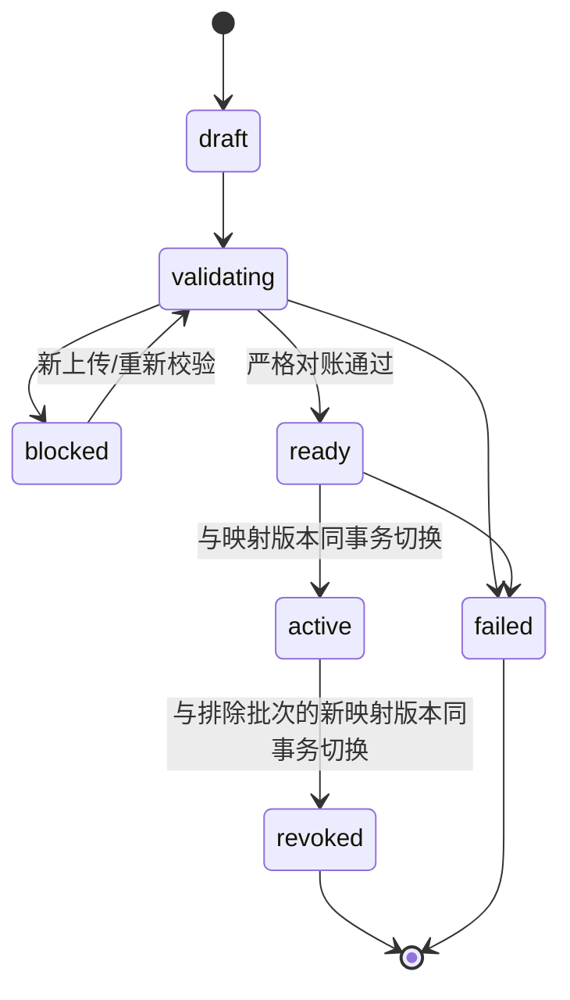
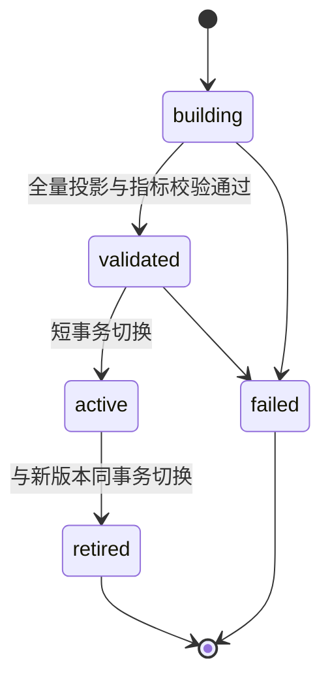
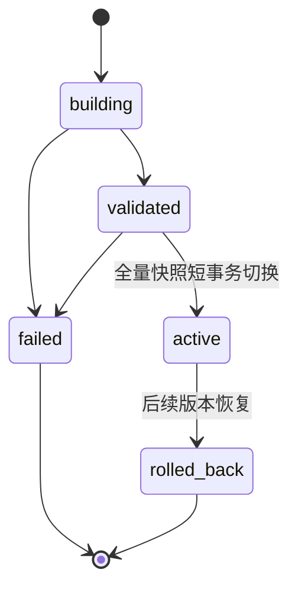
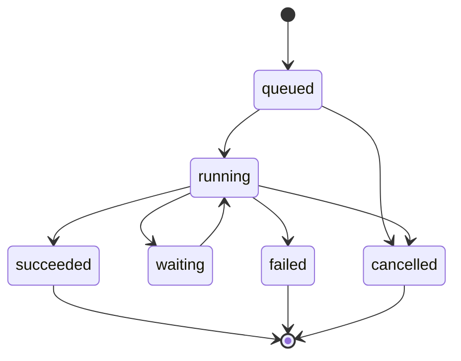

# M1 物理数据模型 v0.2

| 项目 | 内容 |
|---|---|
| 状态 | DDL FEASIBILITY REVIEWED；仅允许进入迁移方案与文件结构设计 |
| 日期 | 2026-06-20 |
| 数据库 | PostgreSQL 16+ |
| 金额类型 | `NUMERIC(32,18)` |
| ADR | `docs/technical-design/ADR-M1-数据库选型.md` |
| 基线 | `M1-物理数据模型-v0.1.md`、`M1-技术设计草案-v0.3.md`、现有 PRD 与真实数据分析 |
| 不包含 | 正式迁移文件、应用代码、接口、页面、正式数据库、正式数据导入、运营确认结果自动应用 |

## 1. v0.2 修订结论

v0.2 保留 PostgreSQL 16+ 与 `NUMERIC(32,18)`，并完成以下结构性修订：

- 批次收入事实、候选映射投影和首次正数实销派生结果先以不可见版本构建；严格对账通过后，批次状态与映射版本状态在同一短事务中切换；
- 渠道别名、原始作品 ID 映射和历史分册映射全部采用 `mapping_version` 完整快照，不再混用行级 `valid_from` / `valid_to`；
- 历史分册映射改为 `historical_raw_work_id -> target_standard_work_id`，历史原始 ID 不创建独立标准作品；
- 删除 `income_fact.is_effective`、`income_projection.actual_sales_amount`、`income_projection.bill_month`、标准作品当前基础信息指针及首次实销缓存；
- 删除不可成立的 `income_projection_monthly_summary` 多粒度缓存表，M1 初版使用普通查询视图或按需聚合；
- 基础信息版本采用全量快照，全库最多一个 active 版本；分类树与标签库分别增加发布版本；
- 增加问题运行上下文、任务重试链和多消费者影响消费记录；
- 正式收入事实的七个业务字段及来源工作表全部 `NOT NULL`；临时记录仍允许空值并生成问题；
- 物理表由 v0.1 的 42 张调整为 **47 张**。

## 2. 全局物理约定

### 2.1 类型与通用字段

- 主键默认使用 `bigint generated always as identity`；外部业务 ID 使用 `text`。
- 金额统一使用 `numeric(32,18)`，不得使用 `real`、`double precision` 或应用语言浮点数参与权威存储和严格对账。
- 自然月使用 `date` 且检查 `date_trunc('month', value)::date = value`。
- 时间使用 `timestamptz`；JSON 扩展信息使用 `jsonb`，但关键查询和约束字段不得只存入 JSON。
- 除纯关联表外，业务表默认含 `created_at timestamptz not null default now()`、`created_by text null`、`updated_at timestamptz null`、`updated_by text null`。
- 所有状态字段使用 `text + CHECK`；本阶段不创建 PostgreSQL enum，避免状态扩展必须改类型。
- 文档中的“部分唯一索引”使用 PostgreSQL `CREATE UNIQUE INDEX ... WHERE ...` 实现。

### 2.2 删除策略

- 权威事实、已激活版本、问题决定、影响事件和审计记录：`ON DELETE RESTRICT`，业务上只撤销、退休或归档，不物理删除。
- 仅随父对象存在的临时行和纯关联行：`ON DELETE CASCADE`。
- 可选审计引用在来源允许归档时使用 `ON DELETE SET NULL`，但不得使核心事实失去来源。
- 所有 FK 在建表顺序无法直接满足时，先建表后 `ALTER TABLE ADD CONSTRAINT`；本模型不依赖不可解循环 FK。

### 2.3 版本原则

- 当前映射仅由 `mapping_version.status='active'` 决定；全库最多一个 active 映射版本。
- 当前基础信息仅由 `basic_info_version.status='active'` 决定；全库最多一个 active 基础信息版本。
- 当前分类与标签版本分别由 `classification_release.status='active'`、`tag_release.status='active'` 决定。
- 映射和基础信息版本均为完整快照；快照行不再承担行级生效区间语义。
- 派生结果必须直接携带来源版本主键；不存在无来源版本的“当前缓存”。

## 3. 物理表总表

| # | 表名 | 职责 | 属性 |
|---:|---|---|---|
| 1 | `background_task` | 后台任务与重试链 | 权威 |
| 2 | `background_task_event` | 任务阶段、瞬时尝试与状态事件 | 权威审计 |
| 3 | `file_fingerprint_registry` | SHA-256 与文件大小权威登记 | 权威 |
| 4 | `import_file` | 上传文件元数据 | 权威 |
| 5 | `bill_staging_session` | 账单临时解析会话 | 临时权威 |
| 6 | `temp_bill_record` | 临时账单行 | 临时权威 |
| 7 | `issue_run` | 数据问题运行上下文 | 权威 |
| 8 | `data_issue` | 账单、批次或映射问题实例 | 权威 |
| 9 | `data_issue_decision` | 问题处理决定 | 权威 |
| 10 | `cleaning_rule_version` | 清洗和校验规则版本 | 权威 |
| 11 | `import_batch` | 账单导入批次 | 权威 |
| 12 | `import_batch_file` | 批次文件关系 | 权威关联 |
| 13 | `import_batch_month` | 批次月份覆盖 | 可重算派生 |
| 14 | `income_fact` | 不可变收入事实 | 权威 |
| 15 | `mapping_version` | 完整映射与投影快照版本 | 权威 |
| 16 | `income_projection` | 收入到渠道、作品、形态的版本化投影 | 派生 |
| 17 | `mapping_version_work_metric` | 标准作品上线月版本化结果 | 派生 |
| 18 | `mapping_version_work_form_metric` | 业务形态首次正数实销月版本化结果 | 派生 |
| 19 | `channel` | 统一渠道 | 权威 |
| 20 | `channel_alias` | 版本化渠道别名与原始 ID 映射 | 权威快照 |
| 21 | `standard_work` | 标准作品身份 | 权威 |
| 22 | `work_business_form` | 标准作品业务形态 | 权威 |
| 23 | `raw_work_id_mapping` | 版本化常规原始作品 ID 映射 | 权威快照 |
| 24 | `historical_volume_mapping` | 版本化历史分册原始 ID 映射 | 权威快照 |
| 25 | `standard_work_status_history` | 标准作品状态历史 | 权威 |
| 26 | `author` | 作者 | 权威 |
| 27 | `author_alias` | 作者别名 | 权威 |
| 28 | `classification_system` | 分类体系身份 | 权威 |
| 29 | `classification_release` | 分类树发布版本 | 权威 |
| 30 | `classification_node` | 版本化分类节点 | 权威快照 |
| 31 | `work_classification_assignment` | 基础信息版本内作品分类 | 权威快照 |
| 32 | `tag_release` | 标签库发布版本 | 权威 |
| 33 | `tag` | 版本化标签 | 权威快照 |
| 34 | `work_tag_assignment` | 基础信息版本内作品标签 | 权威快照 |
| 35 | `basic_info_version` | 标准作品基础信息全量版本 | 权威 |
| 36 | `basic_info_version_work` | 版本内标准作品基础信息 | 权威快照 |
| 37 | `basic_info_export` | 待补全表导出 | 权威 |
| 38 | `basic_info_upload` | 补全文件上传 | 权威 |
| 39 | `basic_info_temp_record` | 补全文件临时行 | 临时权威 |
| 40 | `basic_info_issue` | 补全文件问题 | 权威 |
| 41 | `basic_info_apply_batch` | 基础信息整批应用 | 权威 |
| 42 | `month_completeness_confirmation` | 月份完整性人工确认 | 权威 |
| 43 | `batch_impact_record` | 幂等影响事件 | 派生权威 |
| 44 | `batch_impact_consumption` | 多消费者独立消费状态 | 权威 |
| 45 | `restore_point` | 逻辑恢复点 | 权威 |
| 46 | `import_batch_undo` | 批次撤销操作 | 权威 |
| 47 | `mapping_change_record` | 映射变更审计 | 权威审计 |

M1 初版不创建 `income_projection_monthly_summary`。`v_income_projection_monthly` 为查询视图，不计入物理表数量。

## 4. 表定义

### 4.1 `background_task`

- 职责/属性：后台异步任务、幂等提交和显式重试链；权威。
- 字段：`id bigint identity`；`task_type text not null`；`logical_operation_key text not null`；`idempotency_key text not null`；`retry_of_task_id bigint null`；`status text not null default 'queued'`；`business_stage text null`；`priority int not null default 100`；`transient_attempt_count int not null default 0`；`max_transient_attempts int not null default 1`；`required_model text null`；`payload jsonb not null default '{}'`；`result jsonb null`；`error_code text null`；`error_message text null`；`available_at timestamptz not null default now()`；`started_at timestamptz null`；`finished_at timestamptz null`；通用字段。
- 主键/外键：PK `id`；`retry_of_task_id -> background_task(id) ON DELETE RESTRICT`。
- 唯一约束：`UNIQUE(task_type, idempotency_key)`；同一逻辑操作的重试任务使用新幂等键并复用 `logical_operation_key`。
- 检查约束：`status in ('queued','running','waiting','succeeded','failed','cancelled')`；计数非负；`retry_of_task_id is null or retry_of_task_id <> id`；`status in ('succeeded','failed','cancelled')` 时 `finished_at is not null`。
- 索引：部分索引 `idx_task_queue(priority, available_at, id) where status='queued'`；`idx_task_logical_operation(task_type, logical_operation_key)`；`idx_task_retry_of(retry_of_task_id)`。
- 保留：至少 2 年；任务链、结果摘要和错误永久审计，超大 payload 可按脱敏策略归档。
- 对应：`REQ-PLATFORM-001/002`，`AT-M1-050/051`。

### 4.2 `background_task_event`

- 职责/属性：记录状态变化、业务阶段和单任务内瞬时尝试；权威审计。
- 字段：`id bigint identity`；`task_id bigint not null`；`event_type text not null`；`from_status text null`；`to_status text null`；`transient_attempt_no int null`；`message text null`；`event_payload jsonb not null default '{}'`；`occurred_at timestamptz not null default now()`；`created_by text null`。
- 主键/外键：PK `id`；`task_id -> background_task(id) ON DELETE RESTRICT`。
- 唯一约束：无。
- 检查约束：状态值与任务状态域相同；`transient_attempt_no is null or transient_attempt_no > 0`。
- 索引：`(task_id, occurred_at, id)`。
- 保留：随任务保留。
- 对应：`REQ-PLATFORM-001`，`AT-M1-050`。

### 4.3 `file_fingerprint_registry`

- 职责/属性：文件内容指纹的唯一权威来源；权威。
- 字段：`id bigint identity`；`sha256 text not null`；`file_size_bytes bigint not null`；`created_at timestamptz not null default now()`。
- 主键/外键：PK `id`；无 FK，不再保存 `first_import_file_id`。
- 唯一约束：`UNIQUE(sha256)`。
- 检查约束：`sha256 ~ '^[0-9a-f]{64}$'`；`file_size_bytes > 0`。
- 索引：唯一索引已覆盖指纹查询。
- 保留：永久保留；批次撤销不删除指纹。
- 权威说明：SHA-256 和大小只在本表保存；`import_file` 仅保存 `fingerprint_id`，避免双存不一致。
- 对应：`REQ-DATA-IMPORT-002/007`，`AT-M1-002/007`。

### 4.4 `import_file`

- 职责/属性：上传文件元数据、留存状态和解析报告；权威。
- 字段：`id bigint identity`；`fingerprint_id bigint not null`；`original_filename text not null`；`storage_uri text null`；`uploaded_at timestamptz not null default now()`；`uploaded_by text null`；`retention_status text not null default 'retained'`；`deleted_at timestamptz null`；`parse_report_uri text null`；`row_count bigint null`；`total_amount numeric(32,18) null`。
- 主键/外键：PK `id`；`fingerprint_id -> file_fingerprint_registry(id) ON DELETE RESTRICT`。
- 唯一约束：无；受控重新导入可生成指向同一指纹的新文件记录。
- 检查约束：`retention_status in ('retained','deleted','redacted')`；deleted 状态与 `deleted_at` 一致；行数非负。
- 索引：`(fingerprint_id, uploaded_at)`；`(uploaded_at)`。
- 保留：元数据永久；原文件按 PRD 留存策略处理。
- 对应：`REQ-DATA-IMPORT-002/005/007`，`AT-M1-002/005/007`。

### 4.5 `bill_staging_session`

- 职责/属性：大文件分块解析和正式激活前工作区；临时权威。
- 字段：`id bigint identity`；`task_id bigint not null`；`import_file_id bigint not null`；`rule_version_id bigint not null`；`status text not null default 'parsing'`；`parsed_row_count bigint not null default 0`；`valid_row_count bigint not null default 0`；`invalid_row_count bigint not null default 0`；`raw_total_amount numeric(32,18) null`；`created_at timestamptz not null default now()`；`finished_at timestamptz null`。
- 主键/外键：PK `id`；FK 到 `background_task`、`import_file`、`cleaning_rule_version`，均 `ON DELETE RESTRICT`。
- 唯一约束：`UNIQUE(import_file_id, task_id)`。
- 检查约束：`status in ('parsing','parsed','failed','discarded','promoted')`；计数非负；`valid_row_count + invalid_row_count <= parsed_row_count`。
- 索引：`(status, created_at)`；`(import_file_id)`。
- 保留：成功会话至少保留至迁移验收完成；失败会话按排障期限清理。
- 对应：`REQ-DATA-IMPORT-003`、`REQ-DQ-003`，`AT-M1-003/012`。

### 4.6 `temp_bill_record`

- 职责/属性：允许空值的临时七字段账单行；临时权威。
- 字段：`id bigint identity`；`staging_session_id bigint not null`；`source_sheet_name text null`；`source_row_number int not null`；`bill_month date null`；`raw_channel_id text null`；`raw_channel_name text null`；`raw_authorization_category text null`；`raw_work_id text null`；`raw_work_name text null`；`actual_sales_amount numeric(32,18) null`；`parse_status text not null default 'parsed'`；`row_hash text not null`；`created_at timestamptz not null default now()`。
- 主键/外键：PK `id`；`staging_session_id -> bill_staging_session(id) ON DELETE CASCADE`。
- 唯一约束：`UNIQUE(staging_session_id, source_sheet_name, source_row_number) NULLS NOT DISTINCT`。
- 检查约束：月份为空或为月首；`source_row_number > 0`；`parse_status in ('parsed','invalid','ignored')`。
- 索引：`(staging_session_id, raw_work_id)`；`(staging_session_id, raw_channel_id)`。
- 保留：随 staging 清理；正式事实不依赖此表。
- 对应：`REQ-DATA-IMPORT-001/003`、`REQ-DQ-001`，`AT-M1-001/003/010`。

### 4.7 `issue_run`

- 职责/属性：隔离每次上传、批次校验或映射构建的问题实例；权威。
- 字段：`id bigint identity`；`run_type text not null`；`staging_session_id bigint null`；`import_batch_id bigint null`；`mapping_version_id bigint null`；`run_no int not null default 1`；`status text not null default 'running'`；`started_at timestamptz not null default now()`；`finished_at timestamptz null`；通用字段。
- 主键/外键：PK `id`；FK 分别到 staging、批次、映射版本，`ON DELETE RESTRICT`。
- 唯一约束：按上下文使用三个部分唯一索引：`(staging_session_id, run_no) where run_type='upload'`、`(import_batch_id, run_no) where run_type='batch'`、`(mapping_version_id, run_no) where run_type='mapping'`。
- 检查约束：`run_type in ('upload','batch','mapping')`；`status in ('running','completed','failed','discarded')`；`num_nonnulls(staging_session_id, import_batch_id, mapping_version_id)=1`；上下文字段与 `run_type` 必须匹配。
- 索引：`(status, started_at)`。
- 保留：永久；重新上传创建新 staging 与新 issue run。
- 对应：`REQ-DQ-001/002/003`、`REQ-DATA-IMPORT-007`，`AT-M1-007/010/011/012`。

### 4.8 `data_issue`

- 职责/属性：某一 issue run 内的问题实例；权威。
- 字段：`id bigint identity`；`issue_run_id bigint not null`；`issue_type text not null`；`severity text not null`；`blocking boolean not null default true`；`group_key text not null`；`sample_ref jsonb not null default '{}'`；`status text not null default 'open'`；通用字段。
- 主键/外键：PK `id`；`issue_run_id -> issue_run(id) ON DELETE RESTRICT`。
- 唯一约束：`UNIQUE(issue_run_id, issue_type, group_key)`；问题不得跨运行上下文去重。
- 检查约束：`severity in ('info','warning','blocking')`；`status in ('open','decided','resolved','waived')`；`blocking = (severity='blocking')` 或由明确问题类型规则校验。
- 索引：部分索引 `(issue_run_id, issue_type, group_key) where status in ('open','decided')`；`(status, blocking, issue_type)`。
- 保留：永久；旧决定不继承到新 issue run。
- 对应：`REQ-DQ-001/002/003`，`AT-M1-010/011/012`。

### 4.9 `data_issue_decision`

- 职责/属性：运营对问题组的版本化决定；权威。
- 字段：`id bigint identity`；`issue_id bigint not null`；`decision text not null`；`decision_payload jsonb not null default '{}'`；`decided_by text not null`；`decided_at timestamptz not null default now()`；`superseded_by_id bigint null`。
- 主键/外键：PK `id`；FK 到 `data_issue` 和自身，`ON DELETE RESTRICT`。
- 唯一约束：部分唯一索引 `(issue_id) where superseded_by_id is null`。
- 检查约束：`decision in ('delete_duplicate','keep_as_valid','source_file_fix_required','map_to_existing','needs_more_info','not_applicable')`；不得自我取代。
- 索引：`(issue_id, decided_at)`。
- 保留：永久。
- 对应：`REQ-DQ-001/002/003`、`REQ-DATA-IMPORT-007`，`AT-M1-007/010/011/012`。

### 4.10 `cleaning_rule_version`

- 职责/属性：字段校验、重复识别、金额及月份解析规则版本；权威。
- 字段：`id bigint identity`；`rule_code text not null`；`version_no int not null`；`status text not null default 'draft'`；`rule_payload jsonb not null`；`effective_from timestamptz null`；`effective_to timestamptz null`；通用字段。
- 主键/外键：PK `id`；无 FK。
- 唯一约束：`UNIQUE(rule_code, version_no)`；部分唯一索引 `UNIQUE(rule_code) WHERE status='active'`。
- 检查约束：`status in ('draft','active','retired')`；有效期顺序正确。
- 索引：`(rule_code, status)`。
- 保留：永久，保证历史批次可重放。
- 对应：`REQ-DQ-001/002/003`，`AT-M1-010/011/012`。

### 4.11 `import_batch`

- 职责/属性：正式导入、撤销和受控重新导入的业务批次；权威。
- 字段：`id bigint identity`；`batch_no text not null`；`status text not null default 'draft'`；`source_type text not null default 'normal_upload'`；`reimport_of_batch_id bigint null`；`rule_version_id bigint not null`；`activation_mapping_version_id bigint null`；`raw_row_count bigint not null default 0`；`accepted_row_count bigint not null default 0`；`fact_row_count bigint not null default 0`；`projection_row_count bigint not null default 0`；`raw_total_amount numeric(32,18) not null default 0`；`deleted_confirmed_amount numeric(32,18) not null default 0`；`accepted_total_amount numeric(32,18) not null default 0`；`fact_total_amount numeric(32,18) not null default 0`；`projection_total_amount numeric(32,18) not null default 0`；`reconciliation_checksum text null`；`reconciled_at timestamptz null`；`activated_at timestamptz null`；`revoked_at timestamptz null`；通用字段。
- 主键/外键：PK `id`；自 FK `reimport_of_batch_id`；FK 到规则版本和激活映射版本，均 `ON DELETE RESTRICT`。
- 唯一约束：`UNIQUE(batch_no)`；部分唯一索引 `UNIQUE(reimport_of_batch_id) where source_type='controlled_reimport' and status in ('ready','active')`，允许失败尝试保留审计，但同一被撤销批次不得同时存在两个可激活或已激活重导批次。
- 检查约束：`status in ('draft','validating','blocked','ready','active','revoked','failed')`；`source_type in ('normal_upload','controlled_reimport')`；受控重导与旧批次引用同时为空或同时存在；所有计数非负；当 `status in ('ready','active','revoked')` 时，必须满足 `raw_total_amount-deleted_confirmed_amount=accepted_total_amount=fact_total_amount=projection_total_amount`、`accepted_row_count=fact_row_count=projection_row_count`，且 `reconciled_at`、checksum 非空；active/revoked 时间字段必须一致。
- 跨表约束：受控重导仅可引用 revoked 批次且关联文件指纹相同；激活/撤销通过受控存储过程和 deferred constraint trigger 校验当前 active 映射投影覆盖集合。
- 索引：`(status, created_at)`；`(reimport_of_batch_id)`；`(activation_mapping_version_id)`。
- 保留：永久；撤销只改状态，不删除事实。
- 对应：`REQ-DATA-IMPORT-002..007`，`AT-M1-002..007`。

### 4.12 `import_batch_file`

- 职责/属性：批次与文件关系；权威关联。
- 字段：`import_batch_id bigint not null`；`import_file_id bigint not null`；`file_role text not null default 'source_bill'`；`created_at timestamptz not null default now()`。
- 主键/外键：PK `(import_batch_id, import_file_id)`；FK 到批次和文件，`ON DELETE RESTRICT`。
- 唯一约束：主键。
- 检查约束：`file_role in ('source_bill','cleaned_return','supporting_report')`。
- 索引：`(import_file_id)`。
- 保留：随批次永久。
- 对应：`REQ-DATA-IMPORT-002/007`，`AT-M1-002/007`。

### 4.13 `import_batch_month`

- 职责/属性：由批次事实重算的覆盖月份；派生。
- 字段：`import_batch_id bigint not null`；`bill_month date not null`；`row_count bigint not null`；`amount_total numeric(32,18) not null`；`source_fact_checksum text not null`；`recomputed_at timestamptz not null default now()`。
- 主键/外键：PK `(import_batch_id, bill_month)`；`import_batch_id -> import_batch(id) ON DELETE RESTRICT`。
- 唯一约束：主键。
- 检查约束：月份为月首；行数非负。
- 索引：`(bill_month, import_batch_id)`。
- 保留/重算：随批次永久；权威来源为该批次 `income_fact`，批次事实构建完成时重算。
- 对应：`REQ-DATA-IMPORT-006`，`AT-M1-006`。

### 4.14 `income_fact`

- 职责/属性：正式账单原始七字段的不可变收入事实；权威。
- 字段：`id bigint identity`；`import_batch_id bigint not null`；`import_file_id bigint not null`；`source_sheet_name text not null`；`source_row_number int not null`；`bill_month date not null`；`raw_channel_id text not null`；`raw_channel_name text not null`；`raw_authorization_category text not null`；`raw_work_id text not null`；`raw_work_name text not null`；`actual_sales_amount numeric(32,18) not null`；`row_hash text not null`；`created_at timestamptz not null default now()`。
- 主键/外键：PK `id`；FK 到 `import_batch`、`import_file`，`ON DELETE RESTRICT`。
- 唯一约束：`UNIQUE(import_file_id, source_sheet_name, source_row_number)`；所有组成列非空，不受 NULL 语义绕过。
- 检查约束：月份为月首；来源行号大于 0；五个原始文本业务字段 `btrim(value)<>''`；金额不限制正负或零。
- 索引：`(import_batch_id)`；`(bill_month)`；`(raw_work_id, bill_month)`；`(raw_channel_id, bill_month)`。
- 不可变性：数据库触发器拒绝 `UPDATE` 和 `DELETE`；撤销仅通过批次状态和新映射快照改变可见性。
- 保留：永久。
- 对应：`REQ-DATA-IMPORT-001..007`，`AT-M1-001..007`。

### 4.15 `mapping_version`

- 职责/属性：渠道、作品、业务形态映射及全部投影的完整快照版本；权威。
- 字段：`id bigint identity`；`version_no bigint not null`；`status text not null default 'building'`；`base_version_id bigint null`；`trigger_type text not null`；`trigger_ref text null`；`build_task_id bigint not null`；`projection_row_count bigint not null default 0`；`projection_total_amount numeric(32,18) not null default 0`；`projection_checksum text null`；`validated_at timestamptz null`；`activated_at timestamptz null`；`retired_at timestamptz null`；通用字段。
- 主键/外键：PK `id`；自 FK `base_version_id`；`build_task_id -> background_task(id)`，均 `ON DELETE RESTRICT`。
- 唯一约束：`UNIQUE(version_no)`；部分唯一索引 `CREATE UNIQUE INDEX ... ON mapping_version ((true)) WHERE status='active'`，保证全库最多一个 active 版本。
- 检查约束：`status in ('building','validated','active','retired','failed')`；validated/active/retired 必须有校验时间、checksum；active 必须有激活时间；retired 必须有退休时间。
- 索引：`(status, version_no desc)`；`(base_version_id)`。
- 保留：active、上一 active、回滚依赖版本永久；失败构建按审计期限归档。
- 对应：`REQ-DATA-IMPORT-007`、`REQ-WORK-001..006`、`REQ-CHANNEL-001`，`AT-M1-007/020..025/030`。

### 4.16 `income_projection`

- 职责/属性：指定映射快照中每条收入事实到统一渠道、标准作品和业务形态的唯一投影；派生。
- 字段：`mapping_version_id bigint not null`；`income_fact_id bigint not null`；`channel_id bigint not null`；`standard_work_id text not null`；`business_form text not null`；`channel_alias_id bigint not null`；`raw_work_mapping_id bigint null`；`historical_volume_mapping_id bigint null`；`projection_rule_code text not null`；`created_at timestamptz not null default now()`。
- 主键/外键：PK `(mapping_version_id, income_fact_id)`；FK 到映射版本、事实、渠道、标准作品及 `(standard_work_id,business_form)` 业务形态；FK 到渠道别名及两类作品映射；版本和来源映射使用复合 FK 保证均属于同一 `mapping_version_id`；均 `ON DELETE RESTRICT`。
- 唯一约束：主键；不再另存投影状态。
- 检查约束：`business_form in ('audio_copyright','audio_product')`；`num_nonnulls(raw_work_mapping_id, historical_volume_mapping_id)=1`。
- 索引：`(mapping_version_id, standard_work_id, business_form, income_fact_id)`；`(mapping_version_id, channel_id, income_fact_id)`；`(income_fact_id)`。
- 权威说明：不保存金额和月份，查询必须通过 `income_fact_id` 读取；整表可由映射快照和收入事实重建。
- 保留：active、回滚所需和审计版本；失败版本可清理。
- 对应：`REQ-DATA-IMPORT-004/007`、`REQ-WORK-001..006`、`REQ-CHANNEL-001`，`AT-M1-004/007/020..025/030`。

### 4.17 `mapping_version_work_metric`

- 职责/属性：指定映射版本下标准作品上线月；派生快照。
- 字段：`mapping_version_id bigint not null`；`standard_work_id text not null`；`launch_month date null`；`positive_fact_count bigint not null default 0`；`source_projection_checksum text not null`；`computed_at timestamptz not null default now()`。
- 主键/外键：PK `(mapping_version_id, standard_work_id)`；FK 到映射版本和标准作品，`ON DELETE RESTRICT`。
- 唯一约束：主键。
- 检查约束：月份为空或为月首；`positive_fact_count >= 0`；月份为空当且仅当正数事实数为 0。
- 索引：`(mapping_version_id, launch_month)`。
- 重算：由同版本 `income_projection` 连接 `income_fact`，筛选 `actual_sales_amount > 0` 后取两种业务形态最早月份；在版本切换前构建并校验。
- 保留：随映射版本。
- 对应：`REQ-WORK-003`，`AT-M1-022`。

### 4.18 `mapping_version_work_form_metric`

- 职责/属性：指定映射版本下标准作品每种业务形态首次正数实销月；派生快照。
- 字段：`mapping_version_id bigint not null`；`standard_work_id text not null`；`business_form text not null`；`first_positive_sale_month date null`；`positive_fact_count bigint not null default 0`；`source_projection_checksum text not null`；`computed_at timestamptz not null default now()`。
- 主键/外键：PK `(mapping_version_id, standard_work_id, business_form)`；复合 FK 到 `work_business_form`，另 FK 到映射版本，`ON DELETE RESTRICT`。
- 唯一约束：主键。
- 检查约束：业务形态值域；月份为空或月首；月份为空当且仅当正数事实数为 0。
- 索引：`(mapping_version_id, business_form, first_positive_sale_month)`。
- 重算：由同版本投影与金额大于 0 的事实取最早月份；零值、负值不参与，同月只要存在正数即成立。
- 保留：随映射版本。
- 对应：`REQ-WORK-004`，`AT-M1-023`。

### 4.19 `channel`

- 职责/属性：统一渠道身份；权威。
- 字段：`id bigint identity`；`channel_code text not null`；`display_name text not null`；`status text not null default 'active'`；通用字段。
- 主键/外键：PK `id`；无 FK。
- 唯一约束：`UNIQUE(channel_code)`；展示名不作为身份唯一键。
- 检查约束：`status in ('active','inactive')`；code 和名称非空白。
- 索引：`(status, display_name)`。
- 保留：永久；停用不删除。
- 对应：`REQ-CHANNEL-001`，`AT-M1-030`。

### 4.20 `channel_alias`

- 职责/属性：某完整映射快照内原始渠道 ID/名称到统一渠道的映射；权威快照。
- 字段：`id bigint identity`；`mapping_version_id bigint not null`；`channel_id bigint not null`；`raw_channel_id text not null`；`raw_channel_name text not null`；`normalized_channel_name text not null`；`mapping_source text not null`；`confirmed_issue_id bigint null`；`created_at timestamptz not null default now()`。
- 主键/外键：PK `id`；FK 到映射版本、渠道和问题；另建 `UNIQUE(id, mapping_version_id)` 供投影复合 FK 使用。
- 唯一约束：`UNIQUE(mapping_version_id, raw_channel_id, normalized_channel_name)`；约束触发器保证同一版本内同一 `raw_channel_id` 的所有历史名称只能指向同一 `channel_id`。
- 检查约束：原始 ID、名称、规范化名称非空白；`mapping_source in ('bill_observed','ops_confirmed')`。
- 索引：`(mapping_version_id, raw_channel_id)`；`(mapping_version_id, normalized_channel_name)`；`(mapping_version_id, channel_id)`。
- 版本语义：无 `valid_from/valid_to`；当前有效性只由所属映射版本 active 决定。
- 保留：随映射版本。
- 对应：`REQ-CHANNEL-001`，`AT-M1-030`。

### 4.21 `standard_work`

- 职责/属性：标准作品稳定身份；权威。
- 字段：`standard_work_id text not null`；`identity_source text not null`；`created_at timestamptz not null default now()`；`created_by text null`。
- 主键/外键：PK `standard_work_id`；无 FK。
- 唯一约束：主键。
- 检查约束：ID 非空白；`identity_source in ('bill_derived','ops_confirmed')`。
- 索引：主键足够；初版不建名称、上线月或状态缓存索引。
- 权威说明：不保存当前基础信息版本、当前状态、上线月或版权期限。
- 保留：永久。
- 对应：`REQ-WORK-001/003/007/008`，`AT-M1-020/022/026/027`。

### 4.22 `work_business_form`

- 职责/属性：标准作品存在的业务形态；权威。
- 字段：`standard_work_id text not null`；`business_form text not null`；`created_at timestamptz not null default now()`；`created_by text null`。
- 主键/外键：PK `(standard_work_id, business_form)`；FK 到标准作品，`ON DELETE RESTRICT`。
- 唯一约束：主键。
- 检查约束：`business_form in ('audio_copyright','audio_product')`。
- 索引：`(business_form, standard_work_id)`。
- 权威说明：不保存独立状态、版权期限或首次实销缓存；这些分别来自作品状态历史、基础信息版本和版本化指标。
- 保留：永久。
- 对应：`REQ-WORK-002/004/011`，`AT-M1-021/023/031`。

### 4.23 `raw_work_id_mapping`

- 职责/属性：某映射快照内常规原始作品 ID 到标准作品和业务形态的映射；权威快照。
- 字段：`id bigint identity`；`mapping_version_id bigint not null`；`raw_work_id text not null`；`standard_work_id text not null`；`business_form text not null`；`mapping_source text not null`；`confirmed_issue_id bigint null`；`created_at timestamptz not null default now()`。
- 主键/外键：PK `id`；FK 到映射版本、标准作品、作品业务形态和问题；`UNIQUE(id, mapping_version_id)` 供投影复合 FK 使用。
- 唯一约束：`UNIQUE(mapping_version_id, raw_work_id)`；`UNIQUE(mapping_version_id, standard_work_id, business_form)`，保证一种业务形态只有一个常规原始财务 ID。
- 检查约束：原始 ID 非空白；业务形态值域；`mapping_source in ('id_rule','ops_confirmed')`。
- 索引：`(mapping_version_id, standard_work_id)`；唯一索引覆盖原始 ID 查询。
- 版本语义：无 `valid_from/valid_to`；完整复制到每个候选版本。
- 保留：随映射版本。
- 对应：`REQ-WORK-001/002/006`，`AT-M1-020/021/025`。

### 4.24 `historical_volume_mapping`

- 职责/属性：历史分册原始财务 ID 到目标标准作品和业务形态的隐藏映射；权威快照。
- 字段：`id bigint identity`；`mapping_version_id bigint not null`；`historical_raw_work_id text not null`；`target_standard_work_id text not null`；`business_form text not null`；`confirmed_issue_id bigint not null`；`created_at timestamptz not null default now()`。
- 主键/外键：PK `id`；FK 到映射版本、目标标准作品、目标作品业务形态和确认问题；历史原始 ID 无标准作品 FK；`UNIQUE(id, mapping_version_id)` 供投影复合 FK 使用。
- 唯一约束：`UNIQUE(mapping_version_id, historical_raw_work_id, business_form)`。
- 检查约束：历史原始 ID 非空白；业务形态值域；禁止同时在同一版本的 `raw_work_id_mapping` 中作为常规 ID，使用 deferred constraint trigger 检查。
- 索引：`(mapping_version_id, target_standard_work_id, business_form)`。
- 版本语义：无 `valid_from/valid_to`；历史分册 ID 不创建独立 `standard_work`。
- 保留：随映射版本永久追溯。
- 对应：`REQ-WORK-005/006`，`AT-M1-024/025`。

### 4.25 `standard_work_status_history`

- 职责/属性：标准作品层状态历史；权威。
- 字段：`id bigint identity`；`standard_work_id text not null`；`status text not null`；`status_basis text null`；`valid_from timestamptz not null`；`valid_to timestamptz null`；通用字段。
- 主键/外键：PK `id`；FK 到标准作品，`ON DELETE RESTRICT`。
- 唯一约束：部分唯一索引 `UNIQUE(standard_work_id) WHERE valid_to IS NULL`。
- 检查约束：`status in ('listed','suspected_delisted','delisted','relisted')`；结束时间晚于开始时间。
- 索引：`(status, valid_to)`；`(standard_work_id, valid_from desc)`。
- 保留：永久；业务形态不保存独立状态。
- 对应：`REQ-WORK-007`，`AT-M1-026`。

### 4.26 `author`

- 职责/属性：作者稳定身份；权威。
- 字段：`id bigint identity`；`author_code text not null`；`primary_name text not null`；`status text not null default 'active'`；通用字段。
- 主键/外键：PK `id`；无 FK。
- 唯一约束：`UNIQUE(author_code)`；作者名称不强制唯一，避免误并同名作者。
- 检查约束：`status in ('active','inactive','pending_confirmation')`；名称和 code 非空白。
- 索引：`(primary_name)`；`(status)`。
- 保留：永久。
- 对应：`REQ-WORK-010`，`AT-M1-029`。

### 4.27 `author_alias`

- 职责/属性：已确认作者别名及来源；权威。
- 字段：`id bigint identity`；`author_id bigint not null`；`alias_name text not null`；`normalized_alias text not null`；`source_type text not null`；`source_ref text null`；`confirmed_issue_id bigint null`；`status text not null default 'active'`；通用字段。
- 主键/外键：PK `id`；FK 到作者和确认问题，`ON DELETE RESTRICT`。
- 唯一约束：部分唯一索引 `UNIQUE(normalized_alias) WHERE status='active'`；同一规范化别名若对应多作者必须先阻断确认，不能并存为 active。
- 检查约束：`status in ('active','retired','pending_confirmation')`；`source_type in ('master_data','ops_supplement','formal_basic_info')`。
- 索引：`(author_id, status)`；`(normalized_alias)`。
- 保留：永久。
- 对应：`REQ-WORK-010`，`AT-M1-029`。

### 4.28 `classification_system`

- 职责/属性：出版物与网文分类体系的稳定身份；权威。
- 字段：`id bigint identity`；`system_code text not null`；`display_name text not null`；`status text not null default 'active'`；通用字段。
- 主键/外键：PK `id`；无 FK。
- 唯一约束：`UNIQUE(system_code)`。
- 检查约束：`system_code in ('publication','web')`；`status in ('active','inactive')`。
- 索引：`(status)`。
- 保留：永久；两个体系不得共用节点。
- 对应：`REQ-CLASS-001`，`AT-M1-040`。

### 4.29 `classification_release`

- 职责/属性：同时封装出版物与网文分类树的一次不可变发布；权威。
- 字段：`id bigint identity`；`version_no bigint not null`；`status text not null default 'draft'`；`release_note text null`；`activated_at timestamptz null`；`retired_at timestamptz null`；通用字段。
- 主键/外键：PK `id`；无 FK。
- 唯一约束：`UNIQUE(version_no)`；部分唯一索引 `UNIQUE((true)) WHERE status='active'`。
- 检查约束：`status in ('draft','active','retired')`；active/retired 时间一致。
- 索引：`(status, version_no desc)`。
- 保留：永久；分类名称或层级变化必须创建新 release。
- 对应：`REQ-CLASS-001`，`AT-M1-040`。

### 4.30 `classification_node`

- 职责/属性：某分类 release 和体系内的三级树节点；权威快照。
- 字段：`id bigint identity`；`classification_release_id bigint not null`；`classification_system_id bigint not null`；`parent_id bigint null`；`node_code text not null`；`display_name text not null`；`level smallint not null`；`sort_order int not null default 0`；`created_at timestamptz not null default now()`。
- 主键/外键：PK `id`；FK 到 release、system；`UNIQUE(id, classification_release_id, classification_system_id)`；复合自 FK `(parent_id, classification_release_id, classification_system_id)` 引用同表，确保父节点同版本同体系。
- 唯一约束：`UNIQUE(classification_release_id, classification_system_id, node_code)`；兄弟节点使用 `UNIQUE NULLS NOT DISTINCT(classification_release_id, classification_system_id, parent_id, display_name)`，根节点不会因 `parent_id IS NULL` 绕过唯一性。
- 检查约束：`level between 1 and 3`；level 1 的 parent 为空，level 2/3 的 parent 非空；父级 level 连续由 deferred trigger 校验。
- 索引：`(classification_release_id, classification_system_id, parent_id, sort_order)`；`(classification_release_id, level)`。
- 保留：随 release 永久。
- 对应：`REQ-CLASS-001`，`AT-M1-040`。

### 4.31 `work_classification_assignment`

- 职责/属性：基础信息快照内每部作品唯一完整三级主分类；权威快照。
- 字段：`basic_info_version_id bigint not null`；`standard_work_id text not null`；`classification_node_id bigint not null`；`source_type text not null`；`created_at timestamptz not null default now()`。
- 主键/外键：PK `(basic_info_version_id, standard_work_id)`；FK 到基础信息版本、版本内作品行和分类节点，`ON DELETE RESTRICT`；deferred trigger 校验节点 release 等于基础信息版本的 `classification_release_id`。
- 唯一约束：主键。
- 检查约束：`source_type in ('confirmed_master_data','ops_supplement','formal_basic_info')`；仅允许分配 level 3 节点，由触发器校验完整祖先链。
- 索引：`(classification_node_id, basic_info_version_id)`。
- 保留：随基础信息版本永久。
- 对应：`REQ-WORK-008`、`REQ-CLASS-001`，`AT-M1-027/040`。

### 4.32 `tag_release`

- 职责/属性：辅助内容标签与特殊属性标签的一次不可变发布；权威。
- 字段：`id bigint identity`；`version_no bigint not null`；`status text not null default 'draft'`；`release_note text null`；`activated_at timestamptz null`；`retired_at timestamptz null`；通用字段。
- 主键/外键：PK `id`；无 FK。
- 唯一约束：`UNIQUE(version_no)`；部分唯一索引 `UNIQUE((true)) WHERE status='active'`。
- 检查约束：`status in ('draft','active','retired')`；时间字段与状态一致。
- 索引：`(status, version_no desc)`。
- 保留：永久；标签重命名或语义变化必须新建 release。
- 对应：`REQ-CLASS-002`，`AT-M1-041`。

### 4.33 `tag`

- 职责/属性：某标签 release 内的标签定义；权威快照。
- 字段：`id bigint identity`；`tag_release_id bigint not null`；`tag_code text not null`；`display_name text not null`；`normalized_name text not null`；`tag_type text not null`；`sort_order int not null default 0`；`created_at timestamptz not null default now()`。
- 主键/外键：PK `id`；FK 到 `tag_release`，`ON DELETE RESTRICT`；`UNIQUE(id, tag_release_id)` 供一致性校验。
- 唯一约束：`UNIQUE(tag_release_id, tag_code)`；`UNIQUE(tag_release_id, tag_type, normalized_name)`。
- 检查约束：`tag_type in ('auxiliary_content','special_attribute')`；名称和 code 非空白。
- 索引：`(tag_release_id, tag_type, sort_order)`。
- 保留：随 release 永久。
- 对应：`REQ-CLASS-002`，`AT-M1-041`。

### 4.34 `work_tag_assignment`

- 职责/属性：基础信息快照内作品标签分配；权威快照。
- 字段：`basic_info_version_id bigint not null`；`standard_work_id text not null`；`tag_id bigint not null`；`source_type text not null`；`created_at timestamptz not null default now()`。
- 主键/外键：PK `(basic_info_version_id, standard_work_id, tag_id)`；FK 到版本内作品行和标签；deferred trigger 校验标签 release 等于基础信息版本的 `tag_release_id`。
- 唯一约束：主键。
- 检查约束：`source_type in ('confirmed_master_data','ops_supplement','formal_basic_info')`。
- 索引：`(tag_id, basic_info_version_id)`；`(basic_info_version_id, standard_work_id)`。
- 保留：随基础信息版本永久。
- 对应：`REQ-WORK-008`、`REQ-CLASS-002`，`AT-M1-027/041`。

### 4.35 `basic_info_version`

- 职责/属性：全部标准作品当前基础信息的全量快照版本；权威。
- 字段：`id bigint identity`；`version_no bigint not null`；`status text not null default 'building'`；`source_type text not null`；`classification_release_id bigint not null`；`tag_release_id bigint not null`；`build_task_id bigint not null`；`snapshot_work_count bigint not null default 0`；`snapshot_checksum text null`；`validated_at timestamptz null`；`activated_at timestamptz null`；`retired_at timestamptz null`；通用字段。
- 主键/外键：PK `id`；FK 到分类 release、标签 release 和后台任务，`ON DELETE RESTRICT`。
- 唯一约束：`UNIQUE(version_no)`；部分唯一索引 `UNIQUE((true)) WHERE status='active'`。
- 检查约束：`status in ('building','validated','active','retired','failed')`；`source_type in ('master_data_seed','ops_supplement','formal_basic_info')`；validated/active/retired 必须有 checksum 与校验时间；active/retired 时间一致。
- 激活约束：deferred trigger/受控过程检查该版本对激活时全部 `standard_work` 各有一行，并且分类、标签分配仅引用本版本指定 release。
- 索引：`(status, version_no desc)`；`(classification_release_id)`；`(tag_release_id)`。
- 循环消除：不保存 `apply_batch_id`；应用批次单向引用目标版本。
- 保留：永久，至少保留所有曾 active 的版本。
- 对应：`REQ-WORK-008/009/010/011`、`REQ-CLASS-001/002`，`AT-M1-027/028/029/031/040/041`。

### 4.36 `basic_info_version_work`

- 职责/属性：基础信息全量版本内每部标准作品的一行基础信息；权威快照。
- 字段：`basic_info_version_id bigint not null`；`standard_work_id text not null`；`standard_work_name text not null`；`author_id bigint null`；`copyright_start_date date null`；`copyright_end_date date null`；`copyright_source_priority text null`；`source_record_ref text null`；`created_at timestamptz not null default now()`。
- 主键/外键：PK `(basic_info_version_id, standard_work_id)`；FK 到基础信息版本、标准作品和作者，`ON DELETE RESTRICT`。
- 唯一约束：主键。
- 检查约束：作品名称非空白；版权日期同时为空或同时非空；非空时到期日不早于开始日；`copyright_source_priority in ('confirmed_master_data','ops_supplement','formal_basic_info_version')`，有版权日期时来源优先级必填。
- 索引：`(basic_info_version_id, author_id)`；`(basic_info_version_id, copyright_end_date)`。
- 权威说明：版权开始日期来自已确认台账“签订日期”、运营补全或后续正式版本；不得由上线月、首次实销月或文件时间推算。版权期限只存标准作品层。
- M2 完整性：不保存 `is_complete_for_m2`。视图 `v_basic_info_m2_completeness` 按版本重算名称、作者、完整三级分类、版权日期和已冻结的必需标签；必需标签配置仍 PENDING-DATA 时返回 `pending_configuration=true`，不得推断为完整。
- 保留：随版本永久。
- 对应：`REQ-WORK-008/010/011`，`AT-M1-027/029/031`。

### 4.37 `basic_info_export`

- 职责/属性：生成待补全表时的范围、来源版本和文件记录；权威。
- 字段：`id bigint identity`；`export_no text not null`；`source_basic_info_version_id bigint not null`；`source_mapping_version_id bigint not null`；`status text not null default 'generated'`；`file_uri text null`；`row_count bigint not null default 0`；`generated_at timestamptz not null default now()`；`generated_by text null`。
- 主键/外键：PK `id`；FK 到基础信息版本和映射版本，`ON DELETE RESTRICT`。
- 唯一约束：`UNIQUE(export_no)`。
- 检查约束：`status in ('generated','downloaded','expired')`；行数非负。
- 索引：`(status, generated_at)`。
- 保留：元数据永久；文件按私有数据留存策略管理。
- 对应：`REQ-WORK-009`，`AT-M1-028`。

### 4.38 `basic_info_upload`

- 职责/属性：运营补全文件上传与解析状态；权威。
- 字段：`id bigint identity`；`export_id bigint not null`；`import_file_id bigint not null`；`task_id bigint not null`；`status text not null default 'uploaded'`；`parsed_row_count bigint not null default 0`；`valid_row_count bigint not null default 0`；`invalid_row_count bigint not null default 0`；`uploaded_at timestamptz not null default now()`；`uploaded_by text null`；`finished_at timestamptz null`。
- 主键/外键：PK `id`；FK 到导出、文件和后台任务，`ON DELETE RESTRICT`。
- 唯一约束：`UNIQUE(import_file_id, task_id)`。
- 检查约束：`status in ('uploaded','parsing','validated','blocked','applied','failed','discarded')`；计数非负且有效+无效不大于解析数。
- 索引：`(status, uploaded_at)`；`(export_id)`。
- 保留：永久元数据；临时行按流程清理。
- 对应：`REQ-WORK-009`，`AT-M1-028`。

### 4.39 `basic_info_temp_record`

- 职责/属性：补全文件临时解析行；临时权威。
- 字段：`id bigint identity`；`upload_id bigint not null`；`source_sheet_name text not null`；`source_row_number int not null`；`standard_work_id text null`；`standard_work_name text null`；`author_name text null`；`classification_level_1 text null`；`classification_level_2 text null`；`classification_level_3 text null`；`copyright_start_date date null`；`copyright_end_date date null`；`tag_values jsonb not null default '[]'`；`parse_status text not null default 'parsed'`；`row_hash text not null`；`created_at timestamptz not null default now()`。
- 主键/外键：PK `id`；`upload_id -> basic_info_upload(id) ON DELETE CASCADE`。
- 唯一约束：`UNIQUE(upload_id, source_sheet_name, source_row_number)`。
- 检查约束：来源行号大于 0；`parse_status in ('parsed','invalid','ignored')`；日期顺序在两者均非空时有效。
- 索引：`(upload_id, standard_work_id)`；`(upload_id, parse_status)`。
- 保留：应用完成并通过验收后可按策略清理。
- 对应：`REQ-WORK-009`，`AT-M1-028`。

### 4.40 `basic_info_issue`

- 职责/属性：一次基础信息上传内的字段、引用、冲突和完整性问题；权威。
- 字段：`id bigint identity`；`upload_id bigint not null`；`issue_type text not null`；`severity text not null`；`group_key text not null`；`sample_ref jsonb not null default '{}'`；`status text not null default 'open'`；`resolution text null`；`resolved_by text null`；`resolved_at timestamptz null`；通用字段。
- 主键/外键：PK `id`；`upload_id -> basic_info_upload(id) ON DELETE RESTRICT`。
- 唯一约束：`UNIQUE(upload_id, issue_type, group_key)`；重新上传生成新 upload 和新问题实例。
- 检查约束：`severity in ('info','warning','blocking')`；`status in ('open','resolved','waived')`；resolved 状态要求处理人和时间。
- 索引：`(upload_id, status, severity)`；部分索引 `(issue_type, group_key) where status='open'`。
- 保留：永久；不继承旧上传问题决定。
- 对应：`REQ-WORK-009/011`，`AT-M1-028/031`。

### 4.41 `basic_info_apply_batch`

- 职责/属性：补全文件全量快照构建、校验和原子应用；权威。
- 字段：`id bigint identity`；`apply_no text not null`；`upload_id bigint not null`；`target_version_id bigint not null`；`restore_point_id bigint not null`；`status text not null default 'building'`；`applied_row_count bigint not null default 0`；`snapshot_checksum text null`；`started_at timestamptz not null default now()`；`finished_at timestamptz null`；`error_message text null`；通用字段。
- 主键/外键：PK `id`；FK 到上传、目标基础信息版本和恢复点，`ON DELETE RESTRICT`。
- 唯一约束：`UNIQUE(apply_no)`；`UNIQUE(target_version_id)`。
- 检查约束：`status in ('building','validated','active','failed','rolled_back')`；active 要求 checksum、完成时间和目标版本 active。
- 索引：`(status, started_at)`；`(upload_id)`。
- 循环消除：由本表单向引用 `basic_info_version`；版本表不反向引用应用批次。
- 保留：永久。
- 对应：`REQ-WORK-009`、`REQ-PLATFORM-003`，`AT-M1-028/052`。

### 4.42 `month_completeness_confirmation`

- 职责/属性：自然月完整性的版本化人工确认；权威。
- 字段：`id bigint identity`；`bill_month date not null`；`completeness_status text not null default 'unconfirmed'`；`basis text null`；`confirmed_by text null`；`confirmed_at timestamptz null`；`superseded_by_id bigint null`；`created_at timestamptz not null default now()`；`created_by text null`。
- 主键/外键：PK `id`；自 FK `superseded_by_id ON DELETE RESTRICT`。
- 唯一约束：部分唯一索引 `UNIQUE(bill_month) WHERE superseded_by_id IS NULL`。
- 检查约束：月份为月首；`completeness_status in ('unconfirmed','complete','incomplete')`；仅 complete/incomplete 强制 `confirmed_by` 和 `confirmed_at` 非空；unconfirmed 不强制确认人。
- 索引：`(completeness_status, bill_month)`；`(bill_month, confirmed_at desc)`。
- 保留：永久；账单最大月份由 active 批次事实聚合，最新已确认完整月份由本表单独计算。
- 对应：`REQ-DATA-IMPORT-006`，`AT-M1-006`。

### 4.43 `batch_impact_record`

- 职责/属性：批次激活、撤销、映射切换和基础信息变化产生的幂等影响事件；派生权威。
- 字段：`id bigint identity`；`event_key text not null`；`event_type text not null`；`import_batch_id bigint null`；`mapping_version_id bigint null`；`standard_work_id text null`；`bill_month date null`；`payload jsonb not null default '{}'`；`created_at timestamptz not null default now()`。
- 主键/外键：PK `id`；FK 到批次、映射版本和标准作品，`ON DELETE RESTRICT`。
- 唯一约束：`UNIQUE(event_key)`。
- 检查约束：`event_type in ('batch_activated','batch_revoked','mapping_reprojected','basic_info_changed')`；月份为空或月首；至少一个业务引用非空。
- 索引：`(event_type, created_at)`；`(standard_work_id, created_at)`；`(mapping_version_id)`。
- 权威说明：不保存消费状态；每个消费者在独立表中记录。
- 保留：永久。
- 对应：`REQ-DATA-IMPORT-007`，`AT-M1-007`；M2/M4 仅作为未来消费者，不新增其业务规则。

### 4.44 `batch_impact_consumption`

- 职责/属性：M2、M4 或其他消费者对同一影响事件的独立消费状态；权威。
- 字段：`impact_record_id bigint not null`；`consumer_code text not null`；`status text not null default 'pending'`；`consumed_at timestamptz null`；`error_message text null`；`attempt_count int not null default 0`；`updated_at timestamptz not null default now()`。
- 主键/外键：PK `(impact_record_id, consumer_code)`；FK 到影响记录，`ON DELETE RESTRICT`。
- 唯一约束：主键。
- 检查约束：`status in ('pending','processing','consumed','failed','ignored')`；`attempt_count >= 0`；consumed 状态要求 `consumed_at`。
- 索引：部分索引 `(consumer_code, status, impact_record_id) where status in ('pending','failed')`。
- 保留：随影响事件永久。
- 对应：`REQ-DATA-IMPORT-007`，`AT-M1-007`；不定义 M2/M4 的失效或自动重评规则。

### 4.45 `restore_point`

- 职责/属性：关键切换前的数据库备份位置和业务版本摘要；权威。
- 字段：`id bigint identity`；`restore_point_no text not null`；`operation_type text not null`；`operation_ref text null`；`database_backup_ref text not null`；`mapping_version_id bigint null`；`basic_info_version_id bigint null`；`import_batch_id bigint null`；`checksum_payload jsonb not null default '{}'`；`created_at timestamptz not null default now()`；`created_by text null`。
- 主键/外键：PK `id`；FK 到映射版本、基础信息版本和批次，`ON DELETE RESTRICT`。
- 唯一约束：`UNIQUE(restore_point_no)`。
- 检查约束：`operation_type in ('batch_activate','batch_revoke','mapping_activate','basic_info_apply','manual_backup')`；备份引用非空白。
- 索引：`(operation_type, created_at desc)`。
- 保留：按备份与 PITR 策略；元数据永久。
- 对应：`REQ-PLATFORM-003`，`AT-M1-052`。

### 4.46 `import_batch_undo`

- 职责/属性：一次批次撤销请求、执行结果和新映射版本；权威。
- 字段：`id bigint identity`；`import_batch_id bigint not null`；`restore_point_id bigint not null`；`result_mapping_version_id bigint null`；`undo_reason text not null`；`status text not null default 'requested'`；`affected_fact_count bigint null`；`affected_amount numeric(32,18) null`；`created_at timestamptz not null default now()`；`created_by text null`；`finished_at timestamptz null`；`error_message text null`。
- 主键/外键：PK `id`；FK 到批次、恢复点和结果映射版本，`ON DELETE RESTRICT`。
- 唯一约束：部分唯一索引 `UNIQUE(import_batch_id) WHERE status in ('requested','building','ready','switching')`。
- 检查约束：`status in ('requested','building','ready','switching','succeeded','failed')`；succeeded 要求结果映射版本和完成时间。
- 索引：`(status, created_at)`；`(result_mapping_version_id)`。
- 保留：永久；撤销与删除严格分离。
- 对应：`REQ-DATA-IMPORT-007`、`REQ-PLATFORM-003`，`AT-M1-007/052`。

### 4.47 `mapping_change_record`

- 职责/属性：映射快照相对基线版本的变更审计；权威审计。
- 字段：`id bigint identity`；`mapping_version_id bigint not null`；`change_type text not null`；`entity_type text not null`；`entity_key text not null`；`before_payload jsonb null`；`after_payload jsonb null`；`confirmed_issue_id bigint null`；`created_at timestamptz not null default now()`；`created_by text null`。
- 主键/外键：PK `id`；FK 到映射版本和确认问题，`ON DELETE RESTRICT`。
- 唯一约束：`UNIQUE(mapping_version_id, change_type, entity_type, entity_key)`。
- 检查约束：`change_type in ('insert','update','delete','reproject')`；`entity_type in ('channel_alias','raw_work_mapping','historical_volume_mapping','projection')`；before/after 至少一个非空。
- 索引：`(mapping_version_id, entity_type)`；`(entity_type, entity_key)`。
- 保留：永久。
- 对应：`REQ-DATA-IMPORT-007`、`REQ-WORK-005/006`、`REQ-CHANNEL-001`，`AT-M1-007/024/025/030`。

## 5. 权威事实、派生结果与重算

| 语义 | 唯一权威来源 | 派生位置 | 重算触发 |
|---|---|---|---|
| 文件 SHA-256、大小 | `file_fingerprint_registry` | 无 | 上传时一次计算；文件记录不复制 |
| 原始账单七字段与金额 | `income_fact` | 无 | 不重算、不更新；错误通过撤销和新批次纠正 |
| 批次覆盖月份 | `income_fact` | `import_batch_month` | 批次事实构建完成；校验失败时丢弃重建 |
| 批次严格对账摘要 | `income_fact` + 问题决定 | `import_batch` 汇总字段 | 批次进入 ready 前 |
| 当前映射 | active `mapping_version` 的完整映射行 | `income_projection` | 新映射候选构建、批次激活/撤销、映射确认变化 |
| 投影金额与月份 | `income_fact` | 查询时经 `income_projection.income_fact_id` 连接 | 不在投影重复保存 |
| 标准作品上线月 | active 映射版本投影 + 正数事实 | `mapping_version_work_metric` | 候选映射版本切换前 |
| 业务形态首次正数实销月 | active 映射版本投影 + 正数事实 | `mapping_version_work_form_metric` | 候选映射版本切换前 |
| 月度收入汇总 | 当前投影 + 收入事实 | 普通视图/按需 SQL | 每次查询；性能证据不足前不持久化 |
| 账单最大月份 | 当前 active 批次的事实 | 查询视图 | 批次切换后自然变化 |
| 最新已确认完整月份 | `month_completeness_confirmation` | 查询视图 | 人工确认变化 |
| 标准作品身份 | `standard_work` | 无 | 不重算 |
| 标准作品当前状态 | `standard_work_status_history` 当前行 | 查询视图 | 新状态历史行生效 |
| 当前基础信息 | active `basic_info_version` 全量快照 | 查询视图 | 基础信息版本切换 |
| M2 基础信息完整性 | active 基础信息版本、分类/标签分配及已冻结必需标签配置 | `v_basic_info_m2_completeness` | 基础信息、分类、标签或必需标签配置变化 |
| 影响事件消费状态 | `batch_impact_consumption` 每消费者行 | 无 | 消费者独立更新 |

所有派生物均带来源版本或父对象 ID。M1 初版不保存无来源版本的金额汇总、上线月、首次实销月、当前状态或当前基础信息指针。

## 6. 批次与映射版本原子切换

### 6.1 不可见构建边界

1. 上传文件计算指纹；普通入口发现已有指纹立即阻断。
2. 只有显式引用 revoked 旧批次的 `controlled_reimport` 才能复用指纹；创建新文件、新 staging、新 issue run 和新批次，完整重新解析校验，不复制旧问题或决定。
3. `income_fact` 可在新批次 `validating/ready` 状态下分块写入。正式读取视图只读取 active 批次，因此事实尚不可见。
4. 创建 `mapping_version.status='building'`，复制完整渠道别名与作品映射快照，并为“当前 active 批次集合 + 待激活批次”构建全量 `income_projection`。
5. 在候选版本下预构建 `mapping_version_work_metric` 和 `mapping_version_work_form_metric`。月度汇总不持久化。
6. 完成行数、金额、事实覆盖、映射唯一性和 checksum 严格校验后，将候选版本改为 `validated`，批次改为 `ready`。这两个状态仍不可被正式读取。

### 6.2 激活短事务

事务隔离级别使用 `READ COMMITTED` 即可，但所有写入口必须调用唯一受控数据库函数；函数执行以下边界：

```sql
begin;
select pg_advisory_xact_lock(hashtext('m1:mapping-switch'));

-- 锁定要激活的批次、候选版本和当前 active 版本。
select id from import_batch where id = :batch_id for update;
select id from mapping_version where id = :candidate_version_id for update;
select id from mapping_version where status = 'active' for update;

-- 在锁内重验批次 ready、候选版本 validated、当前 active 版本未变化、
-- 严格对账字段、全量事实覆盖、投影金额和 checksum。

update mapping_version
   set status='retired', retired_at=clock_timestamp()
 where status='active';

update mapping_version
   set status='active', activated_at=clock_timestamp()
 where id=:candidate_version_id and status='validated';

update import_batch
   set status='active', activation_mapping_version_id=:candidate_version_id,
       activated_at=clock_timestamp()
 where id=:batch_id and status='ready';

-- 同事务插入 restore point 关联、影响事件和状态事件。
commit;
```

锁定对象：全局事务级 advisory lock、目标 `import_batch` 行、候选 `mapping_version` 行、原 active `mapping_version` 行。advisory lock 序列化批次激活、批次撤销和纯映射切换；行锁防止目标对象被并发取消或重复切换。

部分唯一索引保证“最多一个 active 映射版本”。`DEFERRABLE INITIALLY DEFERRED` 约束触发器在提交前保证：

- 恰有一个 active 映射版本；
- active 版本投影只包含 active 批次事实；
- 每条 active 批次事实恰有一条投影；
- 投影行数和金额与 active 批次事实严格一致；
- 版本化首次正数实销结果 checksum 与投影一致。

状态更新顺序在事务内部可能短暂出现“无 active 版本”，但 MVCC 下其他事务只能看到提交前旧版本或提交后新版本，不会看到中间状态。

### 6.3 撤销短事务

撤销前在长任务中构建一个排除目标批次、包含其余 active 批次的完整候选映射版本及两张指标表，并完成严格对账。短事务使用与激活相同 advisory lock，依次锁定目标 active 批次、候选版本和当前 active 版本，然后在同一事务中：

1. 旧 active 映射版本改为 retired；
2. 排除目标批次的新版本改为 active；
3. 目标批次由 active 改为 revoked；
4. `import_batch_undo` 改为 succeeded 并引用结果版本；
5. 插入受影响标准作品集合和幂等 `batch_impact_record`。

提交前 deferred trigger 验证新 active 投影不包含 revoked 批次，且覆盖所有其余 active 批次。因此不存在“批次已 revoked、当前投影仍含该批次”的可提交状态。

### 6.4 纯映射变更

渠道别名、常规原始作品 ID 或历史分册映射变化时：

1. 基于当前 active 版本创建完整 building 快照；
2. 只修改新快照中的映射行，不更新旧版本；
3. 对全部 active 批次事实重建投影和首次实销指标；
4. 严格对账和问题阻断通过后变为 validated；
5. 使用同一 advisory lock 在短事务内 retired 旧版本、active 新版本、写入 `mapping_change_record` 和影响事件。

原始账单字段和金额始终不变。

### 6.5 基础信息整批应用

1. 上传文件进入 `basic_info_temp_record`，生成独立 `basic_info_issue`。
2. 有 blocking 问题时不得构建可激活版本。
3. 基于当前 active 基础信息版本创建新的全量 building 快照；未在补全文件中变化的作品也复制到新版本。
4. 引用明确的 `classification_release_id` 和 `tag_release_id`，构建全部作品行、分类分配和标签分配。
5. 校验每个标准作品在快照内恰有一行、引用版本一致、checksum 正确后改为 validated。
6. 短事务使用 `pg_advisory_xact_lock(hashtext('m1:basic-info-switch'))`，锁定旧/新版本和 apply batch；retired 旧版本、active 新版本、apply batch active，并写影响事件。

全库最多一个 active 基础信息版本。失败时旧 active 版本保持可见；回滚通过再次切换到从旧快照复制的新版本完成，不修改历史 active 快照。

## 7. 任务重试与并发语义

- 单任务内瞬时重试：任务保持 `running`，增加 `transient_attempt_count` 并写事件；不产生 `failed -> queued` 状态转换。
- 瞬时尝试耗尽：原任务进入终态 `failed`，不得重新排队。
- 人工或策略性重试：创建新的 `queued` 任务，`retry_of_task_id` 指向失败任务，使用新 `idempotency_key`，保留同一 `logical_operation_key`。
- 同一 `(task_type, idempotency_key)` 重复提交返回已有任务，不新增行。
- 队列领取使用 `SELECT ... FOR UPDATE SKIP LOCKED`；领取与 `queued -> running` 在同一短事务内完成。
- 映射切换、批次切换和基础信息切换使用各自固定 advisory lock key；获取多个锁时始终按“mapping -> basic-info -> task”顺序，避免死锁。

## 8. 查询视图、索引与容量

### 8.1 正式读取视图

- `v_current_income_projection`：active 映射版本 → `income_projection` → `income_fact` → active `import_batch`。
- `v_income_projection_monthly`：在上述视图上按月份、渠道、标准作品、业务形态按需聚合。
- `v_current_work_metrics`：active 映射版本的两张指标表。
- `v_current_basic_info`：active 基础信息版本的作品、作者、分类和标签。
- `v_bill_cutoff`：分别返回 active 批次的账单最大月份和人工确认的最新完整月份。

正式服务不得绕过这些视图直接把 building/validated 版本当作当前数据。

### 8.2 五个首要索引

1. `income_projection(mapping_version_id, standard_work_id, business_form, income_fact_id)`；
2. `income_projection(mapping_version_id, channel_id, income_fact_id)`；
3. `income_fact(bill_month, import_batch_id, id)`；
4. `data_issue(issue_run_id, status, blocking, issue_type)`，可做 open/decided 部分索引；
5. `background_task(priority, available_at, id) where status='queued'`。

关键唯一索引另包括 active 映射版本、active 基础信息版本、版本内事实投影、版本内原始作品 ID 和来源文件行唯一性。

### 8.3 暂缓项

- 当前 192,899 行不启用表分区；当事实达到千万级且月份裁剪成为真实瓶颈时，再按 `bill_month` 评估分区。
- 不创建月度多粒度汇总物理表或物化视图；先以真实查询基线验证。
- 不为每个 JSON 字段建立 GIN 索引；仅在问题检索或审计查询出现明确证据后增加。
- 不预建 M2/M4 评估、失效或自动重评索引与表。

## 9. ER 图

```mermaid
erDiagram
    FILE_FINGERPRINT_REGISTRY ||--o{ IMPORT_FILE : identifies
    IMPORT_FILE ||--o{ BILL_STAGING_SESSION : parsed_as
    BILL_STAGING_SESSION ||--o{ TEMP_BILL_RECORD : contains
    ISSUE_RUN ||--o{ DATA_ISSUE : contains
    DATA_ISSUE ||--o{ DATA_ISSUE_DECISION : decided_by
    IMPORT_BATCH ||--o{ IMPORT_BATCH_FILE : uses
    IMPORT_FILE ||--o{ IMPORT_BATCH_FILE : belongs_to
    IMPORT_BATCH ||--o{ INCOME_FACT : owns
    MAPPING_VERSION ||--o{ INCOME_PROJECTION : contains
    INCOME_FACT ||--o{ INCOME_PROJECTION : projected_as
    MAPPING_VERSION ||--o{ CHANNEL_ALIAS : snapshots
    MAPPING_VERSION ||--o{ RAW_WORK_ID_MAPPING : snapshots
    MAPPING_VERSION ||--o{ HISTORICAL_VOLUME_MAPPING : snapshots
    STANDARD_WORK ||--o{ WORK_BUSINESS_FORM : has
    STANDARD_WORK ||--o{ RAW_WORK_ID_MAPPING : target
    STANDARD_WORK ||--o{ HISTORICAL_VOLUME_MAPPING : target
    MAPPING_VERSION ||--o{ MAPPING_VERSION_WORK_METRIC : computes
    MAPPING_VERSION ||--o{ MAPPING_VERSION_WORK_FORM_METRIC : computes
    CLASSIFICATION_RELEASE ||--o{ CLASSIFICATION_NODE : contains
    TAG_RELEASE ||--o{ TAG : contains
    BASIC_INFO_VERSION ||--o{ BASIC_INFO_VERSION_WORK : contains
    BASIC_INFO_VERSION ||--o{ WORK_CLASSIFICATION_ASSIGNMENT : classifies
    BASIC_INFO_VERSION ||--o{ WORK_TAG_ASSIGNMENT : tags
    BASIC_INFO_UPLOAD ||--o{ BASIC_INFO_TEMP_RECORD : contains
    BASIC_INFO_UPLOAD ||--o{ BASIC_INFO_ISSUE : raises
    BASIC_INFO_APPLY_BATCH ||--|| BASIC_INFO_VERSION : builds
    BATCH_IMPACT_RECORD ||--o{ BATCH_IMPACT_CONSUMPTION : consumed_by
```



## 10. 状态图

### 10.1 批次



### 10.2 映射版本



### 10.3 基础信息应用



### 10.4 后台任务



失败任务没有 `failed -> queued`。新任务通过 `retry_of_task_id` 形成重试链。

## 11. Schema 建立与首次迁移规划

本节只规定顺序，不生成迁移文件。

### 11.1 建表顺序

1. 无业务 FK 的基础表：`background_task`、`file_fingerprint_registry`、`cleaning_rule_version`、`channel`、`standard_work`、`author`、`classification_system`、`classification_release`、`tag_release`；
2. 文件与临时区：`import_file`、`background_task_event`、`bill_staging_session`、`temp_bill_record`；
3. 先创建 `mapping_version`，再创建引用它的 `import_batch`；
4. `issue_run`、`data_issue`、`data_issue_decision`；其跨上下文 FK 在批次和映射表均存在后创建；
5. 批次文件、月份和事实：`import_batch_file`、`income_fact`、`import_batch_month`；
6. 渠道、作品与映射：`channel_alias`、`work_business_form`、`raw_work_id_mapping`、`historical_volume_mapping`、`standard_work_status_history`；
7. 投影及指标：`income_projection`、两张 mapping metric 表、`mapping_change_record`；
8. 分类、标签与作者别名：`classification_node`、`tag`、`author_alias`；
9. 基础信息版本及分配：`basic_info_version`、`basic_info_version_work`、分类/标签分配；
10. 月份确认、影响事件、消费状态和 `restore_point`；此时其引用的批次、映射和基础信息版本均已存在；
11. 基础信息工作流：export、upload、temp、issue、apply batch；再创建引用恢复点的 apply batch；
12. `import_batch_undo` 和其余审计表，最后创建复合 FK、部分唯一索引、不可变触发器、deferred constraint triggers、受控切换函数和读取视图。

### 11.2 数据装载顺序

1. 初始化规则版本、分类体系身份和业务形态值域；
2. 装载已确认渠道、标准作品身份，不要求 3,099 部基础信息已补齐；
3. 处理正式导入阻断组，完成关键字段异常修正；
4. 账单上传到 staging，生成新问题实例；
5. 问题全部解除后构建批次事实；
6. 构建首个完整映射快照、投影和首次正数实销指标；
7. 在激活前完成严格对账和恢复点；
8. 原子激活首批批次与首个映射版本；
9. 装载月份完整性确认；
10. 根据运营确认结果逐批构建基础信息全量版本；M2 前再完成对应作品必需字段。

### 11.3 检查点与回滚点

- 检查点 A：staging 行数、七字段缺失和金额精度；失败只清理 staging。
- 检查点 B：事实行数与严格金额对账；失败不切换批次。
- 检查点 C：候选投影覆盖、唯一性、金额和 checksum；失败保留旧 active 版本。
- 检查点 D：基础信息全量快照覆盖和引用 release 一致性；失败保留旧 active 版本。
- 回滚点：每次批次激活/撤销、映射切换、基础信息切换前创建 `restore_point`；正常业务回滚优先通过新版本切换，数据库 PITR 仅用于灾难恢复。

## 12. 可以设计、待装载与 PENDING-DATA

### 12.1 可立即进入迁移结构设计

- 本文 47 张表、主外键、唯一约束、状态检查、索引和触发器边界；
- `NUMERIC(32,18)`、自然月 `date`、不可变收入事实；
- 完整映射快照、完整基础信息快照、分类/标签 release；
- 批次与映射同事务切换、影响事件多消费者模型；
- 签订日期和到期时间的版权字段语义。

### 12.2 运营确认后才能装载

- 346 组正式导入阻断涉及的标准作品 ID、名称、授权分类和源文件修正结果；
- 85 组多 ID 归并候选及历史分册目标；
- 11 组台账真实冲突中的非版权关键字段确认；
- 2 组版权期限冲突的确认日期；
- 未匹配或缺失作品的作者、分类、版权期限和标签补全；
- 渠道别名和任何不能由已确认 ID 关系直接确定的映射。

### 12.3 M2 前补齐，但不阻断物理结构设计

- 进入 M2 正式评估的作品名称、作者、完整三级分类、版权开始/到期日期、必需标签和已确认归并关系；
- 未满足者由派生完整性视图显示缺口，不影响收入事实与映射结构建立。

### 12.4 仍为 PENDING-DATA

- 最终分类树具体值；
- 辅助内容标签和特殊属性标签具体值；
- 台账候选分类/标签到正式库的映射；
- M2 “必需标签”的具体集合；
- 数据问题自动退回阈值及状态判断阈值。

不得根据少量样本、频率、金额或日期长短写死以上配置。

## 13. 27 项 REQ/AT 覆盖矩阵

| 验收 | 物理对象或非数据库归属 |
|---|---|
| AT-M1-001 | `temp_bill_record`、`income_fact`、`NUMERIC(32,18)` |
| AT-M1-002 | 指纹登记、`import_file`、批次文件关系 |
| AT-M1-003 | staging、不可见批次、短事务切换 |
| AT-M1-004 | 批次对账字段、事实/投影覆盖触发器 |
| AT-M1-005 | `import_file` 留存状态和报告引用 |
| AT-M1-006 | `import_batch_month`、月份确认、两个截止月视图 |
| AT-M1-007 | 撤销、受控重导、完整新映射版本、影响事件/消费 |
| AT-M1-010 | `issue_run`、`data_issue`、批次阻断 |
| AT-M1-011 | 问题决定、不可变合法零值/负值事实 |
| AT-M1-012 | 新上传、新 issue run、不继承决定 |
| AT-M1-020 | 标准作品、常规原始 ID 映射 |
| AT-M1-021 | `work_business_form`、投影业务形态 |
| AT-M1-022 | `mapping_version_work_metric` |
| AT-M1-023 | `mapping_version_work_form_metric` |
| AT-M1-024 | `historical_volume_mapping`、版本化投影 |
| AT-M1-025 | 版本内常规 ID 唯一约束、历史分册例外 |
| AT-M1-026 | `standard_work_status_history`；无形态独立状态 |
| AT-M1-027 | 基础信息全量版本、作者/分类/版权/标签 |
| AT-M1-028 | export/upload/temp/issue/apply 全流程 |
| AT-M1-029 | `author`、`author_alias` 及歧义阻断 |
| AT-M1-030 | `channel`、版本化 `channel_alias` |
| AT-M1-031 | 标准作品层版权期限、冲突问题；业务形态无期限列 |
| AT-M1-040 | 分类 system/release/node、三级分配 |
| AT-M1-041 | tag release、两类标签和版本化分配 |
| AT-M1-050 | task/event、终态失败和重试链 |
| AT-M1-051 | `required_model`；模型不可用时等待或失败的非数据库执行策略 |
| AT-M1-052 | restore point、撤销和基础信息应用恢复 |

27 个 REQ 与 27 个 AT 均有物理对象或明确非数据库实现归属。M2/M4 仅作为影响事件消费者标识，不在本模型中定义评估失效或自动重评规则。

## 14. 删除、撤销与恢复

- 删除文件：只改变文件留存状态和存储对象，不删除批次、事实、问题或指纹。
- 撤销批次：事实保持不可变，批次变 revoked，并原子切换到不包含该批次的新映射版本。
- 受控重新导入：从 revoked 批次显式发起新批次；复用指纹但重新解析、校验和确认。
- 映射回滚：构建内容等价于历史版本的新快照后切换，或按受控恢复流程使用恢复点；不把旧版本行原地改回 active。
- 基础信息回滚：同样构建新全量版本，不修改历史版本。
- 灾难恢复：依赖数据库备份/WAL/PITR；逻辑恢复点保存业务版本和 checksum，不替代数据库备份。

## 15. 进入下一阶段结论

v0.2 已具备进入“迁移方案与迁移文件结构设计”的业务语义和物理结构条件。下一阶段可以设计 migration 文件分层、命名、依赖、回滚和测试策略，但本轮不得生成正式迁移文件，也不得连接或创建正式数据库。
