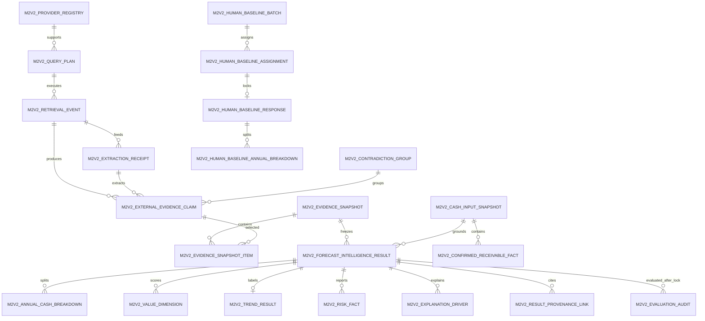

# M2 Forecast Intelligence v2 数据库逻辑契约 v0.1

## 1. 状态与原则

- 状态：`V2_A_ARCHITECTURE_CONTRACT_READY_FOR_REVIEW`
- 契约版本：`m2.v2.db.v0.1`
- 本文件只定义未来逻辑模型，不包含 migration、SQL 或数据库写入授权。
- V2 数据对象必须新增并版本化；不得复用旧三情景列、建议字段或改变现有 B4/result 数据。
- 金额统一使用整数分 `bigint`；禁止以二进制浮点做货币守恒。
- 外部证据与预测结果采用 append-only / immutable snapshot；纠错通过 supersede，不原地覆盖历史。

## 2. 逻辑实体总览

## 3. External Evidence Layer

### 3.1 `m2v2_provider_registry`

| 字段 | 约束/语义 |
|---|---|
| `provider_id` | PK；稳定代码，不含凭据 |
| `provider_version` | PK；adapter 版本 |
| `provider_type` | API / permitted web / licensed aggregate / search index |
| `status` | pending_review / approved_shadow / disabled |
| `terms_class` | 与 data policy 一致 |
| `rate_limit_policy_version` | 非空 |
| `retention_policy_version` | 非空 |
| `effective_from/to` | 版本有效期 |
| `created_at` | UTC |

禁止存储 API key、cookie、浏览器会话、密码或完整服务条款正文。

### 3.2 `m2v2_query_plan`

保存冻结的 query contract：query ID、pilot run ID、private work/entity reference、evidence type、template ID/version、canonical query hash、locale/region/time window、provider/source policy versions、allowed/blocked-domain digests、request mode、call/result/page/token/cost 上限、timeout/retry、created at 与 plan digest。原始 query 和真实标题只可存在于 private ignored store；普通日志与公开报告不得保存。

### 3.3 `m2v2_retrieval_event`

| 字段 | 约束/语义 |
|---|---|
| `retrieval_id` | PK |
| `query_id/attempt_no` | FK query plan；联合唯一 |
| `provider_id/version` | FK provider registry |
| `request_fingerprint` | 规范化请求摘要，不含原 query 明文 |
| `started_at/completed_at` | UTC |
| `captured_at` | source record 实际获取时点；不得与 call completed_at 混用 |
| `outcome` | success / partial / failed / blocked_by_policy |
| `http_status_class` | 可空，仅分类值 |
| `record_count` | 非负整数 |
| `payload_digest` | 可空 SHA-256；不是原 payload |
| `error_code` | 受控代码，不保存敏感响应正文 |
| `cache_key/cache_hit` | 可复现缓存审计 |
| `latency_ms/cost_minor/currency/price_version` | 成本与延迟；整数最小货币单位 |
| `source_access_decision_id` | terms/robots/paywall/login/captcha 判定引用 |
| `receipt_digest` | 规范化 receipt SHA-256 |

失败 retrieval 不得产生“成功”的 evidence claim，也不得静默复用未来数据。

### 3.4 `m2v2_extraction_receipt`

保存 extraction ID、retrieval ID、extractor type、model ID/prompt version（deterministic 时 null）、schema version、input digest、output digest、status/error code 和 created at。不得保存 chain-of-thought、完整网页或 provider raw payload。

### 3.5 `m2v2_external_evidence_claim`

列必须完整承载 `M2-v2-external-evidence.schema.json`：

- identity：`evidence_id + evidence_version`、`standard_work_id`、`evidence_type`、`claim_key`；
- structured value：typed JSON 或显式 typed columns，不能存任意网页正文；
- source/provider：tier/class/terms、domain/record key/private locator、provider/query/retrieval/extraction 版本与 digest；
- as-of：`event_time`、`published_at`、`first_observed_at`、`available_at_status`、`available_at`、`captured_at`、valid range；
- confidence：四个 component、overall、tier、method；
- entity：work/author 分离状态、selected entity hash、candidate-set/input digest、threshold/margin、normalization/resolution policy；
- contradiction：status、group、winner、resolution rule/version/time、current claim disposition；
- usage：prediction allowed / explanation only / prohibited 与 admissibility/exclusion reasons；
- governance：policy versions、content digest、created at、superseded by。

约束：

- `max(available_at, first_observed_at, captured_at) <= evidence_as_of_at <= prediction_locked_at` 才能加入 prediction/result snapshot；unknown availableAt 只能 excluded 或进入独立 audit snapshot；
- overall 必须等于所需 component 的最小值，精确到冻结精度；
- prediction allowed 必须为 medium/high 且 contradiction 为 none/resolved；
- unresolved entity mapping 不得 prediction allowed；
- raw page、完整文本和凭据不得进入该表。

### 3.6 `m2v2_contradiction_group`

保存同一 `standard_work_id + claim_key + applicable interval` 的冲突集合：group ID、状态、resolution rule/version、winner evidence ID（可空）、resolved at。所有参与 claim 仍保留，不删除 loser。

### 3.7 `m2v2_evidence_snapshot` 与 item

prediction/result snapshot 主表：snapshot ID、`income_data_cutoff_at`、`evidence_as_of_at`、`prediction_locked_at`、data/policy/provider/schema 版本、claim count、coverage summary、digest、created at、sealed at、status。

item：`snapshot_id + evidence_id + evidence_version` 唯一，并保存 inclusion role（prediction/explanation）和 snapshot-specific freshness/conflict/admissibility policy evaluation。post-hoc truth/audit evidence 使用独立 audit snapshot，不得绑定当时 serving result。

sealed snapshot 不可变。模型、结果、解释和导出必须引用同一 snapshot；未 sealed snapshot 不得用于 shadow 结果。

### 3.8 Formal-cash input 与 commitment lineage

`m2v2_cash_input_snapshot` 保存 snapshot ID/version、standard work、income cutoff、as-of time、sales input digest、commitment evidence count、digest、sealed at。`m2v2_confirmed_receivable_fact` 保存该 snapshot 下 cutoff 已确认应收的 opaque evidence ID、status、amount cents、expected receipt time、confirmation time、source/audit digest；不保存未承诺买断猜测。

result 必须 FK 到 sealed cash input snapshot。pure-buyout 无 confirmed receivable 时只能 null abstain；有 confirmed receivable 时可 `point_basis=confirmed_receivable_only`、`model_prediction_available=false` 且合法 served。该跨记录 invariant 必须由 contract test 验证。

## 4. 五头结果模型

### 4.1 `m2v2_forecast_intelligence_result`

| 字段组 | 关键字段 |
|---|---|
| identity | `result_id` PK、`standard_work_id`、`cutoff_month`、result status |
| status separation | statistically scoreable、model prediction available、business serving eligible、abstained、reason |
| cash forecast | point basis、point forecast cents（可空）、currency=`CNY`、confidence、limitations、excludes uncommitted buyout |
| commercial value | status、method type、score/rank（可空）、confidence、limitations、policy/truth version |
| evidence | evidence snapshot ID、coverage level、conflict count |
| governance | cash input snapshot ID、model/B4/result schema/data/value/trend version、created at、decision status |

约束：

- abstained => point null、business serving false、reason 非空；
- served sales basis => point 为非负整数分、model available/business eligible true、reason null；
- served `confirmed_receivable_only` => point 为非负整数分、model available false、business eligible true、reason null；
- pure-buyout 无 cutoff 承诺必须 null abstain，不得用 0；
- 当前 V2-A `not_for_formal_decision=true`；
- 同一 work、cutoff、result family 只能有一个 current；历史版本保留。
- result 中所有 `external_evidence` provenance ref 的 snapshot ID 必须严格等于该 result 的非空 evidence snapshot ID；所有 `internal_snapshot` ref 必须严格等于该 result 的 sealed cash input snapshot ID；不允许只校验“非空”；
- evidence summary 的 prediction/explanation counts 之和不得超过 total，且 total、各 role count、conflict count、coverage 与绑定 snapshot projection 必须逐项一致；无 claim 时 snapshot/policy version 均为空，有 claim 时均非空。

内部 calibration raw prediction 不属于 serving result。若未来需要持久化，必须放在独立受限 schema，不能被产品/API/export 查询直接连接。

### 4.2 `m2v2_annual_cash_breakdown`

主键 `result_id + calendar_year`，`amount_cents >= 0`。所有年度整数分必须严格合计为 result point cents；abstained 结果不得存在明细。

### 4.3 `m2v2_value_dimension`

主键 `result_id + dimension_code`；机器码限定为 `cash_outlook`、`persistence`、`demand_momentum`、`rights_usability`、`evidence_strength`、`risk_adjustment`。保存 score、confidence、limitations 与 typed provenance；score 可空、范围 0–100，且必须绑定 policy version。V2-A 不冻结权重。

### 4.4 `m2v2_trend_result`

每 result 至多一行：trend item ID、status、label、horizon months、unavailability reason、confidence、limitations、definition version 与 typed provenance。没有冻结定义时必须 `status=unavailable` 且 label/horizon/definition 为 null，不能用 current rating 或当前 shelf 状态替代。

### 4.5 `m2v2_risk_fact`

只保存稳定 risk ID、risk code、severity、affected head、rationale、limitation 与 typed provenance。禁止 action、resource allocation 或 operating recommendation 字段。

### 4.6 `m2v2_explanation_driver`

保存稳定 driver ID、driver type、direction、strength band、affected head、as-of、短文本、limitation 与 typed provenance。解释必须有 internal snapshot、external evidence、policy rule 或 model attribution link；无法支持的模型因果表述禁止入库。

### 4.7 `m2v2_result_provenance_link`

主键包含 `result_id + target_type + target_id + ref_type + ref_id`。target type 为 value dimension / trend / risk / explanation；ref type 为 external evidence / internal snapshot / policy rule / model attribution。external/internal ref 必须带 snapshot ID 与 as-of，且必须在 prediction lock 前可得。

prediction lock 后的 future truth、人工 QA 和后验指标进入独立 append-only `m2v2_evaluation_audit`，只引用 result ID，不属于 serving result snapshot/digest，也不得回写预测 provenance。

## 5. Human Baseline 隔离域

### 5.1 batch / assignment / response

- batch：sample policy、seed、origin/horizon 集、population digest、状态、seal time；
- assignment：匿名 case key、review arm、reviewer pseudonym、blind payload version、deadline；
- response：point cents（可空）、abstained、abstention reason、trend、value assessment（仅若有冻结 policy）、confidence、limitations、evidence refs used（只引用 blind packet 内稳定 ID）、submitted at、duration seconds、locked at、baseline-isolated flag、response revision 与 response digest；
- response annual breakdown：主键 `response_id + calendar_year`，保存非负整数分。非 abstained response 的年度分合计必须严格等于 point cents；abstained response 不得有年度明细；
- metric：WAPE、bias、MAE、rank correlation、TopK、trend accuracy、bootstrap CI 和计算版本。

隔离规则：

- reviewer 预测在提交前不可见 actual/model output；
- human response 永远标记 `baseline_isolated`，不得进入候选模型特征；
- reviewer 真实身份、自由文本和私有材料不进入公开结果或训练表；
- 修改必须生成新 revision，不得覆盖 lock 后响应。
- 同一 arm、block/horizon 的共识 response 另存带规则版本的派生 revision；年度共识先取 reviewer 年度占比中位数，再用最大余数法分配整数分，必须与共识 point 精确守恒。

## 6. 索引、审计与保留

建议逻辑索引：

- claim：`standard_work_id, available_at, evidence_type`；
- unresolved contradiction：`claim_key, contradiction_status`；
- snapshot item：`snapshot_id, inclusion_role`；
- result current：`standard_work_id, cutoff_month`；
- portfolio query：cutoff + serving/value/trend/risk status；
- human baseline：batch + case block + arm。

审计必须记录创建者类型（system/job/reviewer pseudonym）、版本、时间、digest 和 supersession 链；不记录 secret。保留期限遵循 source terms 与批准 policy，source terms 要求删除时保留不可逆 digest 和审计 tombstone，不保留被禁止内容。

## 7. 与当前 schema 的共存

当前 migration 及旧 M2 表仍作为历史能力存在。未来实现必须：

1. 新增 V2 命名空间/表或明确版本列；
2. 不把 legacy high/base/low 映射成 V2；
3. 不把建议字段映射成 V2 risk/explanation；
4. 不改变 B4、C1–C3 checkpoint 或 formal-cash actual；
5. migration、backfill、rollback 和数据对账另行评审；
6. 没有外部历史 snapshot 时不得从当前网页恢复历史特征。

## 8. 实现前强制数据库测试

- integer-cent cash reconciliation；
- abstained null/served numeric contract；
- pure-buyout commitment as-of；
- annual sum equals point；
- snapshot immutability；
- available-at cutoff；
- confidence minimum policy；
- unresolved contradiction fails prediction use；
- product result cannot expose raw evidence/PI/raw prediction；
- human baseline isolation；
- small-cell suppression；
- no private or secret columns。
