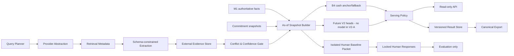

# M2 v2 系统架构设计 v0.1

## 技术摘要

M2 v2 采用 evidence-first、B4-anchored、multi-head 架构。External Evidence Layer 与现有 M1/M2 内部事实在 cutoff snapshot 汇合，但不直接修改 formal-cash target。五个 head 分别生成 Cash、Value、Trend、Risk 和 Explanation；只有通过 serving policy 的 point 可以进入产品 API/export。

V2-A 只定义边界和对象。不存在运行时、数据库变更、模型或新结果。

## 1. Context



## 2. 组件

### 2.1 Authoritative Internal Facts

只读消费：

- standard work、income facts、complete month；
- author/classification/tag；
- rights/shelf snapshots；
- revenue model/channel history；
- separately authorized commitment snapshots；
- truth-only settlement links，仅 prediction lock 后。

V2 不覆盖 M1 值。

### 2.2 Query Planner

输入：standard work public entity keys、evidence type、cutoff、template version。

输出：

- provider-neutral query；
- query hash；
- cost budget；
- allowed source classes；
- max results/pages；
- timeout/retry policy。

Query 不得包含 post-cutoff outcome。

### 2.3 Provider Abstraction

统一能力：

- search；
- structured metric retrieval；
- official page retrieval；
- health/cost metadata；
- source terms classification。

Provider 不得：

- 直接返回 forecast/value/trend；
- 执行登录、付费、互动或发布；
- 暴露 credential；
- 选择 model/gate。

接口概念：

```text
search(request) -> SearchResultPage
fetchStructured(request) -> StructuredProviderResult
fetchPermittedPage(request) -> RetrievalEnvelope
capabilities() -> ProviderCapabilities
health() -> ProviderHealth
```

### 2.4 Evidence Extraction

LLM/规则抽取器只生成 schema-constrained claims，并保留：

- source locator；
- content/excerpt digest；
- extraction version；
- extraction confidence；
- unsupported/unknown 标记。

LLM 不得生成收入预测或补全缺失事实。

### 2.5 Evidence Store

存储 append-only retrieval metadata、claims、contradictions 和 immutable snapshot。网页全文、credential 和 private source body 不进入该层。

### 2.6 As-of Snapshot Builder

对每个 cutoff：

1. 读取当时可得 M1/commitment snapshots；
2. 分离 `incomeDataCutoffAt`、`evidenceAsOfAt`、`predictionLockedAt`，并过滤 `max(availableAt, firstObservedAt, capturedAt) <= evidenceAsOfAt <= predictionLockedAt`；
3. 应用 source/confidence/contradiction policy；
4. 物化 `prediction_allowed` 与 `explanation_only` 视图；
5. 记录 item digests 和 manifest version；
6. 在预测前锁定。

### 2.7 Intelligence Heads

| Head | V2-A 输入边界 | V2-A 状态 |
|---|---|---|
| Cash | formal-cash internal facts；未来可加合格 external features | B4 comparator/fallback only |
| Value | dimension contract；policy 未批准 | unavailable |
| Trend | sales cash truth contract；threshold 未批准 | `status=unavailable`、label/horizon=null |
| Risk | facts、coverage、conflicts、limitations | design only |
| Explanation | internal facts、external evidence、future attribution | design only |

### 2.8 Serving Policy

Serving Policy 决定合法产品输出，不参与模型质量计分。

```text
servedPointAvailable
= businessServingEligible
&& (modelPredictionAvailable || cutoffConfirmedReceivableAvailable)
&& !routeAbstained
```

pure-buyout 无承诺：null。pure-buyout 只有 cutoff-confirmed receivable 时可用 `confirmed_receivable_only` basis 合法 serving，此时 `modelPredictionAvailable=false`，不得把确定现金冒充模型 raw prediction。commitment 在 horizon 后：可解释 0，不 abstain。external provider 失败：B4-only 或 null，不伪造 evidence。

### 2.9 Result/API/Export

所有 surface 共享 `M2-v2-result.schema.json`：

- DB 是 source of persisted result；
- API 是 read-only projection；
- export 是相同 snapshot 的 projection；
- 三者按 resultId、snapshotId、schemaVersion 对账。

## 3. 数据流与 lock 顺序

```text
authority snapshot
-> external evidence snapshot
-> feature/use manifest
-> prediction materialization
-> prediction lock
-> serving policy
-> future truth join for evaluation
-> metrics/report
```

禁止在 prediction lock 前读取：

- future actual；
- truth-only settlement links；
- future evidence；
- reviewer answer；
- candidate comparison result；
- final holdout。

## 4. Failure handling

| Failure | 行为 | 产品影响 |
|---|---|---|
| provider unavailable | retry/circuit break/cache | B4-only；evidence limitation |
| source terms unknown | reject retrieval result | no evidence use |
| entity ambiguous | prediction prohibited | risk/explanation |
| availableAt missing | prediction prohibited | limitation |
| low confidence | explanation-only | confidence down |
| unresolved conflict | claim group blocked | conflict risk |
| schema mismatch | quarantine | no product claim |
| snapshot digest mismatch | fail closed | no result |
| B4 unavailable | route-specific null/failed attempt | no fabricated point |
| value/trend policy missing | unavailable/insufficient | cash unaffected |

## 5. Security and privacy

- provider credential 只在未来 secret manager/runtime config；
- 禁止写入 Git、DB evidence payload、logs、API/export；
- URL/query 可包含公开实体但不进入 public aggregate report；
- no full page/raw private text；
- restricted snapshots stay outside Git；
- logs 使用 evidence/query IDs，不打印 content；
- source allowlist/denylist、rate limit、timeout、budget；
- no remote production/shared/staging-like DB。

## 6. Non-functional contracts

### Reproducibility

- schema/provider/query/extractor/policy versions；
- deterministic snapshot filtering；
- item/content digests；
- immutable result and evidence；
- seed binding for Human baseline and future models。

### Availability

- evidence layer is optional for B4 fallback；
- no external call on product read path；
- read API consumes persisted snapshot；
- provider outage cannot mutate prior result。

### Cost

- per work/type budget；
- cohort refresh；
- cache and dedupe；
- query/page/token/cost telemetry；
- V2-B cost cap required before acquisition。

### Observability

- provider success/error/latency；
- evidence coverage/freshness/conflict；
- snapshot build failures；
- fallback rate；
- API/export parity；
- prohibited-field count。

## 7. Versioning

独立版本：

- `resultSchemaVersion`；
- `evidenceSchemaVersion`；
- `providerRegistryVersion`；
- `sourcePolicyVersion`；
- `confidencePolicyVersion`；
- `valuePolicyVersion`；
- `trendDefinitionVersion`；
- `modelVersion`；
- `exportSchemaVersion`。

任一版本变化必须创建新 snapshot/result，不覆盖历史。

## 8. Future implementation order

仅在新授权后：

1. schema contract tests；
2. synthetic provider adapters；
3. local evidence store migration proposal；
4. V2-B evidence pilot；
5. prospective snapshots；
6. Human baseline；
7. future algorithm pre-registration。

本轮在步骤 0（设计）停止。
